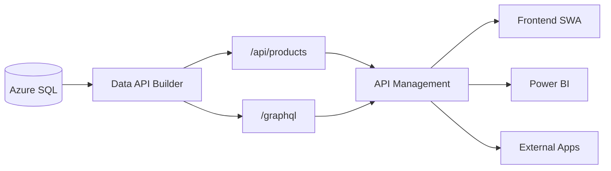

# Data API Builder — Quick Start

> **Azure Data API Builder (DAB)** turns your Azure SQL database into instant
> REST and GraphQL APIs with zero application code.



## Prerequisites

| Tool | Version | Purpose |
|------|---------|---------|
| Azure CLI | 2.50+ | Deploy infrastructure |
| SQL Server / Azure SQL | 2019+ | Database engine |
| Data API Builder CLI | 1.1+ | Local development |
| Node.js | 18+ | Frontend tooling (optional) |

## Quick Start

### 1. Deploy Infrastructure

```bash
az deployment group create \
  --resource-group rg-csa-dab-dev \
  --template-file ../../deploy/bicep/DLZ/modules/data-api-builder.bicep \
  --parameters ../../deploy/bicep/DLZ/modules/data-api-builder.dev.bicepparam \
  --parameters sqlAdminPassword='<YOUR_PASSWORD>'
```

### 2. Create the Database Schema

```bash
sqlcmd -S <server>.database.windows.net -d csa-dab-db-dev \
  -U sqladmin -P '<PASSWORD>' \
  -i sql/setup.sql
```

### 3. Run DAB Locally

```bash
# Install DAB CLI
dotnet tool install -g Microsoft.DataApiBuilder

# Set connection string
export SQL_CONNECTION_STRING="Server=localhost;Database=dab;User Id=sa;Password=<PWD>;TrustServerCertificate=true"

# Start DAB
dab start --config dab-config.json
```

### 4. Test the API

```bash
# REST
curl http://localhost:5000/api/products | jq

# GraphQL
curl -X POST http://localhost:5000/graphql \
  -H 'Content-Type: application/json' \
  -d '{"query":"{ dataProducts { items { id name domain quality_score } } }"}'
```

### 5. Serve the Frontend

```bash
# Using SWA CLI for local dev
npx @azure/static-web-apps-cli start frontend/ --data-api-location http://localhost:5000
```

## Directory Structure

```
examples/data-api-builder/
├── dab-config.json              # DAB configuration (entities, permissions, relationships)
├── sql/
│   └── setup.sql                # Database schema + seed data
├── frontend/
│   ├── index.html               # Dashboard
│   ├── products.html            # Product catalog
│   ├── explorer.html            # GraphQL explorer
│   ├── styles.css               # Dark theme styles
│   ├── app.js                   # API client + rendering
│   └── staticwebapp.config.json # SWA routing & auth
├── api-examples/
│   ├── rest-examples.http       # VS Code REST Client examples
│   └── graphql-examples.graphql # GraphQL query/mutation examples
└── README.md                    # This file
```

## Key Configuration

The `dab-config.json` defines:

- **5 entities**: DataProducts, QualityMetrics, AccessGrants, Domains, DataLineage
- **2 stored procedures**: sp_domain_stats, sp_quality_trend
- **Role-based permissions**: anonymous (read), authenticated (CRUD), admin (full)
- **Relationships**: products → quality metrics (1:many), products → domains (many:1)
- **Policy filters**: anonymous users cannot see draft products; authenticated users see only their own access grants

## Full Tutorial

See [`docs/tutorials/11-data-api-builder/README.md`](../../docs/tutorials/11-data-api-builder/README.md)
for the complete 90-minute walkthrough.

## Related

- [Tutorial 10: Data Marketplace](../../docs/tutorials/10-data-marketplace/README.md)
- [Azure Data API Builder Docs](https://learn.microsoft.com/azure/data-api-builder/)
- [Bicep Module](../../deploy/bicep/DLZ/modules/data-api-builder.bicep)
