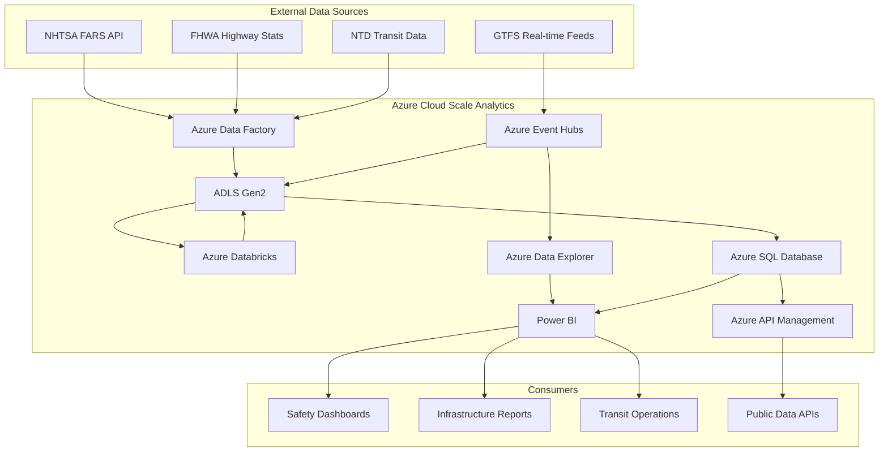
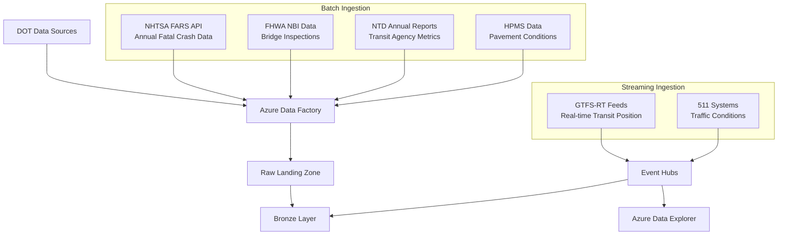
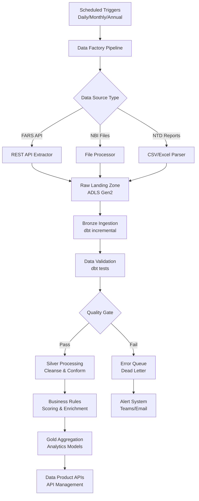
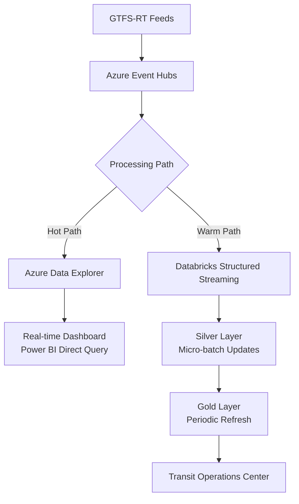
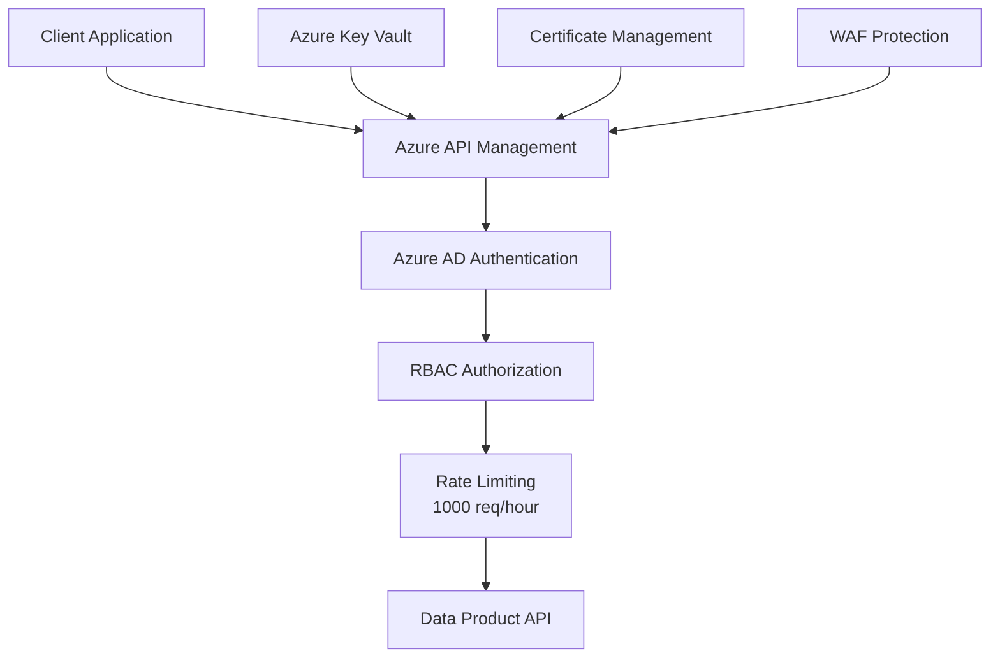

# DOT Transportation Analytics Architecture

> **Last Updated:** 2026-04-15 | **Status:** Active | **Audience:** Architects / Data Engineers

## Table of Contents
- [Overview](#overview)
- [Domain Context](#domain-context)
  - [Transportation Data Landscape](#transportation-data-landscape)
  - [Data Characteristics](#data-characteristics)
- [System Context](#system-context)
- [Architecture Layers](#architecture-layers)
  - [Data Ingestion Layer](#data-ingestion-layer)
  - [Bronze Layer (Raw Data)](#bronze-layer-raw-data)
  - [Silver Layer (Cleaned & Conformed)](#silver-layer-cleaned--conformed)
  - [Gold Layer (Business Analytics)](#gold-layer-business-analytics)
- [Data Flow Architecture](#data-flow-architecture)
  - [Batch Processing Pipeline](#batch-processing-pipeline)
  - [Real-time Processing Pipeline](#real-time-processing-pipeline)
- [Integration Points](#integration-points)
  - [Event Hub Configuration](#event-hub-configuration)
  - [Azure Data Explorer (ADX) Integration](#azure-data-explorer-adx-integration)
  - [Power BI Dashboards](#power-bi-dashboards)
- [Security Architecture](#security-architecture)
  - [Data Protection](#data-protection)
  - [Compliance](#compliance)
  - [API Security](#api-security)
- [Performance Optimization](#performance-optimization)
  - [Data Partitioning Strategy](#data-partitioning-strategy)
  - [Caching Strategy](#caching-strategy)
- [Monitoring & Observability](#monitoring--observability)
  - [Data Quality Monitoring](#data-quality-monitoring)
  - [Pipeline Monitoring](#pipeline-monitoring)
  - [Alerting](#alerting)
- [Disaster Recovery](#disaster-recovery)
  - [Backup Strategy](#backup-strategy)
  - [Business Continuity](#business-continuity)
- [Technology Stack](#technology-stack)
  - [Core Platform](#core-platform)
  - [Development Tools](#development-tools)
  - [Programming Languages](#programming-languages)

## Overview

The DOT Transportation Analytics platform is built on Azure Cloud Scale Analytics (CSA) and follows a domain-driven design approach. It ingests data from multiple DOT agencies — NHTSA, FHWA, FTA, and FAA — transforms it through a medallion architecture, and provides analytical insights for transportation safety, infrastructure planning, and transit operations.

## Domain Context

### Transportation Data Landscape

The US Department of Transportation ecosystem produces extensive data through multiple agencies and programs:

- **NHTSA (National Highway Traffic Safety Administration)**: Fatal crash data, vehicle safety recalls, driver behavior studies
- **FHWA (Federal Highway Administration)**: Bridge condition ratings, pavement quality indices, traffic counts (AADT), highway statistics
- **FTA (Federal Transit Administration)**: Transit agency performance, ridership, service metrics via the National Transit Database
- **FAA (Federal Aviation Administration)**: Airport operations, air traffic data, facility information

### Data Characteristics

- **Volume**: Millions of crash records, 600,000+ bridge inspections, 2,200+ transit agencies
- **Velocity**: Annual FARS releases, quarterly infrastructure assessments, monthly transit reports, real-time transit feeds
- **Variety**: Structured tabular data (crashes, inspections), geospatial (coordinates, routes), time-series (ridership trends)
- **Veracity**: Government-mandated reporting with standardized collection methodologies (FARS coding manual, NBI standards, NTD reporting guidelines)

## System Context



## Architecture Layers

### Data Ingestion Layer



#### Ingestion Patterns

**NHTSA FARS API**
- REST API with query parameters for year, state, data elements
- No authentication required (public data)
- Data format: JSON responses, also available as SAS/CSV flat files
- Update frequency: Annual release with ~12-month lag
- Coverage: All fatal motor vehicle crashes since 1975

**FHWA National Bridge Inventory (NBI)**
- Annual ASCII fixed-width file downloads
- Standardized NBI coding guide (FHWA Recording and Coding Guide)
- 600,000+ bridge records per year
- Condition ratings on 0-9 scale for deck, superstructure, substructure

**NTD Transit Data**
- Annual agency-reported data via FTA NTD portal
- Monthly ridership data available with 2-3 month lag
- Standardized NTD reporting forms (S-10, R-10, R-20, etc.)
- Covers all transit agencies receiving FTA funding

**Real-time Transit (GTFS-RT)**
- Protocol buffer format via GTFS-Realtime specification
- Sub-minute update frequency for vehicle positions
- Ingested through Azure Event Hubs for streaming processing

### Bronze Layer (Raw Data)

The Bronze layer stores raw, unprocessed data exactly as received from source systems.

```sql
-- Example: Bronze crash data table structure
CREATE TABLE bronze.brz_crash_data (
    source_system STRING,
    ingestion_timestamp TIMESTAMP,
    case_id STRING,
    state_code INT,
    state_name STRING,
    county STRING,
    city STRING,
    crash_date DATE,
    crash_time STRING,
    fatalities INT,
    drunk_drivers INT,
    weather_condition INT,
    road_surface INT,
    light_condition INT,
    latitude DECIMAL(10,6),
    longitude DECIMAL(10,6),
    manner_of_collision INT,
    number_of_vehicles INT,
    road_function_class INT,
    speed_limit INT,
    raw_json STRING,
    record_hash STRING,
    _dbt_loaded_at TIMESTAMP
)
USING DELTA
PARTITIONED BY (state_code, YEAR(crash_date))
```

#### Data Lineage Tracking

- Source file metadata preserved (`_source_file_name`, `_source_file_timestamp`)
- Ingestion timestamps for audit trails
- Original API responses stored as JSON for reprocessing
- Record hashes for deduplication across incremental loads

### Silver Layer (Cleaned & Conformed)

The Silver layer applies business rules, data quality checks, and standardization.

#### Transformation Patterns

**Data Standardization**
- FARS coding manual lookups for weather, road surface, light condition enums
- FIPS codes for consistent geographic identifiers across crash, bridge, and transit data
- ISO 8601 date normalization for all temporal fields
- Coordinate validation and normalization (WGS84)

**Data Quality Rules**
- Null value handling with domain-appropriate defaults
- Geographic validation (lat/lon within state boundaries)
- Temporal validation (dates within expected ranges)
- Cross-field validation (e.g., fatalities <= persons_involved)
- Outlier flagging for severity scores and traffic counts

**Derived Metrics**
- Crash severity score: composite of fatalities, injuries, vehicle damage
- Bridge condition category: good/fair/poor/critical from NBI ratings
- Transit on-time rate: on_time_trips / scheduled_trips
- Maintenance urgency score: function of condition, traffic, age

### Gold Layer (Business Analytics)

The Gold layer contains aggregated, enriched data optimized for analytics and reporting.

#### Analytical Models

**Safety Hotspot Analysis** (`gld_safety_hotspots`)
- Crash clustering by grid cell (0.1-degree squares) and named corridor
- Severity-weighted scoring with configurable weights
- Year-over-year trend analysis with statistical significance
- Contributing factor analysis (weather, time-of-day, road condition)
- Seasonal pattern identification

**Infrastructure Prioritization** (`gld_infrastructure_priority`)
- Composite priority score: condition (40%) + traffic (30%) + age (20%) + trend (10%)
- Predicted deterioration using historical condition trajectories
- Maintenance cost estimation based on structure type and condition gap
- State and national ranking with funding tier recommendations

**Transit Performance Dashboard** (`gld_transit_dashboard`)
- Agency-level KPIs: on-time rate, ridership per vehicle hour, cost efficiency
- Route-level reliability index with peer comparison
- Mode comparison (bus, rail, ferry, demand-response)
- Trend analysis with seasonally-adjusted metrics

## Data Flow Architecture

### Batch Processing Pipeline



### Real-time Processing Pipeline

For time-sensitive transit data:



- **Hot path**: ADX for sub-second query on real-time vehicle positions, delays, alerts
- **Warm path**: Databricks Structured Streaming for micro-batch Silver layer updates
- **Cold path**: Standard batch pipeline for historical trend analysis

## Integration Points

### Event Hub Configuration

```yaml
event_hub:
  namespace: dot-transit-eventhub
  hubs:
    - name: transit-vehicle-positions
      partitions: 8
      retention_days: 7
      consumer_groups:
        - adx-ingestion
        - spark-streaming

    - name: transit-trip-updates
      partitions: 4
      retention_days: 3
      consumer_groups:
        - adx-ingestion
```

### Azure Data Explorer (ADX) Integration

ADX provides real-time analytics for streaming transit data:

```kql
// Real-time transit delay analysis
TransitVehiclePositions
| where ingestion_time() > ago(1h)
| summarize 
    avg_delay_seconds = avg(delay_seconds),
    max_delay_seconds = max(delay_seconds),
    vehicles_delayed = countif(delay_seconds > 300)
    by agency_id, route_id, bin(ingestion_time(), 5m)
| order by avg_delay_seconds desc
```

### Power BI Dashboards

Three primary dashboards serve different user personas:

**1. Safety Executive Dashboard**
- National crash fatality map with hotspot overlay
- Year-over-year fatality trend with target line
- Contributing factor breakdown (pie/bar)
- State comparison scorecards

**2. Infrastructure Condition Report**
- Bridge condition distribution (good/fair/poor/critical)
- Priority maintenance queue with cost estimates
- Geographic heatmap of deteriorating segments
- Budget allocation recommendations

**3. Transit Operations Center**
- Real-time on-time performance gauges
- Route-level service reliability heatmap
- Ridership trend sparklines by agency
- Service gap alerts and notifications

## Security Architecture

### Data Protection

- **Encryption at Rest**: Azure Storage Service Encryption (SSE) with Microsoft-managed keys
- **Encryption in Transit**: TLS 1.2+ for all API communications
- **Network Security**: VNet integration with private endpoints for all PaaS services
- **Access Control**: Azure AD integration with RBAC (Reader, Contributor, Admin roles)

### Compliance

- **FISMA**: Federal Information Security Modernization Act compliance
- **FedRAMP**: All data is public/unclassified, simplifying authorization
- **Section 508**: Accessibility compliance for Power BI dashboards
- **Open Data**: Data products follow data.gov standards and DCAT metadata

### API Security



## Performance Optimization

### Data Partitioning Strategy

| Layer | Table | Partition Key | Z-Order |
|-------|-------|--------------|---------|
| Bronze | brz_crash_data | state_code, crash_year | crash_date |
| Bronze | brz_highway_conditions | state_code | route_id |
| Bronze | brz_transit_performance | agency_id | service_date |
| Silver | slv_crash_data | state_code, crash_year | severity_score |
| Gold | gld_safety_hotspots | analysis_year | severity_weighted_score |
| Gold | gld_infrastructure_priority | state_code | composite_priority_score |

### Caching Strategy

- **Redis Cache**: Frequently accessed dashboard aggregations (1-hour TTL)
- **CDN**: Static map tiles and dashboard assets
- **ADX Result Cache**: Hot query results for real-time transit (5-minute TTL)
- **Synapse Result Cache**: Gold layer query results (24-hour TTL)

## Monitoring & Observability

### Data Quality Monitoring

- **dbt Tests**: Schema validation, accepted values, range checks, custom SQL tests
- **Great Expectations**: Statistical distribution tests and anomaly detection
- **Custom Monitors**: Geospatial validation (coordinates within state boundaries)

### Pipeline Monitoring

- **Azure Monitor**: Infrastructure health, pipeline run status, resource utilization
- **Application Insights**: API performance, error rates, dependency tracking
- **Log Analytics**: Centralized logging with KQL queries for troubleshooting

### Alerting

```yaml
alerts:
  - name: "FARS Data Freshness"
    condition: "last_update > 45 days"
    severity: "warning"
    channel: "#dot-data-engineering"

  - name: "Bridge Condition Anomaly"
    condition: "condition_rating_change > 2 in single inspection"
    severity: "high"
    channel: "#dot-infrastructure"

  - name: "Transit Feed Interruption"
    condition: "no_events_received > 15 minutes"
    severity: "critical"
    channel: "#dot-transit-ops"
```

## Disaster Recovery

### Backup Strategy

- **Automated Backups**: Daily incremental, weekly full for ADLS and SQL
- **Cross-region Replication**: Primary (East US), Secondary (West US)
- **Point-in-time Recovery**: 30-day retention for all layers
- **ADX**: Follower databases for read-only replicas

### Business Continuity

- **RTO**: 4 hours for batch analytics, 1 hour for real-time transit
- **RPO**: 24 hours for batch data, 15 minutes for streaming data
- **Failover**: Automated for infrastructure, manual approval for data pipelines

## Technology Stack

### Core Platform

- **Compute**: Azure Databricks, Azure Functions, Azure Data Explorer
- **Storage**: Azure Data Lake Storage Gen2, Azure SQL Database
- **Orchestration**: Azure Data Factory, Azure Logic Apps
- **Streaming**: Azure Event Hubs, Databricks Structured Streaming
- **Analytics**: Azure Synapse Analytics, Azure Data Explorer, Power BI

### Development Tools

- **Data Modeling**: dbt, Great Expectations
- **Version Control**: Git, Azure DevOps
- **CI/CD**: Azure Pipelines, GitHub Actions
- **Monitoring**: Azure Monitor, Application Insights, Log Analytics

### Programming Languages

- **Data Processing**: Python, SQL, Scala
- **Streaming**: Python (Structured Streaming), KQL (ADX)
- **Web APIs**: Python (FastAPI)
- **Infrastructure**: Bicep, Terraform
- **Analytics**: Python (pandas, geopandas, scikit-learn), R

---

## Related Documentation

- [DOT README](README.md) — Deployment guide, quick start, and analytics scenarios
- [Platform Architecture](../../docs/ARCHITECTURE.md) — Core CSA platform architecture
- [Platform Services](../../docs/PLATFORM_SERVICES.md) — Shared Azure service configurations
- [Interior Architecture](../interior/ARCHITECTURE.md) — Related federal infrastructure architecture
- [USPS Architecture](../usps/ARCHITECTURE.md) — Related federal logistics architecture
