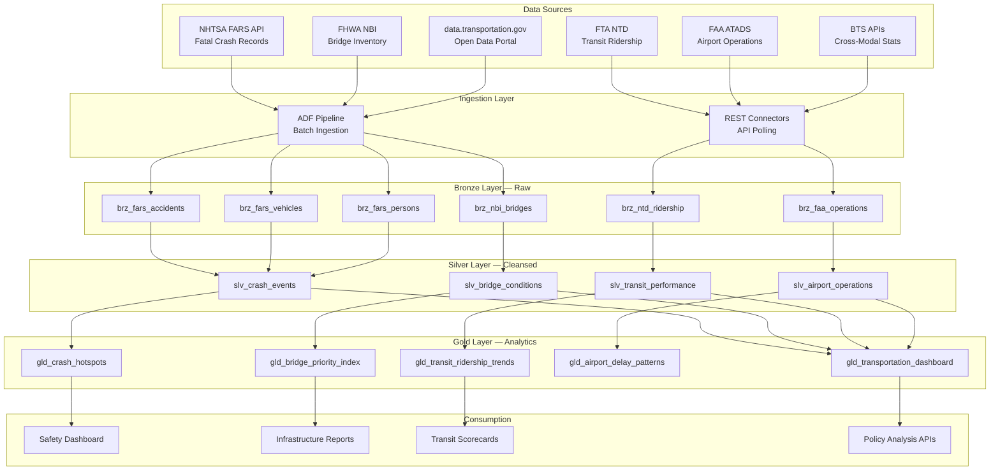

# DOT Transportation Analytics Platform

> [**Examples**](../README.md) > **DOT**

> **Last Updated:** 2026-04-15 | **Status:** Active | **Audience:** Data Engineers

> [!TIP]
> **TL;DR** — Transportation analytics covering highway safety (FARS crash data), infrastructure condition (620K+ bridges from NBI), and transit performance (900+ agencies from NTD). Includes geospatial hotspot analysis and bridge priority scoring.


---

## 📋 Table of Contents
- [Overview](#overview)
  - [Key Features](#key-features)
  - [Data Sources](#data-sources)
- [Architecture Overview](#architecture-overview)
- [Prerequisites](#prerequisites)
  - [Azure Resources](#azure-resources)
  - [Tools Required](#tools-required)
  - [API Access](#api-access)
- [Quick Start](#quick-start)
  - [1. Environment Setup](#1-environment-setup)
  - [2. Configure API Keys](#2-configure-api-keys)
  - [3. Generate Sample Data](#3-generate-sample-data)
  - [4. Deploy Infrastructure](#4-deploy-infrastructure)
  - [5. Run dbt Models](#5-run-dbt-models)
- [Sample Analytics Scenarios](#sample-analytics-scenarios)
  - [1. Highway Safety Hotspot Analysis](#1-highway-safety-hotspot-analysis)
  - [2. Infrastructure Maintenance Prioritization](#2-infrastructure-maintenance-prioritization)
  - [3. Transit Ridership Trend Analysis](#3-transit-ridership-trend-analysis)
- [Data Products](#data-products)
  - [Crash Hotspots](#crash-hotspots-crash-hotspots)
  - [Bridge Priority Index](#bridge-priority-index-bridge-priority)
  - [Transit Ridership Trends](#transit-ridership-trends-transit-ridership)
- [Configuration](#configuration)
  - [dbt Profiles](#dbt-profiles)
  - [Environment Variables](#environment-variables)
- [Azure Government Notes](#azure-government-notes)
- [Monitoring & Alerts](#monitoring--alerts)
- [Troubleshooting](#troubleshooting)
  - [Common Issues](#common-issues)
- [Contributing](#contributing)
- [License](#license)
- [Acknowledgments](#acknowledgments)

A comprehensive transportation analytics platform built on Azure Cloud Scale Analytics (CSA), providing insights into highway safety, infrastructure conditions, transit performance, and aviation operations using official Department of Transportation data sources.


---

## 📋 Overview

The U.S. Department of Transportation oversees one of the most data-rich domains in the federal government — from 6.4 million reported crashes annually to real-time transit feeds from 900+ agencies. This platform ingests, processes, and analyzes data from NHTSA, FHWA, FAA, and FTA to enable evidence-based transportation policy, safety interventions, and infrastructure investment decisions.

### ✨ Key Features

- **Highway Safety Analytics**: FARS fatality analysis with geospatial hotspot detection
- **Infrastructure Health Scoring**: Bridge and pavement condition prioritization using NBI data
- **Transit Performance Monitoring**: NTD ridership trends with on-time performance analysis
- **Aviation Operations**: FAA airport capacity and delay pattern analysis
- **Predictive Models**: Crash risk scoring and infrastructure deterioration forecasting
- **Interactive Dashboards**: Multi-modal transportation KPIs with drill-down by state and corridor

### 🗄️ Data Sources

| Source | Agency | Description | URL |
|--------|--------|-------------|-----|
| FARS | NHTSA | Fatality Analysis Reporting System — all fatal motor vehicle crashes | https://www.nhtsa.gov/research-data/fatality-analysis-reporting-system-fars |
| NBI | FHWA | National Bridge Inventory — condition ratings for 620K+ bridges | https://www.fhwa.dot.gov/bridge/nbi.cfm |
| HPMS | FHWA | Highway Performance Monitoring System — road condition and traffic | https://www.fhwa.dot.gov/policyinformation/hpms.cfm |
| NTD | FTA | National Transit Database — ridership, financials, safety for all transit | https://www.transit.dot.gov/ntd |
| ATADS | FAA | Air Traffic Activity Data System — airport operations counts | https://aspm.faa.gov/opsnet/sys/Airport.asp |
| BTS | OST | Bureau of Transportation Statistics — cross-modal data | https://www.bts.gov/browse-statistical-products-and-data |


---

## 🏗️ Architecture Overview




---

## 📎 Prerequisites

### Azure Resources
- Azure subscription with contributor access
- Azure Data Factory or Synapse Analytics
- Azure Data Lake Storage Gen2
- Azure SQL Database or Synapse SQL Pool
- Azure Key Vault for API credentials

### Tools Required
- Azure CLI (2.55.0 or later)
- dbt CLI (1.7.0 or later)
- Python 3.9+
- Git

### API Access
- NHTSA FARS API (no key required — open access at https://crashviewer.nhtsa.dot.gov/CrashAPI)
- data.transportation.gov Socrata API (app token recommended: https://data.transportation.gov)
- BTS API key (free registration at https://www.bts.gov/developer)


---

## 🚀 Quick Start

### 1. Environment Setup

```bash
# Clone the repository
git clone <repository-url>
cd csa-inabox/examples/dot

# Install Python dependencies
pip install -r requirements.txt

# Install dbt packages
cd domains/dbt
dbt deps
```

### 2. Configure API Keys

```bash
# Add to Azure Key Vault or local environment
export BTS_API_KEY="your-bts-api-key"
export SOCRATA_APP_TOKEN="your-socrata-app-token"  # Optional, raises rate limits
```

### 3. Generate Sample Data

```bash
# Generate synthetic data (fallback if APIs unavailable)
python data/generators/generate_dot_data.py --output-dir domains/dbt/seeds

# Or fetch real data from APIs
python data/open-data/fetch_fars.py --years "2020,2021,2022" --states "TX,CA,FL"
python data/open-data/fetch_nbi.py --states "TX,CA,FL"
python data/open-data/fetch_ntd.py --report-year 2022
```

### 4. Deploy Infrastructure

```bash
# Configure parameters
cp deploy/params.dev.json deploy/params.local.json
# Edit params.local.json with your values

# Deploy using Azure CLI
az deployment group create \
  --resource-group rg-dot-analytics \
  --template-file ../../deploy/bicep/DLZ/main.bicep \
  --parameters @deploy/params.local.json
```

### 5. Run dbt Models

```bash
cd domains/dbt

# Test connections
dbt debug

# Load seed data
dbt seed

# Run models
dbt run

# Run tests
dbt test

# Generate documentation
dbt docs generate
dbt docs serve
```


---

## 💡 Sample Analytics Scenarios

### 1. Highway Safety Hotspot Analysis

Identify road segments with statistically significant crash clustering using FARS data, enabling targeted safety interventions.

```sql
-- Top crash corridors by severity-weighted score
SELECT
    state_name,
    county_name,
    route_id,
    total_fatalities,
    total_crashes,
    severity_weighted_score,
    drunk_driving_pct,
    pedestrian_involved_pct,
    speed_related_pct,
    LAG(severity_weighted_score) OVER (
        PARTITION BY state_name ORDER BY severity_weighted_score DESC
    ) AS prev_corridor_score
FROM gold.gld_crash_hotspots
WHERE year = 2022
    AND total_crashes >= 10
ORDER BY severity_weighted_score DESC
LIMIT 25;
```

### 2. Infrastructure Maintenance Prioritization

Score and rank 620,000+ bridges using NBI condition ratings, traffic volume, and deterioration velocity to optimize limited maintenance budgets.

```sql
-- Bridges requiring urgent attention
SELECT
    structure_number,
    facility_carried,
    state_name,
    county_name,
    year_built,
    deck_condition,
    superstructure_condition,
    substructure_condition,
    average_daily_traffic,
    sufficiency_rating,
    priority_index,
    estimated_repair_cost_usd
FROM gold.gld_bridge_priority_index
WHERE priority_index >= 80
    AND sufficiency_rating < 50
ORDER BY priority_index DESC, average_daily_traffic DESC
LIMIT 50;
```

### 3. Transit Ridership Trend Analysis

Track ridership recovery patterns post-pandemic across transit modes and metropolitan areas using NTD data.

```sql
-- Ridership recovery by mode and metro area
SELECT
    metropolitan_area,
    transit_mode,
    ridership_2019_baseline,
    ridership_current,
    recovery_pct,
    revenue_per_trip,
    cost_per_trip,
    farebox_recovery_ratio
FROM gold.gld_transit_ridership_trends
WHERE report_year = 2023
ORDER BY recovery_pct DESC;
```


---

## ✨ Data Products

### Crash Hotspots (`crash-hotspots`)
- **Description**: Geospatially clustered fatal crash data with severity scoring
- **Freshness**: Annual (FARS final release) with monthly preliminary data
- **Coverage**: 2001–present, all 50 states + DC + territories
- **API**: `/api/v1/crash-hotspots`

### Bridge Priority Index (`bridge-priority`)
- **Description**: NBI bridge condition data with computed maintenance priority scores
- **Freshness**: Annual updates (NBI submission cycle)
- **Coverage**: All federally inspected bridges (~620,000 structures)
- **API**: `/api/v1/bridge-priority`

### Transit Ridership Trends (`transit-ridership`)
- **Description**: NTD ridership, financials, and performance metrics by agency and mode
- **Freshness**: Monthly (preliminary) / Annual (final)
- **Coverage**: 900+ transit agencies, all modes
- **API**: `/api/v1/transit-ridership`


---

## ⚙️ Configuration

### ⚙️ dbt Profiles

Add to your `~/.dbt/profiles.yml`:

```yaml
dot_analytics:
  target: dev
  outputs:
    dev:
      type: databricks
      host: "{{ env_var('DBT_HOST') }}"
      http_path: "{{ env_var('DBT_HTTP_PATH') }}"
      token: "{{ env_var('DBT_TOKEN') }}"
      schema: dot_dev
      catalog: dev
    prod:
      type: databricks
      host: "{{ env_var('DBT_HOST_PROD') }}"
      http_path: "{{ env_var('DBT_HTTP_PATH_PROD') }}"
      token: "{{ env_var('DBT_TOKEN_PROD') }}"
      schema: dot
      catalog: prod
```

### ⚙️ Environment Variables

```bash
# Required for data fetching
BTS_API_KEY=your-bts-api-key
SOCRATA_APP_TOKEN=your-socrata-app-token

# Required for dbt
DBT_HOST=your-databricks-host
DBT_HTTP_PATH=your-sql-warehouse-path
DBT_TOKEN=your-access-token

# Optional
DOT_LOG_LEVEL=INFO
DOT_BATCH_SIZE=5000
```


---

## 🔒 Azure Government Notes

This example is compatible with Azure Government (US) regions. When deploying to Azure Government:

- Use `usgovvirginia` or `usgovarizona` as your Azure region
- Update ARM/Bicep endpoint references to `.usgovcloudapi.net`
- FARS and NBI data are publicly accessible from both commercial and government networks
- Ensure data residency requirements are met for any PII in crash records (person-level FARS data)


---

## 📊 Monitoring & Alerts

- **Data Freshness**: Alerts when FARS annual release or NTD monthly data is overdue
- **Data Quality**: Automated dbt tests on all models with notification hooks
- **Pipeline Health**: ADF pipeline run monitoring with failure alerts
- **Cost Management**: Daily compute spend tracking with anomaly detection


---

## 🔧 Troubleshooting

### 🔧 Common Issues

1. **FARS API Pagination**: The CrashAPI returns max 5,000 records per call. Use the `--paginate` flag in fetch scripts.
2. **NBI File Format Changes**: FHWA occasionally updates field layouts. Check `data/schemas/nbi_layout.json` for the current mapping.
3. **NTD Data Lag**: Final NTD data lags 12–18 months. Use the monthly module for preliminary figures.
4. **Large HPMS Downloads**: HPMS shapefiles can exceed 10 GB. Use the `--state-filter` parameter.


---

## 🔗 Contributing

1. Fork the repository
2. Create a feature branch (`git checkout -b feature/new-data-source`)
3. Make changes and add tests
4. Run quality checks (`make lint test`)
5. Submit a pull request


---

## 🔗 License

This project is licensed under the MIT License. See `LICENSE` file for details.


---

## 🔗 Acknowledgments

- NHTSA, FHWA, FTA, and FAA for maintaining comprehensive public transportation data
- Azure Cloud Scale Analytics team for the foundational platform
- Contributors and the open-source community

---

## 🔗 Related Documentation

- [DOT Architecture](ARCHITECTURE.md) — Detailed platform architecture and design decisions
- [Examples Index](../README.md) — Overview of all CSA-in-a-Box example verticals
- [Platform Architecture](../../docs/ARCHITECTURE.md) — Core CSA platform architecture
- [Getting Started Guide](../../docs/GETTING_STARTED.md) — Platform setup and onboarding
- [Interior Natural Resources](../interior/README.md) — Related federal infrastructure vertical
- [USPS Postal Operations](../usps/README.md) — Related federal logistics vertical


---

## Prerequisites / Cost / Teardown

> [!IMPORTANT]
> **Cost-safety:** this vertical deploys real Azure resources. Always run `teardown.sh` when you are done. A forgotten workshop environment can run **$120-200/day**.

### Prerequisites

- Azure CLI 2.50+ logged in (`az login`), subscription selected (`az account set --subscription <id>`)
- `jq` installed (used by teardown enumeration)
- Bicep CLI 0.25+ (`az bicep version`)
- Contributor + User Access Administrator on target subscription (or a pre-created RG with equivalent RBAC)
- `bash scripts/deploy/validate-prerequisites.sh` passes

### Cost estimate (rough, East US 2)

- **While running:** ~$$120-200/day (services: Synapse, Databricks, ADF, ADX, Storage, Key Vault)
- **Idle overnight:** roughly half if you stop compute (Databricks autostop + Synapse pause)
- **Storage + Key Vault residual:** <$5/month if you skip teardown

Numbers are indicative for a small demo dataset; production workloads vary significantly. Use `az consumption usage list` or Cost Management for live numbers.

### Runtime

- **Deploy:** ~30-45 minutes (first run; cold Bicep)
- **Teardown:** ~10-15 minutes (async RG delete completes in the background)

### Teardown

When finished, run the per-example teardown script. It enforces a typed `DESTROY-dot` confirmation, logs every step to `reports/teardown/dot-<timestamp>.log`, and deletes the resource group `rg-dot-analytics` along with any matching subscription-scope deployments.

```bash
# Interactive (recommended)
bash examples/dot/deploy/teardown.sh

# Dry run (enumerate only)
bash examples/dot/deploy/teardown.sh --dry-run

# From the repo root via Makefile
make teardown-example VERTICAL=dot
make teardown-example VERTICAL=dot DRYRUN=1

# CI automation (no prompt — only for ephemeral environments)
bash examples/dot/deploy/teardown.sh --yes
```

See [`docs/QUICKSTART.md#teardown`](../../docs/QUICKSTART.md#teardown) for the platform-wide teardown flow.
