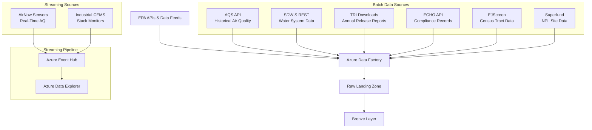
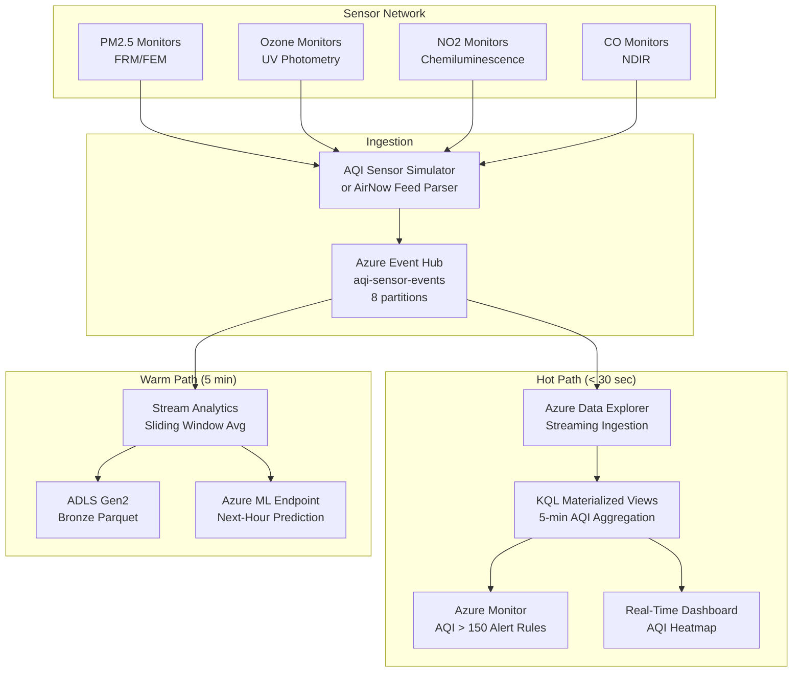
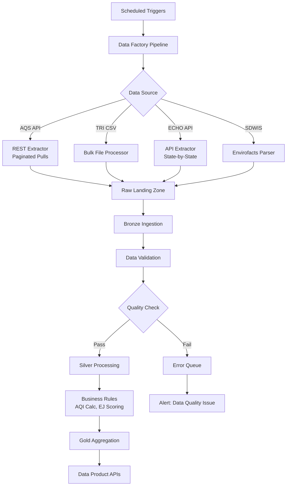
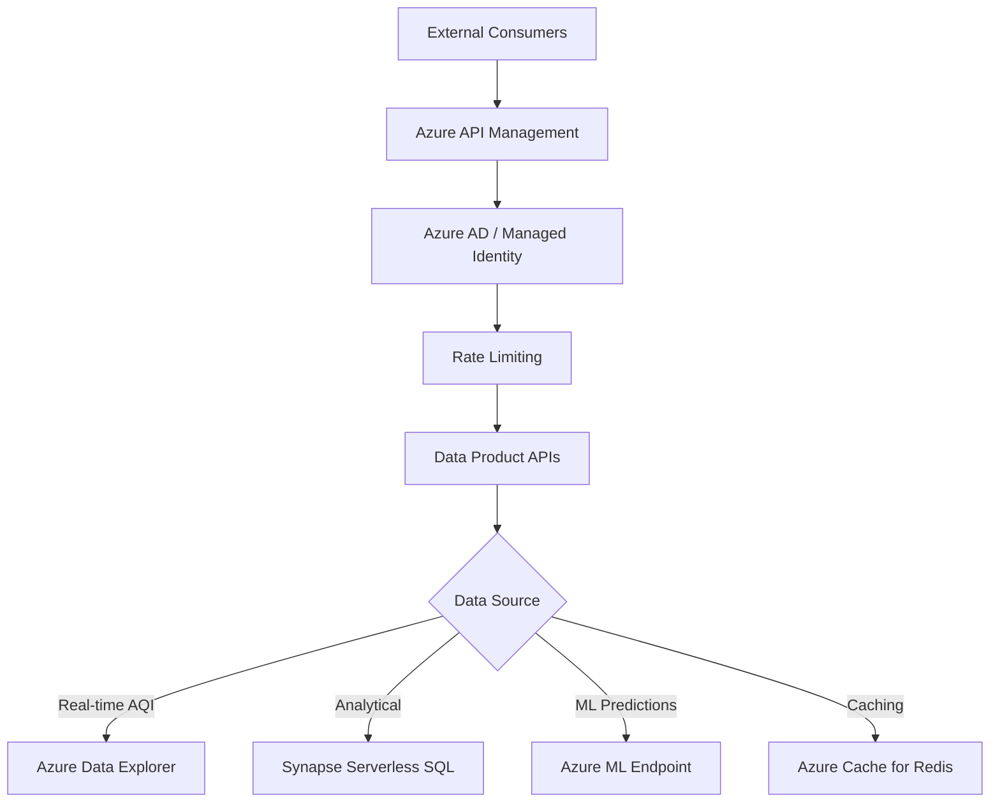

# EPA Environmental Monitoring Analytics Architecture

## Overview

The EPA Environmental Monitoring Analytics platform is built on Azure Cloud Scale Analytics (CSA) and follows a domain-driven design approach. It ingests data from multiple EPA programs — including real-time AQI sensor streaming — transforms it through a medallion architecture (Bronze → Silver → Gold), and provides analytical insights for air quality prediction, environmental justice analysis, and emissions compliance monitoring.

## Domain Context

### Environmental Monitoring Landscape

The EPA manages an extensive network of environmental monitoring programs:

- **AQS / AirNow**: 4,000+ air quality monitoring stations measuring criteria pollutants (PM2.5, PM10, O3, NO2, SO2, CO, Pb) with real-time and quality-assured historical data
- **SDWIS (Safe Drinking Water Information System)**: 25,000+ public water systems with compliance, violation, and enforcement data
- **TRI (Toxics Release Inventory)**: Annual reports from 20,000+ industrial facilities detailing chemical releases to air, water, and land
- **ECHO (Enforcement and Compliance History Online)**: Integrated compliance data across Clean Air Act (CAA), Clean Water Act (CWA), and Resource Conservation and Recovery Act (RCRA)
- **EJScreen**: Environmental justice screening tool with demographic and environmental indicator data at the Census tract level
- **Superfund / CERCLIS**: 1,300+ National Priorities List (NPL) sites with contaminant, remediation, and community health data

### Data Characteristics

- **Volume**: Billions of AQI readings, millions of compliance records, hundreds of thousands of facility reports
- **Velocity**: Real-time AQI sensor data every 1–5 minutes; TRI annual submissions; ECHO monthly updates
- **Variety**: Structured (AQI readings, compliance records), semi-structured (facility inspection reports), geospatial (monitor locations, census tract boundaries, plume models)
- **Veracity**: EPA applies rigorous QA/QC protocols; however, AirNow preliminary data may differ from quality-assured AQS data by 6–12 months

## Architecture Layers

### Data Ingestion Layer



#### Ingestion Patterns

**AirNow API**
- REST API with JSON responses
- Rate limit: 500 requests/hour per API key
- Data includes current AQI, pollutant concentrations, and forecasts
- Coverage: 500+ metropolitan areas, all 50 states

**AQS (Air Quality System) API**
- REST API with email/key authentication
- Quality-assured data with 6–12 month lag behind real-time
- Supports filtering by parameter, date range, bounding box, and site
- Daily, annual, and sample-level data granularity

**SDWIS**
- Envirofacts API (JSON/XML) for water system records
- Violation, enforcement, and water system inventory tables
- Updated monthly; some data quarterly
- Searchable by water system ID, state, or violation type

**TRI (Toxics Release Inventory)**
- Annual CSV bulk downloads and TRI Explorer API
- Reporting year lag: 18 months (e.g., 2022 data available mid-2024)
- 650+ reportable chemicals with release media breakdown
- Facility-level detail with latitude/longitude

**ECHO**
- REST API with no authentication required
- Integrates CAA, CWA, RCRA, and SDWIS compliance data
- Supports detailed facility search and compliance history
- Maximum 10,000 records per query (pagination required)

### Bronze Layer (Raw Data)

The Bronze layer preserves raw data from each EPA source system exactly as received.

```sql
-- Example: Bronze AQI observations
CREATE TABLE bronze.brz_air_quality (
    source_system STRING,
    ingestion_timestamp TIMESTAMP,
    site_id STRING,              -- AQS site identifier (SS-CCC-NNNN)
    parameter_code STRING,       -- AQS parameter code (e.g., 88101 = PM2.5)
    poc INT,                     -- Parameter occurrence code
    latitude DECIMAL(9,6),
    longitude DECIMAL(9,6),
    datum STRING,
    parameter_name STRING,
    sample_duration STRING,
    pollutant_standard STRING,
    date_local DATE,
    units_of_measure STRING,
    observation_count INT,
    observation_percent DECIMAL(5,2),
    arithmetic_mean DECIMAL(12,6),
    first_max_value DECIMAL(12,6),
    aqi INT,
    method_code STRING,
    method_name STRING,
    state_code STRING,
    county_code STRING,
    cbsa_name STRING,
    state_name STRING,
    county_name STRING,
    load_time TIMESTAMP,
    _source_file_name STRING,
    record_hash STRING
)
USING DELTA
PARTITIONED BY (date_local, state_code)
```

#### Data Lineage Tracking

- Source API endpoint and query parameters preserved
- Ingestion timestamps for complete audit trails
- MD5 record hashes for deduplication
- Source system version tracking for API changes

### Silver Layer (Cleaned & Conformed)

The Silver layer applies EPA-specific business rules, standardization, and enrichment.

#### Transformation Patterns

**AQI Calculation and Categorization**
- Standardized AQI calculation from raw pollutant concentrations
- EPA breakpoint table application for each criteria pollutant
- Health advisory level assignment (Good, Moderate, USG, Unhealthy, Very Unhealthy, Hazardous)
- Dominant pollutant identification when multiple pollutants measured

**Chemical Classification**
- TRI chemical grouping by toxicity class, carcinogenicity, and persistence
- NAICS industry code standardization for facility classification
- Release media normalization (air, water, land, underground injection, off-site transfer)
- Unit harmonization across different reporting formats

**Geographic Enrichment**
- Census tract assignment for environmental justice analysis
- CBSA (Core Based Statistical Area) mapping
- State/county FIPS code standardization
- Proximity calculation to sensitive receptors (schools, hospitals)

**Compliance Status Derivation**
- Multi-program compliance status aggregation (CAA + CWA + RCRA)
- Significant Non-Compliance (SNC) determination
- Violation duration calculation
- Penalty assessment vs. collection tracking

```sql
-- Example: Silver air quality model
CREATE TABLE silver.slv_air_quality (
    aqi_observation_sk STRING,
    site_id STRING,
    state_code STRING,
    county_code STRING,
    cbsa_name STRING,
    latitude DECIMAL(9,6),
    longitude DECIMAL(9,6),
    observation_date DATE,
    
    -- Pollutant measurements
    pollutant STRING,
    concentration DECIMAL(12,6),
    units STRING,
    aqi_value INT,
    
    -- Health categories
    aqi_category STRING,
    health_advisory_level STRING,
    sensitive_groups_message STRING,
    
    -- Quality indicators
    observation_completeness_pct DECIMAL(5,2),
    is_preliminary BOOLEAN,
    is_valid BOOLEAN,
    data_quality_score DECIMAL(3,2),
    
    -- Metadata
    source_system STRING,
    processed_timestamp TIMESTAMP,
    _dbt_loaded_at TIMESTAMP
)
USING DELTA
PARTITIONED BY (observation_date, state_code)
```

### Gold Layer (Business Analytics)

The Gold layer contains aggregated, enriched data optimized for the three key analytics scenarios.

#### Analytical Models

**1. AQI Prediction and Forecasting**
- Historical pattern analysis by site, season, and pollutant
- Feature engineering for ML model input (lag values, meteorological correlation, seasonal patterns)
- Prediction performance tracking (predicted vs. actual AQI)
- Health advisory trigger frequency and effectiveness

**2. Environmental Justice Analysis**
- Pollution burden index combining AQI, TRI proximity, and Superfund exposure
- Demographic overlay from Census data (income, race/ethnicity, age)
- Disadvantaged community identification (EPA EJScreen methodology)
- Cumulative environmental impact scoring by Census tract

**3. Emissions Compliance Dashboard**
- Facility-level compliance status across all EPA programs
- Violation trend analysis and enforcement action tracking
- Industry-sector compliance comparisons
- Penalty assessment-to-collection ratios

```sql
-- Example: Gold environmental justice model
CREATE TABLE gold.gld_environmental_justice (
    census_tract STRING,
    state STRING,
    county STRING,
    
    -- Demographics
    population INT,
    pct_minority DECIMAL(5,2),
    pct_low_income DECIMAL(5,2),
    pct_under_5 DECIMAL(5,2),
    pct_over_64 DECIMAL(5,2),
    median_household_income INT,
    
    -- Environmental indicators
    avg_aqi DECIMAL(5,1),
    days_above_aqi_100 INT,
    tri_facilities_within_3mi INT,
    total_chemical_releases_lbs DECIMAL(18,2),
    superfund_sites_within_5mi INT,
    wastewater_discharge_sites INT,
    
    -- Composite scores
    ej_burden_score DECIMAL(5,2),
    ej_percentile DECIMAL(5,2),
    ej_category STRING,
    
    -- Metadata
    assessment_year INT,
    report_date DATE,
    _dbt_loaded_at TIMESTAMP
)
USING DELTA
PARTITIONED BY (state)
```

## Streaming Architecture

### Real-Time AQI Monitoring Pipeline

The streaming pipeline handles sub-minute AQI sensor data for real-time air quality alerting and dashboard updates.



### Event Schema

```json
{
  "schema_version": "1.0",
  "source_type": "aqi_monitor",
  "site_id": "060371103",
  "event_time": "2024-07-15T14:30:00Z",
  "measurements": {
    "parameter_code": "88101",
    "parameter_name": "PM2.5",
    "concentration_ug_m3": 35.2,
    "aqi_value": 101,
    "aqi_category": "Unhealthy for Sensitive Groups",
    "method": "FEM"
  },
  "meteorological": {
    "temperature_c": 32.1,
    "relative_humidity_pct": 45,
    "wind_speed_ms": 3.2,
    "wind_direction_deg": 225,
    "mixing_height_m": 1200
  },
  "quality": {
    "flags": [],
    "monitor_status": "operational"
  }
}
```

### ADX Table Design

```kql
// Create AQI streaming table
.create table AqiSensorEvents (
    schema_version: string,
    source_type: string,
    site_id: string,
    event_time: datetime,
    parameter_code: string,
    parameter_name: string,
    concentration: real,
    aqi_value: int,
    aqi_category: string,
    temperature_c: real,
    humidity_pct: real,
    wind_speed_ms: real,
    wind_direction_deg: int,
    mixing_height_m: real,
    quality_flags: dynamic,
    monitor_status: string,
    ingestion_time: datetime
)

// 5-minute aggregation for dashboards
.create materialized-view AqiSite5MinAvg on table AqiSensorEvents {
    AqiSensorEvents
    | summarize
        avg_aqi = avg(aqi_value),
        max_aqi = max(aqi_value),
        avg_concentration = avg(concentration),
        readings = count()
      by site_id, parameter_name, bin(event_time, 5m)
}
```

## Data Flow Architecture

### Batch Processing Pipeline



## Integration Patterns

### API Gateway Architecture



### Data Contracts

```yaml
apiVersion: v1
kind: DataProduct
metadata:
  name: aqi-prediction
  version: "1.0.0"
  domain: epa-air-quality
spec:
  schema:
    format: delta
    primary_key: [site_id, pollutant, prediction_date]
  sla:
    freshness_hours: 24
    availability: 99.5%
  quality:
    completeness: 95%
    accuracy: 90%  # RMSE target for AQI predictions
```

## Security Architecture

### Data Protection

- **Encryption at Rest**: Azure Storage Service Encryption (SSE)
- **Encryption in Transit**: TLS 1.2+ for all API communications
- **Network Security**: VNet integration with private endpoints
- **Access Control**: Azure AD with RBAC; role-based data access

### Federal Compliance

- **FedRAMP**: Azure Government meets FedRAMP High baseline
- **FISMA**: NIST 800-53 control alignment
- **FOIA**: Public data products designed for open access
- **CUI**: Enforcement-sensitive data (ECHO) may require CUI marking — confirm with ISSO

### Data Classification

- **PUBLIC**: AQI readings, TRI releases, EJScreen indicators
- **CUI (potential)**: Enforcement strategy details, pending enforcement actions
- **PII**: Facility owner contact information (redacted in public-facing products)

## Performance Optimization

### Partitioning Strategy

- **Time-based**: `observation_date` for AQI data (daily partitions)
- **Geographic**: `state_code` for compliance and EJ queries
- **Pollutant**: `parameter_code` for single-pollutant analysis
- **Facility**: `facility_id` for facility-level compliance history

### Caching Strategy

- **ADX Result Cache**: Materialized views for real-time AQI aggregations
- **Redis Cache**: Current-condition AQI by metro area (5-minute TTL)
- **CDN**: EJScreen indicator data, chemical reference tables
- **Query Result Cache**: Gold layer query results (1-hour TTL)

## Monitoring & Observability

### Data Quality Monitoring

- **AQI Range Validation**: Flag readings outside 0–500 AQI range
- **Pollutant Concentration Bounds**: Physical limits per pollutant
- **Completeness Monitoring**: Alert when site reporting drops below 75%
- **Cross-Source Reconciliation**: Compare AirNow vs. AQS for overlapping periods

### Streaming Pipeline Health

- **Event Hub Metrics**: Throughput, partition lag, consumer group status
- **ADX Ingestion**: Latency, failure rate, data volume
- **Alert Latency**: Time from AQI threshold breach to alert delivery (target: < 30 seconds)

## Technology Stack

### Core Platform
- **Compute**: Azure Databricks, Azure Data Explorer, Azure Functions
- **Storage**: Azure Data Lake Storage Gen2, Azure SQL Database
- **Streaming**: Azure Event Hubs, Azure Stream Analytics
- **ML**: Azure Machine Learning, MLflow
- **Orchestration**: Azure Data Factory, Azure Logic Apps
- **Analytics**: Azure Synapse Analytics, Power BI

### Development Tools
- **Data Modeling**: dbt (1.7+), Great Expectations
- **Version Control**: Git, Azure DevOps / GitHub
- **CI/CD**: Azure Pipelines, GitHub Actions
- **Monitoring**: Azure Monitor, Application Insights, Grafana
