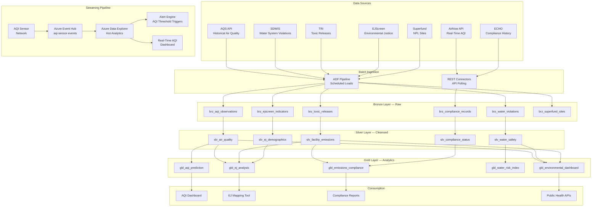
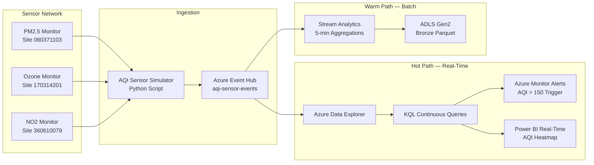

# EPA Environmental Monitoring Analytics Platform

> **Last Updated:** 2026-04-14 | **Status:** Active | **Audience:** Data Engineers

## Table of Contents
- [Overview](#overview)
  - [Key Features](#key-features)
  - [Data Sources](#data-sources)
- [Architecture Overview](#architecture-overview)
- [Real-Time AQI Streaming Architecture](#real-time-aqi-streaming-architecture)
  - [Streaming Quick Start](#streaming-quick-start)
  - [Sample KQL — Real-Time AQI Alerts](#sample-kql--real-time-aqi-alerts)
- [Prerequisites](#prerequisites)
  - [Azure Resources](#azure-resources)
  - [Tools Required](#tools-required)
  - [API Access](#api-access)
- [Quick Start](#quick-start)
  - [1. Environment Setup](#1-environment-setup)
  - [2. Configure API Keys](#2-configure-api-keys)
  - [3. Generate Sample Data](#3-generate-sample-data)
  - [4. Deploy Infrastructure](#4-deploy-infrastructure)
  - [5. Run dbt Models](#5-run-dbt-models)
- [Sample Analytics Scenarios](#sample-analytics-scenarios)
  - [1. Air Quality Prediction with ML](#1-air-quality-prediction-with-ml)
  - [2. Environmental Justice Analysis](#2-environmental-justice-analysis)
  - [3. Emissions Compliance Monitoring](#3-emissions-compliance-monitoring)
- [Data Products](#data-products)
  - [AQI Prediction](#aqi-prediction-aqi-prediction)
  - [Environmental Justice](#environmental-justice-ej-analysis)
  - [Emissions Compliance](#emissions-compliance-emissions-compliance)
- [Configuration](#configuration)
  - [dbt Profiles](#dbt-profiles)
  - [Environment Variables](#environment-variables)
- [Azure Government Notes](#azure-government-notes)
- [Monitoring & Alerts](#monitoring--alerts)
- [Troubleshooting](#troubleshooting)
  - [Common Issues](#common-issues)
- [Contributing](#contributing)
- [License](#license)
- [Acknowledgments](#acknowledgments)

A comprehensive environmental monitoring analytics platform built on Azure Cloud Scale Analytics (CSA), providing insights into air quality, water safety, toxic releases, and environmental justice using official EPA data sources — including real-time AQI sensor streaming for near-real-time air quality dashboards.

## Overview

The Environmental Protection Agency monitors air quality at 4,000+ stations, tracks 25,000+ drinking water systems, catalogs toxic releases from 20,000+ facilities, and manages 1,300+ Superfund sites. This platform ingests, processes, and analyzes EPA data to enable air quality prediction, environmental justice analysis, and emissions compliance monitoring. The streaming pipeline demonstrates real-time AQI sensor data flowing through Azure Event Hub for sub-minute air quality alerting.

### Key Features

- **Real-Time Air Quality Monitoring**: Live AQI data via Event Hub with ML-based prediction
- **Drinking Water Safety**: SDWIS violation tracking with risk-based prioritization
- **Toxic Release Tracking**: TRI facility emissions with trend analysis and community impact
- **Superfund Site Management**: Cleanup progress tracking and community exposure assessment
- **Environmental Justice Analysis**: Overlay pollution data with socioeconomic indicators
- **Regulatory Compliance Dashboards**: Facility-level NESHAP, NPDES, and RCRA compliance

### Data Sources

| Source | Description | URL |
|--------|-------------|-----|
| AirNow API | Real-time and forecast AQI for 500+ metro areas | https://docs.airnowapi.org/ |
| AQS (Air Quality System) | Historical ambient air quality data from monitors | https://aqs.epa.gov/aqsweb/documents/data_api.html |
| SDWIS | Safe Drinking Water Information System — violations & compliance | https://www.epa.gov/enviro/sdwis-search |
| TRI (Toxics Release Inventory) | Chemical releases from industrial facilities | https://www.epa.gov/toxics-release-inventory-tri-program/tri-data-and-tools |
| ECHO | Enforcement and Compliance History Online | https://echo.epa.gov/tools/web-services |
| Envirofacts API | Multi-program environmental data gateway | https://www.epa.gov/enviro/envirofacts-data-service-api |
| EJScreen | Environmental justice screening and mapping | https://www.epa.gov/ejscreen |
| Superfund / CERCLIS | NPL site locations, contaminants, and cleanup status | https://www.epa.gov/superfund/superfund-data-and-reports |

## Architecture Overview



## Real-Time AQI Streaming Architecture

This example includes a streaming pipeline for near-real-time air quality index monitoring:



### Streaming Quick Start

```bash
# Start the AQI sensor simulator
python streaming/aqi_sensor_simulator.py \
  --event-hub-connection "$EVENTHUB_CONNECTION_STRING" \
  --sites "060371103,170314201,360610079" \
  --pollutants "PM2.5,O3,NO2,CO" \
  --interval-seconds 60

# Deploy ADX table and ingestion mapping
az kusto script create \
  --cluster-name epa-adx \
  --database-name airquality \
  --resource-group rg-epa-analytics \
  --script-content @streaming/adx/create_tables.kql
```

### Sample KQL — Real-Time AQI Alerts

```kql
// Locations exceeding "Unhealthy" AQI in the last 30 minutes
AqiSensorEvents
| where ingestion_time() > ago(30m)
| summarize avg_aqi = avg(aqi_value),
            max_aqi = max(aqi_value),
            readings = count()
    by site_id, pollutant, bin(event_time, 5m)
| where avg_aqi > 150
| extend severity = case(
    avg_aqi > 300, "Hazardous",
    avg_aqi > 200, "Very Unhealthy",
    avg_aqi > 150, "Unhealthy",
    "Moderate")
| order by avg_aqi desc
```

## Prerequisites

### Azure Resources
- Azure subscription with contributor access
- Azure Data Factory or Synapse Analytics
- Azure Data Lake Storage Gen2
- Azure Data Explorer cluster (for AQI streaming)
- Azure Event Hub namespace (for AQI streaming)
- Azure Machine Learning workspace (optional, for AQI prediction)
- Azure Key Vault for API credentials

### Tools Required
- Azure CLI (2.55.0 or later)
- dbt CLI (1.7.0 or later)
- Python 3.9+
- Git

### API Access
- AirNow API key (free at https://docs.airnowapi.org/account/request/)
- EPA AQS API credentials (email/key at https://aqs.epa.gov/aqsweb/documents/data_api.html)
- ECHO API (no key required — open access)
- Envirofacts (no key required — open access)

## Quick Start

### 1. Environment Setup

```bash
# Clone the repository
git clone <repository-url>
cd csa-inabox/examples/epa

# Install Python dependencies
pip install -r requirements.txt

# Install dbt packages
cd domains/dbt
dbt deps
```

### 2. Configure API Keys

```bash
# Add to Azure Key Vault or local environment
export AIRNOW_API_KEY="your-airnow-api-key"
export AQS_EMAIL="your-email@example.com"
export AQS_KEY="your-aqs-api-key"
export EVENTHUB_CONNECTION_STRING="your-eventhub-connection"  # For streaming
```

### 3. Generate Sample Data

```bash
# Generate synthetic environmental data
python data/generators/generate_epa_data.py --output-dir domains/dbt/seeds

# Or fetch real data from APIs
python data/open-data/fetch_airnow.py --bbox "-125,24,-66,50" --parameters "PM2.5,O3"
python data/open-data/fetch_tri.py --states "TX,LA,CA" --years "2020,2021,2022"
python data/open-data/fetch_sdwis.py --states "MI,OH,PA"
python data/open-data/fetch_echo.py --program "CAA" --state "CA"
```

### 4. Deploy Infrastructure

```bash
# Configure parameters
cp deploy/params.dev.json deploy/params.local.json
# Edit params.local.json with your values

# Deploy using Azure CLI
az deployment group create \
  --resource-group rg-epa-analytics \
  --template-file ../../deploy/bicep/DLZ/main.bicep \
  --parameters @deploy/params.local.json
```

### 5. Run dbt Models

```bash
cd domains/dbt

# Test connections
dbt debug

# Load seed data
dbt seed

# Run models
dbt run

# Run tests
dbt test

# Generate documentation
dbt docs generate
dbt docs serve
```

## Sample Analytics Scenarios

### 1. Air Quality Prediction with ML

Use historical AQI data combined with meteorological features to predict next-day air quality for proactive health advisories.

```sql
-- AQI prediction performance by metro area
SELECT
    metro_area,
    pollutant,
    prediction_date,
    predicted_aqi,
    actual_aqi,
    prediction_error,
    model_confidence,
    contributing_factors,
    health_advisory_level
FROM gold.gld_aqi_prediction
WHERE prediction_date >= CURRENT_DATE - INTERVAL '30 days'
    AND pollutant = 'PM2.5'
ORDER BY metro_area, prediction_date;
```

### 2. Environmental Justice Analysis

Overlay TRI toxic release data and AQI readings with Census socioeconomic indicators to identify disproportionately burdened communities.

```sql
-- Communities with highest environmental burden
SELECT
    census_tract,
    state,
    county,
    population,
    pct_minority,
    pct_low_income,
    avg_aqi,
    tri_facilities_within_3mi,
    total_chemical_releases_lbs,
    superfund_sites_within_5mi,
    ej_burden_score,
    ej_percentile
FROM gold.gld_ej_analysis
WHERE ej_percentile >= 90
ORDER BY ej_burden_score DESC
LIMIT 50;
```

### 3. Emissions Compliance Monitoring

Track facility-level compliance with Clean Air Act (CAA), Clean Water Act (CWA), and RCRA regulations, identifying repeat violators and enforcement gaps.

```sql
-- Facilities with ongoing violations
SELECT
    facility_id,
    facility_name,
    city,
    state,
    program_area,
    violation_type,
    violation_start_date,
    days_in_violation,
    penalties_assessed_usd,
    penalties_collected_usd,
    inspection_count_3yr,
    compliance_status
FROM gold.gld_emissions_compliance
WHERE compliance_status = 'SIGNIFICANT_VIOLATION'
    AND days_in_violation > 180
ORDER BY days_in_violation DESC;
```

## Data Products

### AQI Prediction (`aqi-prediction`)
- **Description**: Next-day AQI forecasts with confidence intervals by metro area
- **Freshness**: Daily model runs, real-time streaming for current conditions
- **Coverage**: 500+ metro areas, 6 criteria pollutants
- **API**: `/api/v1/aqi-prediction`

### Environmental Justice (`ej-analysis`)
- **Description**: Census tract-level environmental burden scoring with demographic overlays
- **Freshness**: Quarterly updates (aligned with EJScreen releases)
- **Coverage**: All U.S. Census tracts (~74,000)
- **API**: `/api/v1/ej-analysis`

### Emissions Compliance (`emissions-compliance`)
- **Description**: Facility-level regulatory compliance status across CAA, CWA, RCRA
- **Freshness**: Monthly updates from ECHO
- **Coverage**: 800,000+ regulated facilities
- **API**: `/api/v1/emissions-compliance`

## Configuration

### dbt Profiles

Add to your `~/.dbt/profiles.yml`:

```yaml
epa_analytics:
  target: dev
  outputs:
    dev:
      type: databricks
      host: "{{ env_var('DBT_HOST') }}"
      http_path: "{{ env_var('DBT_HTTP_PATH') }}"
      token: "{{ env_var('DBT_TOKEN') }}"
      schema: epa_dev
      catalog: dev
    prod:
      type: databricks
      host: "{{ env_var('DBT_HOST_PROD') }}"
      http_path: "{{ env_var('DBT_HTTP_PATH_PROD') }}"
      token: "{{ env_var('DBT_TOKEN_PROD') }}"
      schema: epa
      catalog: prod
```

### Environment Variables

```bash
# Required for data fetching
AIRNOW_API_KEY=your-airnow-api-key
AQS_EMAIL=your-email@example.com
AQS_KEY=your-aqs-api-key
EVENTHUB_CONNECTION_STRING=your-eventhub-connection

# Required for dbt
DBT_HOST=your-databricks-host
DBT_HTTP_PATH=your-sql-warehouse-path
DBT_TOKEN=your-access-token

# Optional
EPA_LOG_LEVEL=INFO
EPA_BATCH_SIZE=5000
ADX_CLUSTER_URI=https://epa-adx.region.kusto.windows.net
```

## Azure Government Notes

This example is compatible with Azure Government (US) regions. When deploying to Azure Government:

- Use `usgovvirginia` or `usgovarizona` as your Azure region
- Update ARM/Bicep endpoint references to `.usgovcloudapi.net`
- ADX and Event Hub are available in Azure Government
- AirNow and AQS APIs are publicly accessible from government networks
- ECHO data may contain enforcement-sensitive details — confirm classification with your ISSO
- EJScreen data is public and unrestricted

## Monitoring & Alerts

- **Streaming Health**: Event Hub throughput, ADX ingestion latency, alert trigger rates
- **AQI Thresholds**: Automated alerts when AQI exceeds 100 (Unhealthy for Sensitive Groups)
- **Data Freshness**: Alerts when AirNow feeds or TRI annual submissions are overdue
- **Data Quality**: Automated tests on pollutant ranges, geographic bounds, and completeness
- **Cost Management**: ADX auto-scale monitoring with spend guardrails

## Troubleshooting

### Common Issues

1. **AirNow API Rate Limits**: Limited to 500 requests/hour per key. Use the `--delay` parameter and cache responses.
2. **AQS Data Lag**: Quality-assured AQS data lags 6–12 months behind real-time AirNow data. Use AirNow for current conditions, AQS for historical analysis.
3. **TRI Reporting Year Lag**: TRI data is reported annually with an 18-month delay. The most recent year available is typically two years prior.
4. **ECHO Pagination**: ECHO API returns max 10,000 records per query. Use `--state-filter` and `--program-filter` to partition requests.
5. **Sensor Simulator Memory**: For large-scale simulations (100+ sites), increase the `--batch-size` parameter to reduce event hub calls.

## Contributing

1. Fork the repository
2. Create a feature branch (`git checkout -b feature/new-data-source`)
3. Make changes and add tests
4. Run quality checks (`make lint test`)
5. Submit a pull request

## License

This project is licensed under the MIT License. See `LICENSE` file for details.

## Acknowledgments

- EPA for comprehensive environmental monitoring data and open APIs
- AirNow for real-time air quality data infrastructure
- Azure Cloud Scale Analytics team for the foundational platform
- Contributors and the open-source community

---

## Related Documentation

- [EPA Architecture](ARCHITECTURE.md) - Detailed platform architecture and design decisions
- [Examples Index](../README.md) - Overview of all CSA-in-a-Box example verticals
- [Platform Architecture](../../docs/ARCHITECTURE.md) - Core CSA platform architecture
- [Getting Started Guide](../../docs/GETTING_STARTED.md) - Platform setup and onboarding
- [NOAA Climate Analytics](../noaa/README.md) - Related environmental/climate vertical
- [USDA Agricultural Analytics](../usda/README.md) - Related agriculture/environment vertical
