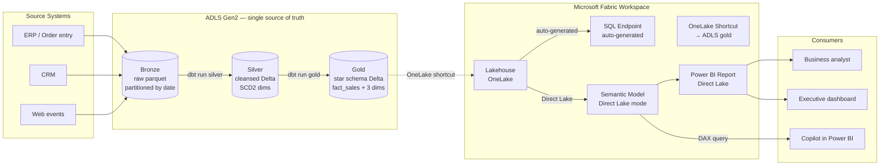
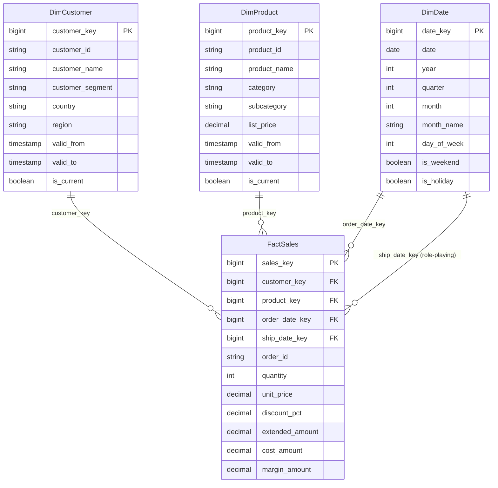
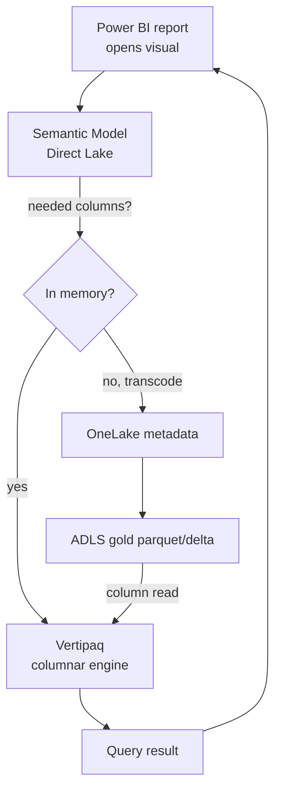
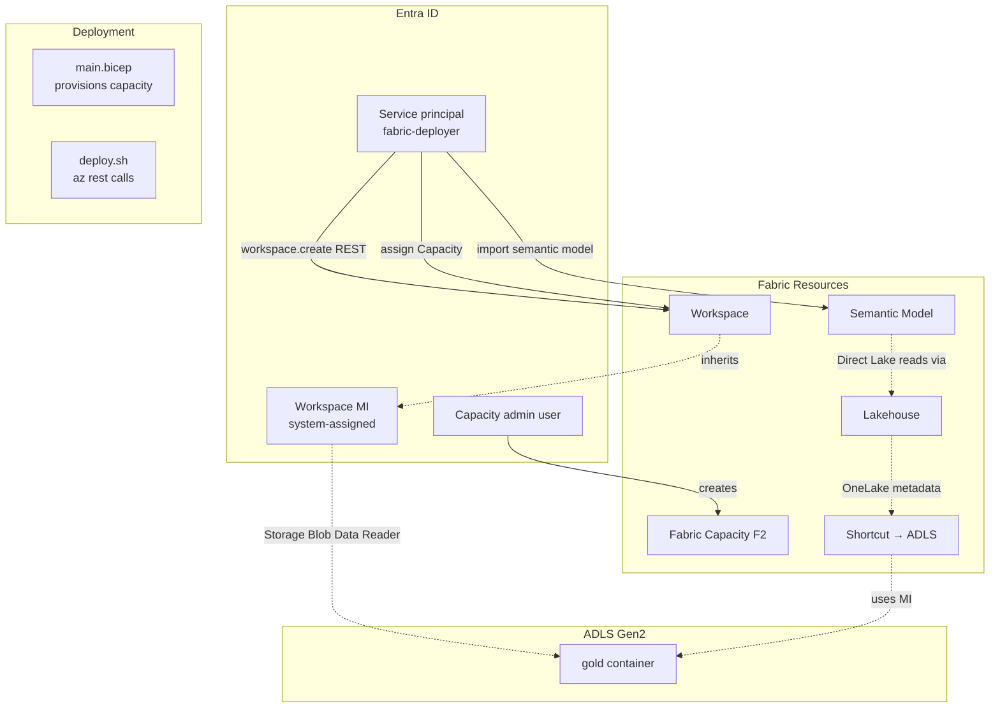
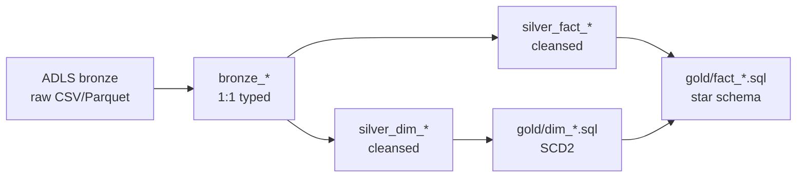
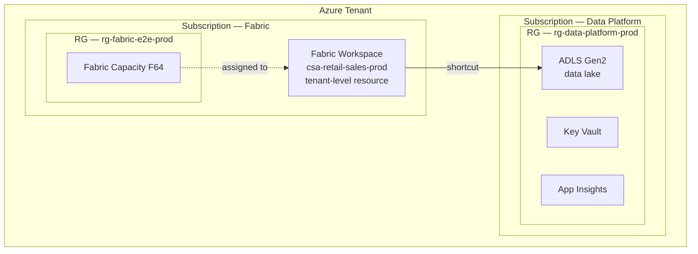
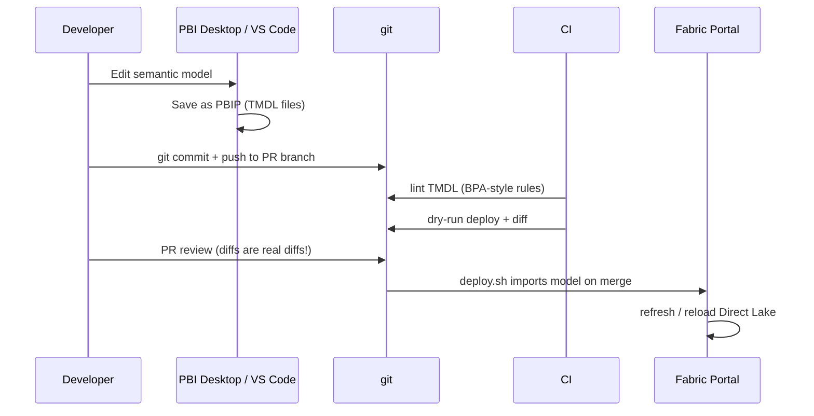

# Architecture — Fabric E2E Retail Sales

## High-level data flow

**Key design choice:** ADLS gold is the **source of truth**, not OneLake. We use a OneLake shortcut so Fabric reads gold via OneLake metadata + ADLS bytes — zero copy, single retention story, multi-cloud-friendly.

## Star schema (gold layer)

Surrogate keys (`*_key`) are bigint identity values; natural keys (`*_id`) are kept for traceability. SCD Type 2 on dimensions via `valid_from` / `valid_to` / `is_current`.

## Direct Lake mode mechanics

- First query for a column = transcode from parquet to Vertipaq columnar (fast, ~ms).
- Subsequent queries hit the in-memory cache — same as Import mode.
- When ADLS gold is updated by dbt, Direct Lake **picks up the new data on next query** — no refresh job.
- Capacity throttling: Direct Lake throttles to DirectQuery if memory pressure exceeds the F-SKU's allocation. Right-size your capacity for your model.

## Identity & secrets flow

**Auth model:**
- Capacity admin assigns the SP to the workspace as `Member` (REST: `groups/{id}/users`).
- Workspace MI gets `Storage Blob Data Reader` on the ADLS gold container — that's how the OneLake shortcut authenticates to ADLS.
- End users get Power BI roles on the workspace + RLS roles on the semantic model.
- No SAS tokens, no embedded keys.

## dbt project layout

| Layer | dbt materialization | Tests |
|-------|---------------------|-------|
| bronze | view (no transformation) | freshness only |
| silver | incremental (insert-only by ingestion_ts) | not_null on PKs |
| gold | dim_*: incremental (SCD2 merge); fact_*: incremental (insert-only) | not_null + unique on surrogate keys; relationships test for FKs |

## Deployment topology

Key:
- **Fabric workspaces are tenant-level resources**, not Azure resources — they don't live in a subscription/RG. They're "assigned to" a capacity.
- Common pattern: capacity in one subscription, data lake in another. Cross-sub access works because shortcut authenticates via workspace MI which gets RBAC at the storage level.

## TMDL workflow

This is the **whole point** of using PBIP / TMDL: the semantic model is **code**. Diff-able, review-able, testable.

## Capacity sizing

| F-SKU | RAM | Recommendation |
|-------|-----|----------------|
| F2 | 3 GB | Dev only — 1-2 users at a time, model <500 MB |
| F4 | 6 GB | Small team test, model <1 GB |
| F8 | 12 GB | Real prod for small workloads, ~5-10 concurrent users |
| F16 | 25 GB | Mid-size prod, 20-30 concurrent |
| F32 | 50 GB | Departmental prod, 50 concurrent |
| F64 | 112 GB | Org-wide prod, 100+ concurrent — also unlocks Copilot in Power BI |

If you want **Copilot in Power BI**, you need **F64 minimum**. This is a real cost cliff; budget accordingly.

## Trade-offs

| ✅ Why this architecture | ⚠️ When to choose differently |
|--------------------------|-------------------------------|
| Single source of truth (ADLS gold) — Fabric is just a consumption surface | If you're all-in on OneLake, can drop ADLS and use OneLake as primary |
| TMDL = real version control for semantic model | If team isn't ready for code workflow, fall back to PBIX in Power BI Desktop (lose diffability) |
| Direct Lake = no refresh, fast queries | If you have complex DAX patterns Direct Lake doesn't yet support, fall back to Import |
| dbt-fabric for transformation | If you have an existing Spark codebase, can use Fabric Notebooks instead |
| Star schema in gold | Wide-table / OBT pattern is cheaper to build but worse for ad-hoc analysis at scale |

## Related

- [README](README.md)
- [`semantic-model/`](semantic-model/retail-sales.SemanticModel/) — the actual TMDL files
- [`dbt/`](dbt/) — transformation project
- [`contracts/`](contracts/) — gold table contracts
- [Pattern — Power BI & Fabric Roadmap](../../docs/patterns/power-bi-fabric-roadmap.md)
- [Reference Architecture — Data Flow (Medallion)](../../docs/reference-architecture/data-flow-medallion.md)
