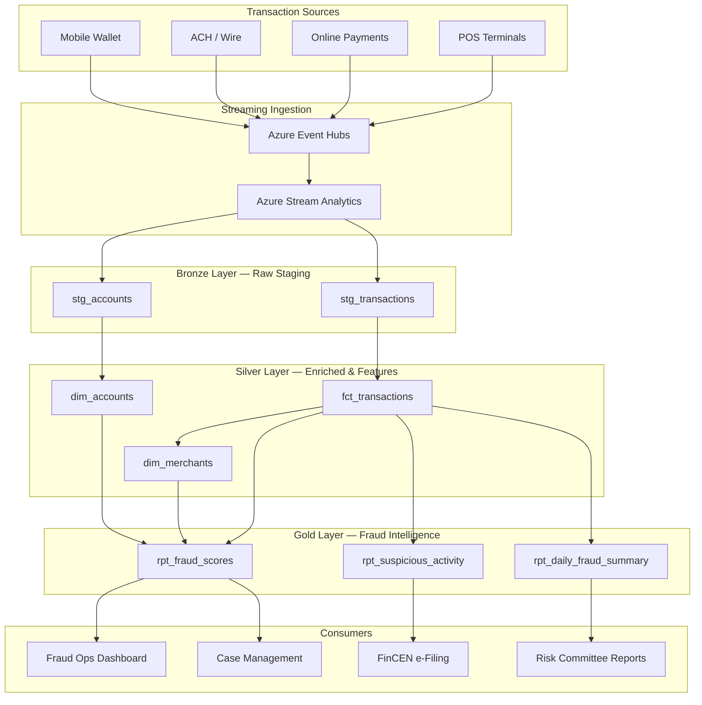

# Financial Fraud Detection — Real-Time Transaction Scoring

> [**Examples**](../README.md) > **Financial Fraud Detection**

> [!TIP]
> **TL;DR** — Real-time transaction fraud detection pipeline built on Azure Cloud Scale Analytics. Ingests payment transactions through a medallion architecture, computes velocity and anomaly features, scores each transaction with an ML model, and produces BSA/AML-compliant suspicious activity reports and daily fraud dashboards.

---

## Table of Contents

- [Overview](#overview)
  - [Key Features](#key-features)
  - [Data Sources](#data-sources)
- [Architecture Overview](#architecture-overview)
- [Business Drivers](#business-drivers)
- [Data Mesh Integration](#data-mesh-integration)
- [Prerequisites](#prerequisites)
- [Quick Start](#quick-start)
- [Data Pipeline](#data-pipeline)
  - [Bronze Layer](#bronze-layer-raw-ingestion)
  - [Silver Layer](#silver-layer-enriched--features)
  - [Gold Layer](#gold-layer-fraud-intelligence)
- [Sample Analytics Scenarios](#sample-analytics-scenarios)
- [Data Products](#data-products)
- [Regulatory Compliance](#regulatory-compliance)
- [Data Contract](#data-contract)
- [Related Resources](#related-resources)
- [Contributing](#contributing)
- [License](#license)

---

## Overview

This example provides a production-ready financial fraud detection platform on Azure CSA. It demonstrates how financial institutions and federal payment processors can ingest transaction streams, compute real-time behavioral features, score transactions against ML models, and generate regulatory reports that satisfy BSA/AML, PCI-DSS, and FinCEN requirements.

All data in this example is **synthetic** and does not represent real financial transactions.

### Key Features

- **Real-Time Transaction Scoring**: Sub-second fraud probability scoring on every transaction using velocity, amount, and behavioral features
- **Velocity Feature Engineering**: Rolling window counts and amounts per account, merchant, and channel
- **Amount Anomaly Detection**: Z-score computation against account-level spending baselines
- **Merchant Risk Profiling**: Risk categorization by MCC code, chargeback history, and geographic patterns
- **SAR Generation**: Automated Suspicious Activity Report aggregation for FinCEN filing
- **Daily Fraud Dashboards**: Operational metrics for fraud operations teams

### Data Sources

| Source | Description | Ingestion |
|--------|-------------|-----------|
| **Payment Transactions** | Card-present and card-not-present transactions | Event Hubs streaming |
| **Account Master** | Customer account profiles and demographics | Batch daily from core banking |
| **Merchant Registry** | Merchant category codes and risk profiles | Batch weekly |
| **Fraud Labels** | Confirmed fraud cases from investigations | Batch daily |

---

## Architecture Overview



---

## Business Drivers

### Regulatory Compliance

| Requirement | Description | How This Example Addresses It |
|-------------|-------------|-------------------------------|
| **BSA/AML** | Bank Secrecy Act / Anti-Money Laundering | Automated SAR aggregation with FinCEN-aligned fields |
| **PCI-DSS v4** | Payment Card Industry Data Security Standard | Tokenized card data, audit trails, access controls |
| **FinCEN CTR** | Currency Transaction Reports (>$10k) | Threshold-based detection and aggregation |
| **FFIEC BSA Exam** | Federal examination procedures | Documented model governance and validation |
| **Reg E** | Electronic Fund Transfer Act | Dispute tracking and provisional credit monitoring |

### Operational Value

- **False Positive Reduction**: ML scoring reduces manual review queues by 40-60%
- **Detection Latency**: Transaction scoring within seconds of authorization
- **SAR Filing Efficiency**: Automated pre-population reduces analyst time per SAR from hours to minutes
- **Model Transparency**: Feature-level explanations for every score support examiner inquiries

---

## Data Mesh Integration

### Fraud Domain Ownership

The fraud detection vertical operates as a **Fraud Analytics Domain** within the CSA Data Mesh:

| Aspect | Details |
|--------|---------|
| **Domain Owner** | Chief Risk Officer (CRO) |
| **Domain Team** | Fraud Analysts, Data Scientists, BSA Officers |
| **Self-Service Platform** | Databricks workspace + Event Hubs |
| **Governance** | BSA/AML, PCI-DSS, model risk management |

---

## Prerequisites

### Azure Resources

- Azure Subscription with Event Hubs namespace
- Azure Data Lake Storage Gen2 (for medallion layers)
- Azure Databricks Workspace
- Azure Stream Analytics (for real-time ingestion)

### Tools Required

- Azure CLI >= 2.50
- dbt-core >= 1.7 with dbt-databricks adapter
- Python >= 3.10

### Permissions

- `Storage Blob Data Contributor` on ADLS Gen2
- `Event Hubs Data Receiver` on the namespace
- `Contributor` on the Databricks workspace

---

## Quick Start

### 1. Clone and Navigate

```bash
git clone https://github.com/your-org/csa-inabox.git
cd csa-inabox/examples/financial-fraud-detection
```

### 2. Set Up Environment

```bash
cp .env.example .env
# Edit .env with your Azure resource names and connection strings
```

### 3. Load Synthetic Data

```bash
# Upload sample transactions to ADLS Bronze container
az storage blob upload-batch \
  --destination bronze/transactions \
  --source data/ \
  --account-name csadatalakedev
```

### 4. Run dbt Models

```bash
cd domains
dbt seed --profiles-dir .
dbt run --profiles-dir .
dbt test --profiles-dir .
```

### 5. Verify Output

```sql
-- Check fraud scores
SELECT * FROM gold.rpt_fraud_scores
WHERE fraud_probability > 0.7
ORDER BY fraud_probability DESC
LIMIT 20;
```

---

## Data Pipeline

### Bronze Layer — Raw Ingestion

Raw transaction and account data lands in ADLS Gen2 with minimal transformation. Each record preserves the source schema.

| Table | Source | Format | Refresh |
|-------|--------|--------|---------|
| `stg_transactions` | Event Hubs via Stream Analytics | JSON/CSV | Near real-time |
| `stg_accounts` | Core banking batch extract | CSV | Daily |

### Silver Layer — Enriched & Features

Cleansed, deduplicated transactions enriched with velocity features, amount anomaly scores, and merchant risk metadata.

| Table | Description | Key Joins |
|-------|-------------|-----------|
| `fct_transactions` | Enriched transactions with velocity counts, amount z-scores, and channel risk flags | `dim_merchants`, `dim_accounts` |
| `dim_merchants` | Merchant dimension with MCC-based risk categories | — |
| `dim_accounts` | Account dimension with tenure, type, and average spend | — |

### Gold Layer — Fraud Intelligence

Aggregated, business-ready views for fraud operations and regulatory reporting.

| Table | Description | Refresh |
|-------|-------------|---------|
| `rpt_fraud_scores` | Per-transaction fraud probability with ML feature columns | Near real-time |
| `rpt_suspicious_activity` | SAR-ready aggregation by account over 30-day windows | Daily |
| `rpt_daily_fraud_summary` | Daily fraud metrics: volume, rates, amounts, channel breakdown | Daily |

---

## Sample Analytics Scenarios

### 1. High-Risk Transactions in the Last 24 Hours

Identify transactions with elevated fraud scores for immediate review.

```sql
SELECT
    transaction_id,
    account_id,
    amount,
    merchant_name,
    channel,
    fraud_probability,
    velocity_1h,
    amount_zscore
FROM gold.rpt_fraud_scores
WHERE fraud_probability > 0.75
  AND transaction_ts >= DATEADD(HOUR, -24, CURRENT_TIMESTAMP())
ORDER BY fraud_probability DESC;
```

### 2. Structuring Detection — Multiple Sub-$10k Transactions

Flag accounts that may be structuring deposits to avoid Currency Transaction Report thresholds.

```sql
SELECT
    account_id,
    COUNT(*)            AS txn_count,
    SUM(amount)         AS total_amount,
    AVG(amount)         AS avg_amount
FROM silver.fct_transactions
WHERE amount BETWEEN 8000 AND 9999
  AND transaction_ts >= DATEADD(DAY, -7, CURRENT_TIMESTAMP())
GROUP BY account_id
HAVING COUNT(*) >= 3 AND SUM(amount) > 25000
ORDER BY total_amount DESC;
```

### 3. Velocity Spike Detection

Find accounts with unusually high transaction counts in a short window.

```sql
SELECT
    account_id,
    MAX(velocity_1h)    AS max_hourly_velocity,
    MAX(velocity_24h)   AS max_daily_velocity,
    COUNT(*)            AS flagged_txn_count
FROM silver.fct_transactions
WHERE velocity_1h > 10
  AND transaction_ts >= DATEADD(DAY, -1, CURRENT_TIMESTAMP())
GROUP BY account_id
ORDER BY max_hourly_velocity DESC;
```

### 4. Cross-Channel Anomaly

Detect accounts transacting across multiple channels in a short window, a common fraud indicator.

```sql
SELECT
    account_id,
    COUNT(DISTINCT channel) AS channel_count,
    COUNT(*)                AS txn_count,
    SUM(amount)             AS total_amount,
    MIN(transaction_ts)     AS first_txn,
    MAX(transaction_ts)     AS last_txn
FROM silver.fct_transactions
WHERE transaction_ts >= DATEADD(HOUR, -4, CURRENT_TIMESTAMP())
GROUP BY account_id
HAVING COUNT(DISTINCT channel) >= 3
ORDER BY channel_count DESC;
```

---

## Data Products

| Data Product | Description | Consumers |
|-------------|-------------|-----------|
| **Transaction Fraud Scores** | Per-transaction ML probability with feature explanations | Fraud Ops, Case Management |
| **Suspicious Activity Reports** | FinCEN-aligned SAR aggregation with account narratives | BSA Officer, Compliance, Regulators |
| **Daily Fraud Summary** | Operational metrics: approval rates, fraud rates, loss amounts | CRO, Risk Committee, Audit |
| **Merchant Risk Profiles** | MCC-based risk scoring with chargeback and velocity history | Merchant Acquiring, Underwriting |

---

## Regulatory Compliance

### BSA/AML

The gold-layer `rpt_suspicious_activity` model produces SAR-ready output aligned with FinCEN e-filing requirements. Fields include subject identification, suspicious activity characterization, and cumulative transaction amounts over the reporting window.

### PCI-DSS v4

This example does not store raw card numbers. All synthetic data uses tokenized account identifiers. In production, card-present data should flow through a PCI-compliant tokenization service before reaching the Bronze layer.

### FinCEN Currency Transaction Reports

The `fct_transactions` model flags individual transactions exceeding $10,000 and aggregates same-day transactions per account to detect structuring patterns below the CTR threshold.

See also: [Compliance — PCI-DSS v4](../../docs/compliance/pci-dss-v4.md)

---

## Data Contract

The `contracts/transactions.yml` data contract defines the schema, quality thresholds, and source configuration for the transaction data product.

Key guarantees:
- **Freshness**: Transactions available in Silver within 5 minutes of authorization
- **Completeness**: >= 99.9% of transactions ingested without data loss
- **Accuracy**: Fraud scores validated against labeled holdout set (AUC > 0.92)
- **Availability**: 99.9% uptime for Gold layer query access

---

## Related Resources

- [Industry — Financial Services](../../docs/industries/financial-services.md) — CSA patterns for financial institutions
- [Tutorial 05 — Streaming Lambda](../../docs/tutorials/05-streaming-lambda/README.md) — Streaming architecture patterns
- [Example — ML Lifecycle](../ml-lifecycle/README.md) — End-to-end MLflow model management
- [Compliance — PCI-DSS v4](../../docs/compliance/pci-dss-v4.md) — Payment card security standard
- [FinCEN BSA/AML Resources](https://www.fincen.gov/resources/statutes-and-regulations) — Federal BSA/AML regulations
- [FFIEC BSA/AML Examination Manual](https://bsaaml.ffiec.gov/manual) — Examination procedures

---

## Contributing

1. Fork the repository
2. Create a feature branch: `git checkout -b feature/fraud-detection-enhancement`
3. Follow existing coding conventions and data contract patterns
4. Submit a pull request with test evidence

---

## License

This project is part of [CSA-in-a-Box](../../README.md) and follows the repository-level license.

## Directory Structure

```text
financial-fraud-detection/
├── contracts/                # Data product contracts (schemas, SLOs, owners)
│   └── transactions.yml
├── data/                     # Synthetic sample data
│   └── sample_transactions.csv
├── domains/                  # dbt models (bronze / silver / gold)
│   ├── bronze/
│   │   ├── stg_transactions.sql
│   │   └── stg_accounts.sql
│   ├── silver/
│   │   ├── fct_transactions.sql
│   │   ├── dim_merchants.sql
│   │   └── dim_accounts.sql
│   └── gold/
│       ├── rpt_fraud_scores.sql
│       ├── rpt_suspicious_activity.sql
│       └── rpt_daily_fraud_summary.sql
└── README.md                 # This file
```
