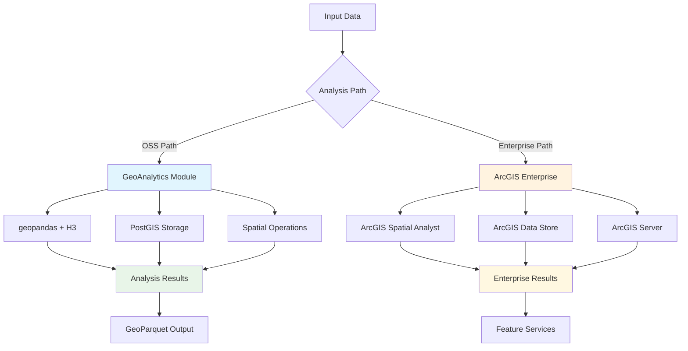

# GeoAnalytics Examples

This directory contains examples demonstrating the CSA-in-a-Box GeoAnalytics module, which provides open-source geospatial analysis capabilities as an alternative to ArcGIS.

## Overview

The GeoAnalytics module offers comprehensive spatial analysis tools built on proven open-source libraries:



## Architecture Comparison

| Capability | OSS GeoAnalytics | ArcGIS Enterprise |
|------------|------------------|-------------------|
| **Data Loading** | geopandas (GeoJSON, Shapefile, GeoParquet) | ArcGIS Data Store, Feature Services |
| **Spatial Operations** | Shapely, PostGIS functions | ArcGIS Spatial Analyst |
| **Coordinate Systems** | pyproj, PROJ | ArcGIS projection engine |
| **Hexagonal Indexing** | H3 library | ArcGIS Pro Tessellation |
| **Database Storage** | PostGIS on PostgreSQL | Enterprise Geodatabase |
| **Visualization** | matplotlib, folium | ArcGIS Maps, Web Maps |
| **Cloud Integration** | Azure Identity, ADLS | ArcGIS Online, Portal |

## Prerequisites

Install the required geospatial libraries:

```bash
# Core geospatial stack
pip install geopandas h3 pyproj shapely

# Database connectivity
pip install sqlalchemy geoalchemy2 psycopg2-binary

# Azure integration
pip install azure-identity azure-storage-blob

# Visualization (optional)
pip install matplotlib folium

# For Databricks/Spark integration
pip install apache-sedona pyspark
```

## Examples

### 1. Environmental Analysis (`environmental_analysis.py`)

Comprehensive spatial analysis demonstrating:

- **Data Loading**: EPA facility locations and Census county boundaries
- **Spatial Joins**: Assign facilities to counties using spatial relationships
- **H3 Indexing**: Create hexagonal grid for pollution density analysis
- **Aggregation**: Calculate pollution metrics by administrative boundaries
- **Visualization**: Generate maps and statistical summaries

**Usage:**

```bash
# Basic analysis
python examples/geoanalytics/environmental_analysis.py

# With visualization
python examples/geoanalytics/environmental_analysis.py --plot

# Custom output directory
python examples/geoanalytics/environmental_analysis.py --output-dir ./my_analysis

# Higher resolution H3 grid
python examples/geoanalytics/environmental_analysis.py --h3-resolution 9
```

**Outputs:**
- `epa_facilities_analyzed.parquet` - Processed facility data
- `county_pollution_stats.parquet` - County-level aggregations
- `h3_pollution_grid.parquet` - Hexagonal grid with pollution density
- `analysis_summary.json` - Summary statistics
- `environmental_analysis.png` - Visualization plots (with --plot)

## Module Components

### Core Classes

- **`GeoProcessor`** - Main processing class for data loading, transformation, and analysis
- **`H3Indexer`** - Hexagonal spatial indexing using H3 library
- **`SpatialJoiner`** - Spatial relationship operations between datasets
- **`PostGISStore`** - PostgreSQL/PostGIS database integration

### Key Capabilities

1. **Data Loading**
   - GeoParquet, GeoJSON, Shapefiles, CSV with coordinates
   - Azure Data Lake Storage integration
   - Automatic CRS detection and handling

2. **Spatial Operations**
   - Coordinate system transformations
   - Buffer, clip, union, intersection operations
   - Distance calculations (geodesic and planar)

3. **H3 Hexagonal Indexing**
   - Point-to-H3 and polygon-to-H3 conversion
   - H3 grid generation for spatial aggregation
   - Multiple resolution levels (0-15)

4. **Database Integration**
   - PostGIS table read/write operations
   - Spatial indexing and optimization
   - Complex spatial SQL query execution

## Configuration

The module uses a configuration class for customization:

```python
from csa_platform.geoanalytics import GeoProcessingConfig, GeoProcessor

config = GeoProcessingConfig(
    default_crs="EPSG:4326",              # Default coordinate system
    h3_resolution=8,                       # H3 hexagon resolution
    buffer_distance_meters=1000.0,         # Default buffer distance
    azure_storage_account="mystorageacct", # Azure storage integration
    azure_container="geoanalytics"         # Container for geo data
)

processor = GeoProcessor(config)
```

## Data Sources

Common geospatial data sources for CSA applications:

- **EPA**: Environmental facility data, air quality monitoring
- **Census**: Administrative boundaries, demographic data
- **USGS**: Topographic data, water resources
- **NOAA**: Weather, climate, coastal data
- **OpenStreetMap**: Road networks, points of interest

## Performance Considerations

- **Large Datasets**: Use GeoParquet for efficient storage and loading
- **Coordinate Systems**: Choose appropriate projected CRS for analysis
- **H3 Resolution**: Balance granularity with computational cost
- **Database Indexing**: Create spatial indexes for large PostGIS tables
- **Memory Management**: Process data in chunks for very large datasets

## Integration with Azure

The module supports Azure cloud integration:

- **Authentication**: Uses `DefaultAzureCredential` for managed identity
- **Storage**: Direct read/write to Azure Data Lake Storage
- **Databases**: Azure Database for PostgreSQL with PostGIS extension
- **Compute**: Compatible with Azure Databricks and Synapse Analytics

## Next Steps

1. **Explore Notebooks**: Check `notebooks/geoanalytics/` for interactive examples
2. **Database Setup**: Configure PostGIS for persistent spatial data storage
3. **Custom Analysis**: Adapt examples for your specific use cases
4. **Performance Tuning**: Optimize for your data sizes and complexity

## Support

For questions about GeoAnalytics examples:

1. Check module documentation in `csa_platform/geoanalytics/`
2. Review test cases for additional usage patterns
3. Consult PostGIS and geopandas documentation for advanced operations