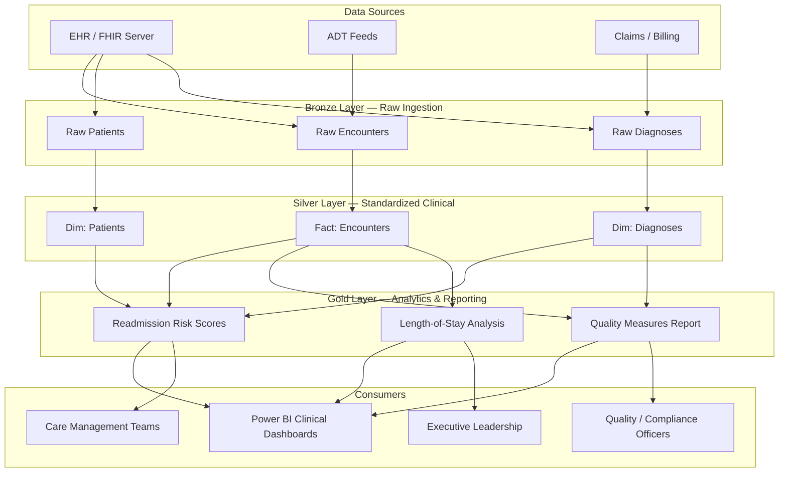

# Healthcare Clinical Analytics — Patient Outcomes & Readmission Risk

> [**Examples**](../README.md) > **Healthcare Clinical Analytics**


> [!TIP]
> **TL;DR** — Clinical analytics platform that ingests EHR/FHIR encounter, patient, and diagnosis data through a medallion architecture to produce readmission risk scores, length-of-stay optimization insights, and CMS quality measure reporting. All data is **synthetic and fully de-identified** under HIPAA Safe Harbor; no real PHI is included anywhere in this example.


---

## Overview

This example demonstrates a production-ready clinical analytics pipeline built on Azure Cloud Scale Analytics (CSA). It transforms raw EHR encounter data into actionable insights for care quality improvement, readmission reduction, and regulatory reporting through bronze/silver/gold layers.

> [!WARNING]
> **No real Protected Health Information (PHI) is included.** Every record is synthetic, computer-generated data satisfying HIPAA Safe Harbor de-identification (45 CFR 164.514(b)(2)). Do not load real patient data without a full HIPAA security assessment.


---

## Architecture Overview




---

## Prerequisites

### Azure Resources

- Azure Subscription with Azure Data Lake Storage Gen2
- Azure Databricks Workspace or Microsoft Fabric Lakehouse
- Azure Key Vault (for connection strings and secrets)
- Power BI Premium or Pro capacity (for dashboards)

### Tools Required

- Azure CLI >= 2.50
- dbt-core >= 1.7 with dbt-databricks or dbt-fabric adapter
- Python >= 3.10

### Permissions

- `Storage Blob Data Contributor` on ADLS Gen2
- Databricks workspace access with cluster create/attach privileges


---

## Quick Start

### 1. Clone and Navigate

```bash
git clone https://github.com/your-org/csa-inabox.git
cd csa-inabox/examples/healthcare-clinical
```

### 2. Upload Sample Data to Bronze

```bash
az storage blob upload-batch \
  --destination bronze/clinical \
  --source data/ \
  --account-name csadatalakedev
```

### 3. Run dbt Models

```bash
cd domains
dbt seed --profiles-dir .
dbt run --profiles-dir .
dbt test --profiles-dir .
```

### 4. Explore Gold Layer

Connect Power BI to the gold schema tables (`rpt_readmission_risk`, `rpt_quality_measures`, `rpt_los_analysis`) or query them directly in Databricks SQL.


---

## Data Pipeline

### Bronze Layer — Raw Ingestion

Raw data lands in ADLS Gen2 preserving the original schema from EHR/FHIR exports. No transformations are applied at this stage.

| Model | Source | Description |
|-------|--------|-------------|
| `stg_encounters` | EHR ADT / FHIR | Raw encounter/visit records with admit and discharge dates |
| `stg_patients` | EHR / FHIR | De-identified patient demographics (age group, gender, zip) |
| `stg_diagnoses` | EHR / Claims | ICD-10 diagnosis codes linked to encounters |


### Silver Layer — Standardized Clinical

Cleansed, validated, and enriched with derived clinical attributes. Encounters gain length-of-stay calculations and readmission flags. Diagnoses are grouped into Clinical Classifications Software (CCS) categories.

| Model | Description | Key Enrichments |
|-------|-------------|-----------------|
| `fct_encounters` | Enriched encounters with LOS and readmission flags | Length-of-stay, 30-day readmission flag, discharge disposition |
| `dim_patients` | Patient dimension with risk factors | Age-based risk tier, chronic condition flag |
| `dim_diagnoses` | Diagnosis dimension with CCS groupings | CCS category, primary/secondary flag, clinical domain |


### Gold Layer — Analytics & Reporting

Business-ready views designed for direct consumption by Power BI dashboards and clinical operations teams.

| Model | Description | Refresh |
|-------|-------------|---------|
| `rpt_readmission_risk` | 30-day readmission risk score per patient with contributing factors | Daily |
| `rpt_quality_measures` | CMS quality measure calculations including readmission rates by condition | Daily |
| `rpt_los_analysis` | Length-of-stay analysis by DRG, facility, and time period | Daily |


---

## Sample Analytics Scenarios

### 1. Readmission Risk Prediction

Identify patients at highest risk of 30-day readmission using a composite score that weights diagnosis complexity, prior admission history, length of stay, and patient risk tier. Care management teams use these scores to prioritize post-discharge follow-up calls and home health referrals.

```sql
SELECT patient_id, readmission_risk_score, risk_tier, top_risk_factors
FROM gold.rpt_readmission_risk
WHERE risk_tier IN ('High', 'Critical')
ORDER BY readmission_risk_score DESC
LIMIT 25;
```

### 2. Length-of-Stay Optimization

Compare actual vs. expected length-of-stay by DRG and facility to identify variation drivers. Facilities with consistently higher-than-expected LOS may benefit from care pathway standardization or discharge planning interventions.

```sql
SELECT facility, drg_code, avg_los_days, expected_los_days,
       ROUND(avg_los_days - expected_los_days, 1) AS los_variance
FROM gold.rpt_los_analysis
WHERE encounter_count >= 10
ORDER BY los_variance DESC;
```

### 3. Quality Measure Reporting

Calculate CMS all-cause readmission rates by condition category for value-based purchasing programs. Track trends over rolling 12-month windows and compare against national benchmarks.

```sql
SELECT condition_category, measure_period,
       readmission_rate, national_benchmark,
       CASE WHEN readmission_rate > national_benchmark THEN 'Above'
            ELSE 'At or Below' END AS benchmark_status
FROM gold.rpt_quality_measures
ORDER BY measure_period DESC, readmission_rate DESC;
```


---

## Data Products

| Data Product | Description | Consumers |
|-------------|-------------|-----------|
| **Readmission Risk Scores** | Per-patient 30-day readmission probability with ranked contributing factors | Care managers, discharge planners, population health teams |
| **Quality Measures Dashboard** | CMS readmission rates by condition, facility, and time period with benchmark comparison | Quality officers, CMO, compliance teams |
| **LOS Analytics** | Length-of-stay distributions and variance analysis by DRG, facility, and payer | Operations leaders, CFO, utilization review |


---

## Data Contract

The `contracts/clinical.yml` data contract defines sources, column-level tests, and quality expectations for the clinical data pipeline.

Key guarantees:
- **Freshness**: Encounters available in Silver within 24 hours of discharge
- **Completeness**: >= 99% of encounters have valid patient and diagnosis linkage
- **Accuracy**: ICD-10 codes validated against CMS reference; readmission flags verified against discharge dates


---

## HIPAA and Compliance Considerations

This example is built around **synthetic, fully de-identified data** and does not contain any real Protected Health Information (PHI).

### De-identification Approach

All sample data satisfies the **HIPAA Safe Harbor** method (45 CFR 164.514(b)(2)):

- **No direct identifiers**: No names, Social Security numbers, medical record numbers, or device identifiers
- **Date generalization**: Only month/year granularity for admit and discharge dates
- **Geographic generalization**: ZIP codes truncated to 3-digit prefix
- **Age generalization**: Ages represented as age groups, not exact values
- **Small cell suppression**: Any category with fewer than 5 observations is suppressed

### Production Deployment Considerations

When adapting this example for real clinical data, ensure the following are in place before loading any PHI:

1. **HIPAA Security Risk Assessment** completed and documented
2. **Business Associate Agreements (BAAs)** executed with all cloud providers
3. **Azure HIPAA/HITRUST compliance** configuration enabled (encryption at rest, TLS in transit, audit logging)
4. **Role-based access control** with minimum necessary access principles
5. **Audit logging** enabled on all data stores and compute resources
6. **Data Loss Prevention (DLP)** policies configured to detect PHI in unauthorized locations
7. **Breach notification procedures** documented and tested


---

## Directory Structure

```text
healthcare-clinical/
├── contracts/               # Data product contracts (schemas, tests)
│   └── clinical.yml
├── data/                    # Synthetic sample data (NO real PHI)
│   └── sample_encounters.csv
├── domains/                 # dbt models (bronze / silver / gold)
│   ├── bronze/
│   │   ├── stg_encounters.sql
│   │   ├── stg_patients.sql
│   │   └── stg_diagnoses.sql
│   ├── silver/
│   │   ├── fct_encounters.sql
│   │   ├── dim_patients.sql
│   │   └── dim_diagnoses.sql
│   └── gold/
│       ├── rpt_readmission_risk.sql
│       ├── rpt_quality_measures.sql
│       └── rpt_los_analysis.sql
└── README.md                # This file
```


---

## Related

- [CSA-in-a-Box Examples](../README.md) — Full example catalog
- [Tribal Health Example](../tribal-health/) — Related health domain with Indian Health Service focus
- [CMS Quality Measures](https://www.cms.gov/Medicare/Quality-Initiatives-Patient-Assessment-Instruments/MMS/MMS-Measures) — CMS measure specifications
- [FHIR R4 Specification](https://hl7.org/fhir/R4/) — HL7 FHIR data standard
- [HIPAA Safe Harbor De-identification](https://www.hhs.gov/hipaa/for-professionals/privacy/special-topics/de-identification/index.html) — HHS guidance on Safe Harbor method
- [CCS Categories](https://hcup-us.ahrq.gov/toolssoftware/ccs/ccs.jsp) — AHRQ Clinical Classifications Software
