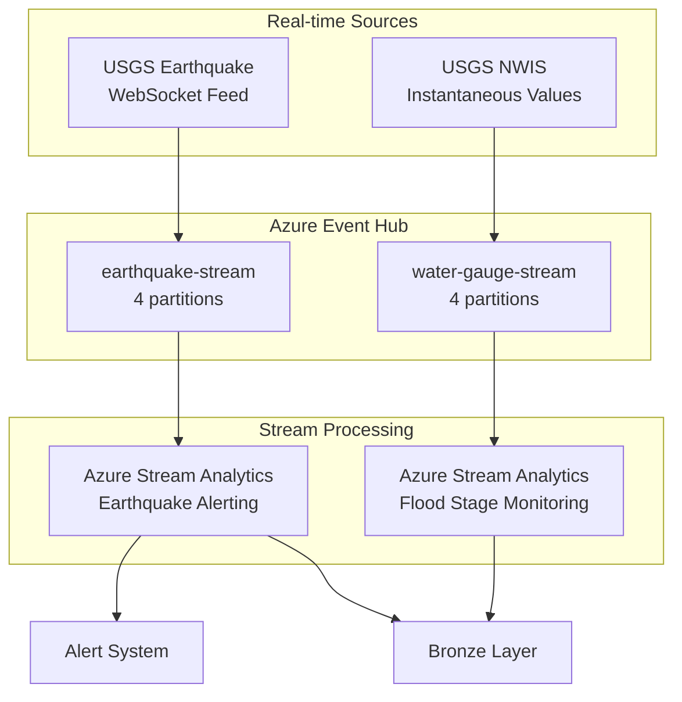
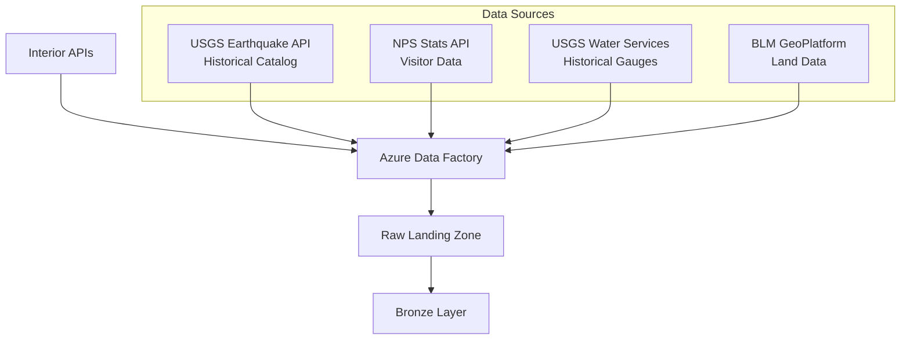
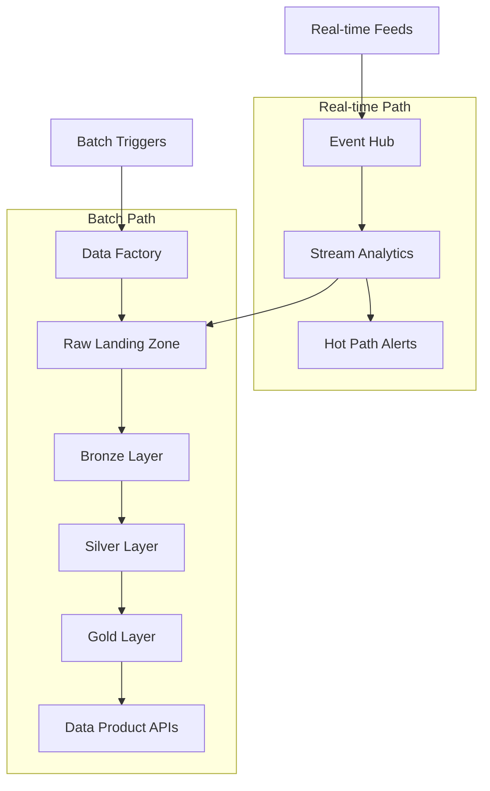

# Department of Interior Natural Resources Architecture

> **Last Updated:** 2026-04-14 | **Status:** Active | **Audience:** Architects / Data Engineers

## Table of Contents
- [Overview](#overview)
- [Domain Context](#domain-context)
  - [Natural Resource Data Landscape](#natural-resource-data-landscape)
  - [Data Characteristics](#data-characteristics)
- [Architecture Layers](#architecture-layers)
  - [Streaming Ingestion Layer](#streaming-ingestion-layer)
  - [Batch Ingestion Layer](#batch-ingestion-layer)
  - [Bronze Layer (Raw Data)](#bronze-layer-raw-data)
  - [Silver Layer (Cleaned & Conformed)](#silver-layer-cleaned--conformed)
  - [Gold Layer (Business Analytics)](#gold-layer-business-analytics)
- [Data Flow Architecture](#data-flow-architecture)
  - [Hybrid Batch + Streaming Pipeline](#hybrid-batch--streaming-pipeline)
- [Security Architecture](#security-architecture)
  - [Data Protection](#data-protection)
  - [Compliance](#compliance)
  - [Sensitive Data Handling](#sensitive-data-handling)
- [Performance Optimization](#performance-optimization)
  - [Data Partitioning Strategy](#data-partitioning-strategy)
  - [Streaming Optimization](#streaming-optimization)
  - [Caching Strategy](#caching-strategy)
- [Monitoring & Observability](#monitoring--observability)
  - [Data Quality Monitoring](#data-quality-monitoring)
  - [Alerting Strategy](#alerting-strategy)
- [Disaster Recovery](#disaster-recovery)
  - [Backup Strategy](#backup-strategy)
  - [Business Continuity](#business-continuity)
- [Technology Stack](#technology-stack)
  - [Core Platform](#core-platform)
  - [Development Tools](#development-tools)
  - [Programming Languages](#programming-languages)

## Overview

The Interior Natural Resources Analytics platform is built on Azure Cloud Scale Analytics (CSA) and follows a domain-driven design approach with an added real-time streaming component. It ingests data from multiple Interior Department bureaus, transforms it through a medallion architecture, and provides analytical insights for resource management, public safety, and environmental monitoring.

## Domain Context

### Natural Resource Data Landscape

The Interior Department ecosystem produces diverse scientific and operational data:

- **USGS (U.S. Geological Survey)**: Seismic event catalogs, water gauge measurements, geologic mapping, volcanic monitoring
- **NPS (National Park Service)**: Visitor statistics, trail conditions, campground occupancy, wildlife surveys
- **BLM (Bureau of Land Management)**: Land use permits, fire perimeters, vegetation surveys, grazing allotments
- **FWS (Fish and Wildlife Service)**: Species occurrence data, critical habitat, refuge visitor counts

### Data Characteristics

- **Volume**: Millions of seismic events, billions of water gauge readings, decades of visitor statistics
- **Velocity**: Real-time earthquake alerts (seconds), 15-minute water gauge intervals, monthly park reports
- **Variety**: Time series (gauges), point events (earthquakes), aggregated counts (visitors), geospatial (boundaries)
- **Veracity**: Scientific-grade instrumentation with published accuracy specifications

## Architecture Layers

### Streaming Ingestion Layer



### Batch Ingestion Layer



#### Ingestion Patterns

**USGS Earthquake API (ComCat)**
- REST API with GeoJSON response format
- No authentication required
- Parameters: time range, magnitude range, geographic bounds
- Rate limit: ~100 requests/minute
- Catalog completeness: M2.5+ since ~1973, M4.0+ since ~1900

**NPS Visitor Statistics**
- Monthly and annual visitation reports
- API key required
- Data granularity: park unit, month, year
- Historical coverage: 1904-present
- Lag: 2-3 months for preliminary data

**USGS Water Services (NWIS)**
- REST API returning WaterML or JSON
- No authentication required
- Parameters: site number, parameter code, date range
- Real-time data: 15-minute intervals
- Historical data: daily mean values back to early 1900s

### Bronze Layer (Raw Data)

The Bronze layer stores raw, unprocessed data exactly as received from source systems and streaming feeds.

```sql
-- Example: Bronze earthquake events table structure
CREATE TABLE bronze.brz_earthquake_events (
    source_system STRING,
    ingestion_timestamp TIMESTAMP,
    event_id STRING,
    event_time TIMESTAMP,
    latitude DECIMAL(9,6),
    longitude DECIMAL(9,6),
    depth_km DECIMAL(6,2),
    magnitude DECIMAL(3,1),
    magnitude_type STRING,
    place_description STRING,
    status STRING,
    tsunami_flag INT,
    felt_reports INT,
    cdi DECIMAL(3,1),
    mmi DECIMAL(3,1),
    alert_level STRING,
    event_type STRING,
    network STRING,
    raw_json STRING,
    load_time TIMESTAMP,
    _source STRING,  -- 'BATCH' or 'STREAM'
    _dbt_loaded_at TIMESTAMP
)
USING DELTA
PARTITIONED BY (YEAR(event_time), MONTH(event_time))
```

### Silver Layer (Cleaned & Conformed)

#### Transformation Patterns

**Seismic Data**
- Magnitude classification (micro, minor, light, moderate, strong, major, great)
- Depth categorization (shallow <70km, intermediate 70-300km, deep >300km)
- Fault zone association using spatial proximity to known faults
- Aftershock sequence identification using space-time clustering
- Duplicate event resolution between batch and streaming ingestion

**Visitor Data**
- Seasonality flag computation (peak/shoulder/off-peak)
- Capacity utilization calculation vs park design capacity
- Year-over-year growth rate normalization
- Missing month interpolation using seasonal decomposition

**Water Data**
- Drought index calculation (Palmer Drought Severity Index proxy)
- Flood stage classification (action, minor, moderate, major)
- Baseflow separation for stream gauges
- Seasonal flow percentile ranking

### Gold Layer (Business Analytics)

#### Analytical Models

**Seismic Risk Model**
- Gutenberg-Richter frequency-magnitude relationship
- Recurrence interval estimation for M5.0+ events by region
- Population exposure calculation using census data overlays
- Aftershock probability using modified Omori's law

**Park Capacity Model**
- Seasonal decomposition for visitor forecasting
- Congestion index based on capacity utilization
- Optimal visit windows by park and month
- Resource allocation recommendations

**Wildfire Risk Model**
- Drought condition scoring from water gauge data
- Vegetation dryness proxy from seasonal precipitation deficits
- Wind risk factor from regional weather patterns
- Historical fire frequency by geographic region
- Composite risk score with calibrated weights

## Data Flow Architecture

### Hybrid Batch + Streaming Pipeline



## Security Architecture

### Data Protection

- **Encryption at Rest**: Azure Storage Service Encryption (SSE) with AES-256
- **Encryption in Transit**: TLS 1.2+ including Event Hub AMQP connections
- **Network Security**: VNet integration with private endpoints for all services
- **Access Control**: Azure AD with RBAC, separate roles for streaming and batch

### Compliance

- **FISMA**: Federal Information Security Modernization Act compliance
- **FedRAMP**: Moderate authorization for Azure Government
- **Section 508**: Accessibility compliance for public-facing dashboards
- **Open Data**: USGS, NPS, BLM data products follow data.gov standards

### Sensitive Data Handling

- Endangered species location data requires restricted access (FWS policy)
- Archaeological site locations are withheld from public APIs (ARPA)
- Individual water rights data may contain PII

## Performance Optimization

### Data Partitioning Strategy

- **Time-based**: Earthquake events by year/month, water gauges by date
- **Geographic**: State/region for visitor data, USGS region for seismic
- **Magnitude-based**: Separate partitions for significant (M5+) events

### Streaming Optimization

- Event Hub: 4 partitions per topic, partition key by geographic region
- Stream Analytics: 6 SU allocation, tumbling windows for aggregation
- Checkpoint storage for exactly-once processing guarantees

### Caching Strategy

- **Redis Cache**: Real-time earthquake summaries (5-minute TTL)
- **CDN**: Park information and static geospatial assets
- **Query Result Cache**: Gold layer aggregations (6-hour TTL)

## Monitoring & Observability

### Data Quality Monitoring

- **dbt Tests**: Schema and business logic validation
- **Custom Monitors**: Earthquake magnitude distribution checks, gauge data continuity
- **Streaming Monitors**: Event Hub throughput, consumer lag, checkpointing health

### Alerting Strategy

```yaml
# Real-time seismic alerts
alert:
  name: "Significant Earthquake Detected"
  condition: "magnitude >= 5.0"
  severity: "critical"
  latency_target: "< 60 seconds"
  notification:
    - sms: "emergency-team"
    - email: "usgs-coordination@contoso.com"
    - slack: "#seismic-alerts"

# Data freshness
alert:
  name: "Water Gauge Data Gap"
  condition: "last_reading > 2 hours ago"
  severity: "high"
  notification:
    - slack: "#data-engineering"
```

## Disaster Recovery

### Backup Strategy

- **Automated Backups**: Daily incremental, weekly full
- **Cross-region Replication**: Primary (East US), Secondary (West US 2)
- **Event Hub**: Geo-disaster recovery pairing between regions
- **Point-in-time Recovery**: 30-day retention

### Business Continuity

- **RTO**: 1 hour for real-time alerting, 4 hours for batch analytics
- **RPO**: 0 data loss for streaming (Event Hub capture), 24 hours for batch
- **Failover**: Automated for Event Hub, manual for batch pipelines

## Technology Stack

### Core Platform
- **Compute**: Azure Databricks, Azure Functions, Azure Stream Analytics
- **Storage**: Azure Data Lake Storage Gen2, Azure SQL Database
- **Streaming**: Azure Event Hubs, Azure Stream Analytics
- **Orchestration**: Azure Data Factory, Azure Logic Apps
- **Analytics**: Azure Synapse Analytics, Power BI

### Development Tools
- **Data Modeling**: dbt, Great Expectations
- **Version Control**: Git, Azure DevOps
- **CI/CD**: Azure Pipelines, GitHub Actions
- **Monitoring**: Azure Monitor, Application Insights

### Programming Languages
- **Data Processing**: Python, SQL
- **Streaming**: Python (azure-eventhub SDK), SQL (Stream Analytics)
- **Web APIs**: Python (FastAPI)
- **Infrastructure**: Bicep, Terraform
- **Analytics**: Python (pandas, scikit-learn, obspy), R

---

## Related Documentation

- [Interior README](README.md) - Deployment guide, quick start, and analytics scenarios
- [Platform Architecture](../../docs/ARCHITECTURE.md) - Core CSA platform architecture
- [Platform Services](../../docs/PLATFORM_SERVICES.md) - Shared Azure service configurations
- [DOT Architecture](../dot/ARCHITECTURE.md) - Related federal infrastructure architecture
- [Tribal Health Architecture](../tribal-health/ARCHITECTURE.md) - Related federal/tribal architecture
