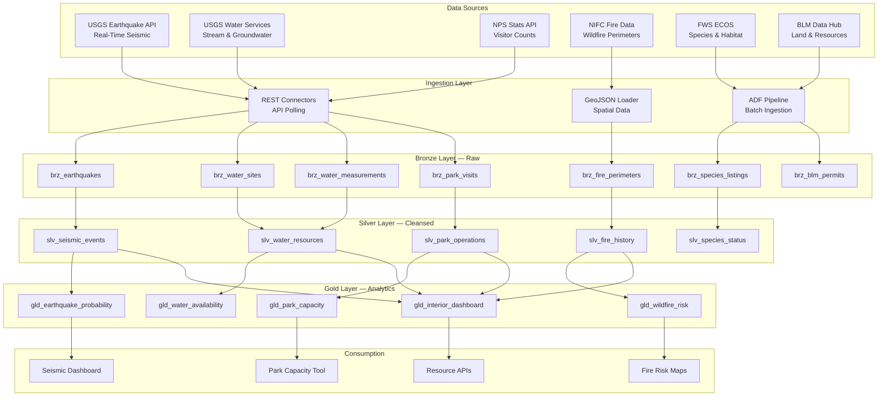

# Department of Interior Natural Resources Analytics Platform

A comprehensive natural resources analytics platform built on Azure Cloud Scale Analytics (CSA), providing insights into seismic activity, water resources, national park management, wildfire risk, and wildlife conservation using official USGS, NPS, BLM, and FWS data sources.

## Overview

The Department of Interior manages 500 million acres of federal land, monitors 1.5 million stream-flow measurements daily, tracks seismic activity from 8,000+ sensors, welcomes 300 million national park visitors annually, and oversees conservation of 2,700+ threatened and endangered species. This platform ingests, processes, and analyzes data from USGS, NPS, BLM, and FWS to enable earthquake probability assessment, national park capacity management, wildfire risk prediction, and water resource optimization.

### Key Features

- **Earthquake Monitoring & Probability**: Real-time seismic event tracking with statistical forecasting
- **Water Resource Analytics**: Stream-flow, groundwater, and water quality monitoring across 13,000+ sites
- **National Park Capacity Management**: Visitor trends, carrying capacity, and reservation optimization
- **Wildfire Risk Prediction**: Fire weather indices, historical burn patterns, and fuel load analysis
- **Wildlife Conservation**: Species distribution, critical habitat, and population trend tracking
- **Land Management Dashboards**: BLM resource extraction, grazing, and recreation permits

### Data Sources

| Source | Agency | Description | URL |
|--------|--------|-------------|-----|
| Earthquake Catalog | USGS | Real-time and historical earthquake events worldwide | https://earthquake.usgs.gov/fdsnws/event/1/ |
| Water Services API | USGS | Stream-flow, groundwater levels, water quality | https://waterservices.usgs.gov/ |
| NPS Visitor Stats | NPS | Monthly recreation visits by park unit | https://irma.nps.gov/Stats/ |
| NPS API | NPS | Park info, alerts, campgrounds, activities | https://www.nps.gov/subjects/developer/api-documentation.htm |
| NIFC Wildfire Data | DOI/USDA | Active fire perimeters, historical burns, fire weather | https://data-nifc.opendata.arcgis.com/ |
| ECOS | FWS | Endangered species listings, critical habitat, recovery plans | https://ecos.fws.gov/ecp/ |
| BLM Public Data | BLM | Land status, mining claims, grazing allotments, oil & gas leases | https://gbp-blm-egis.hub.arcgis.com/ |

## Architecture Overview



## Prerequisites

### Azure Resources
- Azure subscription with contributor access
- Azure Data Factory or Synapse Analytics
- Azure Data Lake Storage Gen2
- Azure SQL Database or Synapse SQL Pool
- Azure Key Vault for API credentials

### Tools Required
- Azure CLI (2.55.0 or later)
- dbt CLI (1.7.0 or later)
- Python 3.9+
- Git
- GDAL/OGR (optional, for geospatial data conversion)

### API Access
- NPS API key (free at https://www.nps.gov/subjects/developer/get-started.htm)
- USGS APIs (no key required — open access)
- NIFC ArcGIS (no key required — open access)

## Quick Start

### 1. Environment Setup

```bash
# Clone the repository
git clone <repository-url>
cd csa-inabox/examples/interior

# Install Python dependencies
pip install -r requirements.txt

# Install dbt packages
cd domains/dbt
dbt deps
```

### 2. Configure API Keys

```bash
# Add to Azure Key Vault or local environment
export NPS_API_KEY="your-nps-api-key"
```

### 3. Generate Sample Data

```bash
# Generate synthetic natural resources data
python data/generators/generate_interior_data.py --output-dir domains/dbt/seeds

# Or fetch real data from APIs
python data/open-data/fetch_earthquakes.py \
  --starttime "2023-01-01" --endtime "2023-12-31" \
  --minmagnitude 2.5 --maxmagnitude 9.0

python data/open-data/fetch_water.py \
  --sites "09380000,02037500,12354500" \
  --parameters "00060,00065" \
  --period "P365D"

python data/open-data/fetch_park_visits.py --years "2020,2021,2022,2023"

python data/open-data/fetch_fire_perimeters.py --year 2023 --min-acres 100
```

### 4. Deploy Infrastructure

```bash
# Configure parameters
cp deploy/params.dev.json deploy/params.local.json
# Edit params.local.json with your values

# Deploy using Azure CLI
az deployment group create \
  --resource-group rg-interior-analytics \
  --template-file ../../deploy/bicep/DLZ/main.bicep \
  --parameters @deploy/params.local.json
```

### 5. Run dbt Models

```bash
cd domains/dbt

# Test connections
dbt debug

# Load seed data
dbt seed

# Run models
dbt run

# Run tests
dbt test

# Generate documentation
dbt docs generate
dbt docs serve
```

## Sample Analytics Scenarios

### 1. Earthquake Probability Assessment

Analyze seismic event clustering using the USGS earthquake catalog to estimate probability of significant aftershocks and identify regions with elevated seismic risk.

```sql
-- Seismic risk zones with probability estimates
SELECT
    seismic_zone,
    region_name,
    total_events_10yr,
    m4_plus_events,
    m5_plus_events,
    avg_depth_km,
    max_magnitude,
    last_significant_event,
    days_since_m5_plus,
    gutenberg_richter_b_value,
    annual_m4_probability,
    risk_tier
FROM gold.gld_earthquake_probability
WHERE annual_m4_probability > 0.10
ORDER BY annual_m4_probability DESC;
```

### 2. National Park Capacity Management

Model park carrying capacity using visitor count trends, infrastructure data, and resource sensitivity to optimize reservation systems and reduce overcrowding.

```sql
-- Park capacity utilization and management recommendations
SELECT
    park_name,
    park_code,
    state,
    annual_visits_2023,
    peak_month,
    peak_month_visits,
    estimated_carrying_capacity,
    utilization_pct_peak,
    avg_length_of_stay_hours,
    campground_fill_rate_pct,
    overcrowding_risk,
    recommended_action
FROM gold.gld_park_capacity
WHERE overcrowding_risk IN ('HIGH', 'CRITICAL')
ORDER BY utilization_pct_peak DESC;
```

### 3. Wildfire Risk Prediction

Combine historical fire perimeters, fuel load estimates, drought indices, and weather forecasts to score wildfire risk at the landscape level.

```sql
-- Wildfire risk scoring by region
SELECT
    region_name,
    state,
    total_acres,
    fire_history_score,
    fuel_load_index,
    drought_severity_index,
    wind_exposure_score,
    wui_population,
    suppression_difficulty_score,
    composite_fire_risk,
    historical_fires_10yr,
    total_acres_burned_10yr,
    risk_tier
FROM gold.gld_wildfire_risk
WHERE composite_fire_risk >= 70
ORDER BY composite_fire_risk DESC
LIMIT 50;
```

## Data Products

### Earthquake Probability (`earthquake-probability`)
- **Description**: Seismic zone risk assessment with Gutenberg-Richter modeling
- **Freshness**: Daily (earthquake catalog updates every 5 minutes; models retrained weekly)
- **Coverage**: Global (emphasis on CONUS, Alaska, Hawaii, territories)
- **API**: `/api/v1/earthquake-probability`

### Park Capacity (`park-capacity`)
- **Description**: National park visitor trends with capacity modeling
- **Freshness**: Monthly visitor counts with annual model recalibration
- **Coverage**: All 423 NPS units (63 national parks + monuments, seashores, etc.)
- **API**: `/api/v1/park-capacity`

### Wildfire Risk (`wildfire-risk`)
- **Description**: Landscape-level wildfire risk scoring with multi-factor analysis
- **Freshness**: Daily (fire weather) / Annual (fuel load and historical recalc)
- **Coverage**: All federal and adjacent lands in the western U.S.
- **API**: `/api/v1/wildfire-risk`

## Configuration

### dbt Profiles

Add to your `~/.dbt/profiles.yml`:

```yaml
interior_analytics:
  target: dev
  outputs:
    dev:
      type: databricks
      host: "{{ env_var('DBT_HOST') }}"
      http_path: "{{ env_var('DBT_HTTP_PATH') }}"
      token: "{{ env_var('DBT_TOKEN') }}"
      schema: interior_dev
      catalog: dev
    prod:
      type: databricks
      host: "{{ env_var('DBT_HOST_PROD') }}"
      http_path: "{{ env_var('DBT_HTTP_PATH_PROD') }}"
      token: "{{ env_var('DBT_TOKEN_PROD') }}"
      schema: interior
      catalog: prod
```

### Environment Variables

```bash
# Required for data fetching
NPS_API_KEY=your-nps-api-key

# Required for dbt
DBT_HOST=your-databricks-host
DBT_HTTP_PATH=your-sql-warehouse-path
DBT_TOKEN=your-access-token

# Optional
INTERIOR_LOG_LEVEL=INFO
INTERIOR_BATCH_SIZE=5000
```

## Azure Government Notes

This example is compatible with Azure Government (US) regions. When deploying to Azure Government:

- Use `usgovvirginia` or `usgovarizona` as your Azure region
- Update ARM/Bicep endpoint references to `.usgovcloudapi.net`
- USGS APIs are publicly accessible from government networks
- BLM permit data may contain lessee PII — apply data masking in Silver layer for non-privileged users
- NIFC fire data is public; operational fire data during active incidents may have access restrictions
- Endangered species location data may be restricted to prevent poaching — consult FWS before exposing precise coordinates

## Monitoring & Alerts

- **Earthquake Alerts**: Automated notifications for M4.0+ events in monitored zones
- **Data Freshness**: Alerts when USGS water data or NPS visitor counts are overdue
- **Data Quality**: Automated tests on magnitude ranges, coordinate bounds, and flow measurements
- **Fire Season**: Elevated monitoring during April–October fire season
- **Cost Management**: Daily compute spend tracking with budget thresholds

## Troubleshooting

### Common Issues

1. **USGS Earthquake API Limits**: Queries returning >20,000 events will fail. Use time and magnitude filters to partition requests.
2. **Water Services Time Series**: Long time series (10+ years) should use the `--period` parameter rather than date ranges to avoid timeouts.
3. **NPS Stats Seasonality**: Monthly data is only available after ~90 days. Use `--year-to-date` for preliminary figures.
4. **Fire Perimeter Shapefiles**: Active fire perimeters update multiple times daily. Use the `--latest` flag for current boundaries.
5. **Geospatial Join Performance**: BLM land status data is large (~50 million polygons). Pre-filter by state before spatial joins.

## Contributing

1. Fork the repository
2. Create a feature branch (`git checkout -b feature/new-data-source`)
3. Make changes and add tests
4. Run quality checks (`make lint test`)
5. Submit a pull request

## License

This project is licensed under the MIT License. See `LICENSE` file for details.

## Acknowledgments

- USGS, NPS, BLM, and FWS for maintaining comprehensive natural resource data programs
- NIFC for open wildfire data and the Wildland Fire Decision Support System
- Azure Cloud Scale Analytics team for the foundational platform
- Contributors and the open-source community
