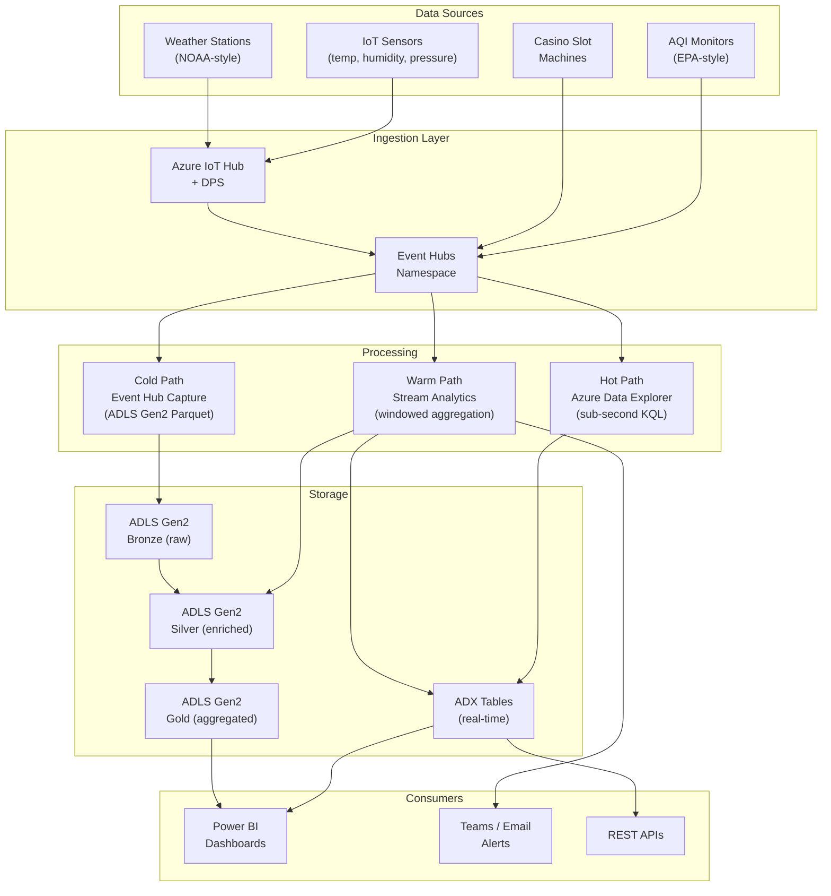

# IoT & Streaming Analytics Examples

> [**Examples**](../README.md) > **IoT Streaming**

> **Last Updated:** 2026-04-15 | **Status:** Active | **Audience:** Data Engineers

> [!TIP]
> **TL;DR** — Reusable streaming patterns shared across verticals: hot path (Event Hub to ADX), warm path (Stream Analytics windowed aggregations), cold path (Event Hub Capture to ADLS), and anomaly detection for temperature, AQI, weather, and slot machine sensors.


---

## 📋 Table of Contents
- [Architecture](#architecture)
- [Streaming Patterns](#streaming-patterns)
  - [Pattern 1: Hot Path (Real-Time)](#pattern-1-hot-path-real-time)
  - [Pattern 2: Warm Path (Near Real-Time)](#pattern-2-warm-path-near-real-time)
  - [Pattern 3: Cold Path (Batch)](#pattern-3-cold-path-batch)
  - [Pattern 4: Anomaly Detection](#pattern-4-anomaly-detection)
- [Directory Structure](#directory-structure)
- [Deployment](#deployment)
  - [Prerequisites](#prerequisites)
  - [Step 1: Deploy IoT Hub and Event Hubs](#step-1-deploy-iot-hub-and-event-hubs)
  - [Step 2: Deploy Stream Analytics](#step-2-deploy-stream-analytics)
  - [Step 3: Create ADX Tables](#step-3-create-adx-tables)
  - [Step 4: Start the Simulator](#step-4-start-the-simulator)
  - [Step 5: Start Stream Analytics Job](#step-5-start-stream-analytics-job)
  - [Step 6: Query Real-Time Data in ADX](#step-6-query-real-time-data-in-adx)
- [KQL Queries Reference](#kql-queries-reference)
- [Stream Analytics Queries Reference](#stream-analytics-queries-reference)
- [Integration with Other Verticals](#integration-with-other-verticals)
- [Azure Government](#azure-government)

Real-time data ingestion and analytics patterns for IoT sensors, telemetry,
and event streaming. These patterns are used across multiple verticals
(NOAA weather stations, EPA air quality sensors, casino slot machines).


---

## Architecture




---

## Streaming Patterns

### Pattern 1: Hot Path (Real-Time)

Event Hub → Azure Data Explorer for sub-second query latency:

```kql
// Real-time slot machine events (last 5 minutes)
SlotEvents
| where timestamp > ago(5m)
| summarize
    total_spins = count(),
    total_coin_in = sum(coin_in),
    total_coin_out = sum(coin_out),
    hold_pct = round((sum(coin_in) - sum(coin_out)) / sum(coin_in) * 100, 2)
  by bin(timestamp, 1m), floor_zone
| render timechart
```

### Pattern 2: Warm Path (Near Real-Time)

Event Hub → Stream Analytics → Power BI for aggregated dashboards:

```sql
-- Stream Analytics query: 5-minute windowed aggregation
SELECT
    System.Timestamp() AS window_end,
    sensor_id,
    AVG(temperature) AS avg_temp,
    MAX(temperature) AS max_temp,
    MIN(temperature) AS min_temp,
    COUNT(*) AS reading_count
INTO [PowerBIOutput]
FROM [EventHubInput]
TIMESTAMP BY event_time
GROUP BY
    sensor_id,
    TumblingWindow(minute, 5)
```

### Pattern 3: Cold Path (Batch)

Event Hub Capture → ADLS Gen2 → dbt/Databricks for historical analytics:

```yaml
# Event Hub Capture configuration
capture:
  enabled: true
  encoding: Avro
  intervalInSeconds: 300
  sizeLimitInBytes: 314572800
  destination:
    name: EventHubArchive.AzureBlockBlob
    storageAccountResourceId: /subscriptions/.../storageAccounts/csastor
    blobContainer: bronze
    archiveNameFormat: "{Namespace}/{EventHub}/{PartitionId}/{Year}/{Month}/{Day}/{Hour}/{Minute}/{Second}"
```

### Pattern 4: Anomaly Detection

Stream Analytics anomaly detection on streaming data:

```sql
-- Detect anomalies in AQI readings
SELECT
    sensor_id,
    event_time,
    aqi_value,
    AnomalyDetection_SpikeAndDip(aqi_value, 95, 120, 'spikesanddips')
      OVER (PARTITION BY sensor_id LIMIT DURATION(minute, 120)) AS anomaly_score
INTO [AlertOutput]
FROM [AQIInput]
WHERE anomaly_score > 0.8
```


---

## 📁 Directory Structure

```text
examples/iot-streaming/
├── README.md                          # This file
├── producers/
│   └── iot_simulator.py               # Multi-type IoT sensor simulator
├── data/
│   └── generators/                    # Seed data generators
├── deploy/
│   └── bicep/
│       ├── iot-hub.bicep              # IoT Hub + DPS + Event Hubs
│       └── stream-analytics.bicep     # Stream Analytics job
├── kql/
│   ├── tables.kql                     # ADX table + mapping definitions
│   └── queries/
│       ├── realtime_anomaly_detection.kql  # Time-series anomaly detection
│       ├── hourly_aggregation.kql          # Hourly rollups by device
│       ├── device_health.kql               # Connectivity & battery monitoring
│       ├── alert_triggers.kql              # Threshold-based alerting
│       └── dashboard_summary.kql           # Top-level KPI queries
└── stream-analytics/
    ├── transform_telemetry.asaql      # Parse & enrich raw telemetry
    ├── aggregate_metrics.asaql        # Tumbling & hopping window aggregation
    └── detect_anomalies.asaql         # Spike/dip & change-point detection
```


---

## 📦 Deployment

### 📎 Prerequisites

- Azure subscription with Event Hubs, IoT Hub, and ADX resource providers registered
- ADLS Gen2 storage account for Event Hub Capture and processed output
- Log Analytics workspace for diagnostic settings
- Azure CLI with Bicep installed

### ⚡ Step 1: Deploy IoT Hub and Event Hubs

```bash
# Create resource group
az group create --name rg-iot-streaming --location eastus

# Deploy IoT Hub + Event Hubs
az deployment group create \
  --resource-group rg-iot-streaming \
  --template-file deploy/bicep/iot-hub.bicep \
  --parameters \
      baseName=csaiot \
      captureStorageAccountName=<your-adls-account> \
      logAnalyticsWorkspaceId=<your-law-id>
```

This deploys:
- **IoT Hub** (S1) with Device Provisioning Service
- **Event Hub Namespace** (Standard, auto-inflate) with three hubs:
  - `telemetry` — raw device data with Capture to ADLS
  - `alerts` — anomaly and threshold alerts
  - `processed` — enriched/aggregated output
- **Consumer groups** for ADX, Stream Analytics, and Capture
- **Diagnostic settings** to Log Analytics

### 🔄 Step 2: Deploy Stream Analytics

```bash
# Get the Event Hub connection string from Step 1 output
EH_CONN=$(az deployment group show \
  --resource-group rg-iot-streaming \
  --name iot-hub \
  --query properties.outputs.telemetryHubListenConnectionString.value -o tsv)

# Deploy Stream Analytics job
az deployment group create \
  --resource-group rg-iot-streaming \
  --template-file deploy/bicep/stream-analytics.bicep \
  --parameters \
      baseName=csaiot \
      eventHubNamespaceName=csaiot-ehns \
      eventHubConnectionString="$EH_CONN" \
      adlsAccountName=<your-adls-account> \
      adlsAccountKey=<your-adls-key> \
      logAnalyticsWorkspaceId=<your-law-id>
```

### 🗄️ Step 3: Create ADX Tables

```bash
# Connect to your ADX cluster
az kusto query \
  --cluster-name <adx-cluster> \
  --database-name realtime \
  --query "$(cat kql/tables.kql)"

# Or using the Kusto CLI
kusto query -database realtime -script kql/tables.kql
```

### Step 4: Start the Simulator

```bash
# Install dependencies
pip install azure-eventhub

# Run the IoT simulator (stdout mode for testing)
python producers/iot_simulator.py \
  --sensor-type temperature \
  --sensor-count 10 \
  --interval 5 \
  --max-events 1000

# Run with Event Hub output
python producers/iot_simulator.py \
  --connection-string "$EVENTHUB_CONNECTION_STRING" \
  --event-hub-name telemetry \
  --sensor-type temperature \
  --sensor-count 10 \
  --interval 5
```

Available sensor types:
- `temperature` — Temperature, humidity, pressure sensors
- `aqi` — EPA-style air quality index sensors
- `weather` — NOAA-style weather station readings
- `slot_machine` — Casino slot machine telemetry

### 🔄 Step 5: Start Stream Analytics Job

```bash
az stream-analytics job start \
  --resource-group rg-iot-streaming \
  --name csaiot-asa \
  --output-start-mode Now
```

### Step 6: Query Real-Time Data in ADX

```kql
// Fleet overview
SensorTelemetry
| where timestamp > ago(15m)
| summarize
    count(),
    avg(temperature_c),
    dcount(sensor_id)
  by bin(timestamp, 1m)
| render timechart

// Anomaly detection
// See kql/queries/realtime_anomaly_detection.kql
```


---

## 🗄️ KQL Queries Reference

| Query File | Purpose |
|-----------|---------|
| `realtime_anomaly_detection.kql` | Time-series decomposition, IQR outliers, correlation anomalies |
| `hourly_aggregation.kql` | Hourly rollups for all sensor types (temp, weather, AQI, slots) |
| `device_health.kql` | Connectivity status, battery monitoring, data freshness, quality checks |
| `alert_triggers.kql` | Temperature, AQI, wind, battery, hold%, and offline device alerts |
| `dashboard_summary.kql` | Fleet KPIs, geographic heatmap, throughput metrics, per-vertical summaries |


---

## 🔄 Stream Analytics Queries Reference

| Query File | Purpose |
|-----------|---------|
| `transform_telemetry.asaql` | Raw passthrough + enrichment (heat index, dew point, quality flags) |
| `aggregate_metrics.asaql` | Tumbling (5min), hopping (1min/5min), regional, and session windows |
| `detect_anomalies.asaql` | SpikeAndDip, ChangePoint, and combined threshold+anomaly alerts |


---

## Integration with Other Verticals

This streaming infrastructure is shared across verticals:

| Vertical | Sensor Type | Event Hub | ADX Table |
|----------|------------|-----------|-----------|
| NOAA Weather | `weather` | `telemetry` | `WeatherObservations` |
| EPA Air Quality | `aqi` | `telemetry` | `AQIReadings` |
| Casino Analytics | `slot_machine` | `telemetry` | `SlotEvents` |
| Generic IoT | `temperature` | `telemetry` | `SensorTelemetry` |

Each vertical can add its own KQL queries and Stream Analytics jobs while
sharing the same Event Hub namespace and ADX cluster.


---

## 🔒 Azure Government

All streaming services are available in Azure Government:
- Event Hubs: GA (FedRAMP High, IL4, IL5)
- Azure Data Explorer: GA (FedRAMP High, IL4, IL5)
- Stream Analytics: GA (FedRAMP High, IL4, IL5)
- IoT Hub: GA (FedRAMP High, IL4, IL5)
- ADLS Gen2 (Capture): GA (FedRAMP High, IL4, IL5)

Use the Government parameter files in `deploy/bicep/gov/` and set your
Azure CLI cloud to `AzureUSGovernment`.

---

## 🔗 Related Documentation

- [Examples Index](../README.md) — Overview of all CSA-in-a-Box example verticals
- [Platform Architecture](../../docs/ARCHITECTURE.md) — Core CSA platform architecture
- [Getting Started Guide](../../docs/GETTING_STARTED.md) — Platform setup and onboarding
- [Casino Analytics](../casino-analytics/README.md) — Streaming patterns for slot machine telemetry
- [EPA Environmental Analytics](../epa/README.md) — Streaming patterns for AQI sensor data
- [NOAA Climate Analytics](../noaa/README.md) — Streaming patterns for weather station data


---

## Prerequisites / Cost / Teardown

> [!IMPORTANT]
> **Cost-safety:** this vertical deploys real Azure resources. Always run `teardown.sh` when you are done. A forgotten workshop environment can run **$80-150/day**.

### Prerequisites

- Azure CLI 2.50+ logged in (`az login`), subscription selected (`az account set --subscription <id>`)
- `jq` installed (used by teardown enumeration)
- Bicep CLI 0.25+ (`az bicep version`)
- Contributor + User Access Administrator on target subscription (or a pre-created RG with equivalent RBAC)
- `bash scripts/deploy/validate-prerequisites.sh` passes

### Cost estimate (rough, East US 2)

- **While running:** ~$$80-150/day (services: IoT Hub, Event Hub, Stream Analytics, ADX, Storage)
- **Idle overnight:** roughly half if you stop compute (Databricks autostop + Synapse pause)
- **Storage + Key Vault residual:** <$5/month if you skip teardown

Numbers are indicative for a small demo dataset; production workloads vary significantly. Use `az consumption usage list` or Cost Management for live numbers.

### Runtime

- **Deploy:** ~20-30 minutes (first run; cold Bicep)
- **Teardown:** ~5-10 minutes (async RG delete completes in the background)

### Teardown

When finished, run the per-example teardown script. It enforces a typed `DESTROY-iot-streaming` confirmation, logs every step to `reports/teardown/iot-streaming-<timestamp>.log`, and deletes the resource group `rg-iot-streaming` along with any matching subscription-scope deployments.

```bash
# Interactive (recommended)
bash examples/iot-streaming/deploy/teardown.sh

# Dry run (enumerate only)
bash examples/iot-streaming/deploy/teardown.sh --dry-run

# From the repo root via Makefile
make teardown-example VERTICAL=iot-streaming
make teardown-example VERTICAL=iot-streaming DRYRUN=1

# CI automation (no prompt — only for ephemeral environments)
bash examples/iot-streaming/deploy/teardown.sh --yes
```

See [`docs/QUICKSTART.md#teardown`](../../docs/QUICKSTART.md#teardown) for the platform-wide teardown flow.
