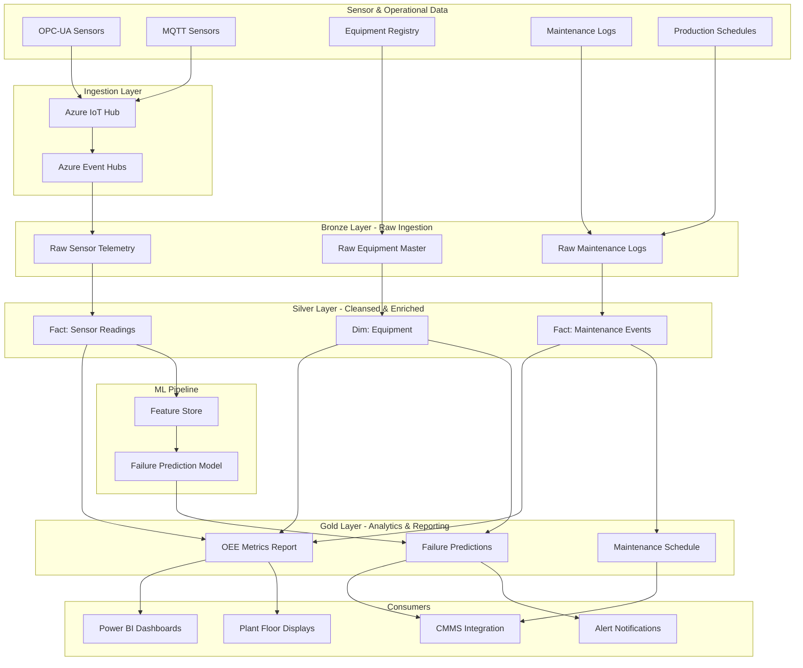

# Manufacturing IoT — Predictive Maintenance & OEE Analytics

> [**Examples**](../README.md) > **Manufacturing IoT**

> [!TIP]
> **TL;DR** — End-to-end manufacturing analytics platform that ingests sensor telemetry from OPC-UA and MQTT devices, computes Overall Equipment Effectiveness (OEE), and predicts equipment failures before they occur. Raw readings flow through a medallion architecture into a Lakehouse where ML models score failure probability and recommend optimized maintenance windows.

---

## Table of Contents

- [Overview](#overview)
- [Architecture Overview](#architecture-overview)
- [Prerequisites](#prerequisites)
- [Quick Start](#quick-start)
- [Data Pipeline](#data-pipeline)
- [Sample Analytics Scenarios](#sample-analytics-scenarios)
- [Data Products](#data-products)
- [Related Resources](#related-resources)

---

## Overview

This vertical demonstrates a production-grade IoT analytics platform built on Azure Cloud Scale Analytics (CSA). It models a discrete manufacturing environment where CNC machines, presses, conveyors, and packaging lines emit continuous sensor telemetry. The platform computes OEE metrics in near-real-time, detects anomalous vibration and temperature patterns, and generates ML-scored failure predictions that feed optimized maintenance schedules.

All data in this example is **synthetic** and intended for demonstration purposes only.

### Key Features

- **Sensor Telemetry Ingestion**: High-throughput ingestion of temperature, vibration, pressure, and humidity readings via IoT Hub and Event Hubs
- **OEE Calculation**: Automated computation of Availability, Performance, and Quality factors at the equipment and production-line level
- **Predictive Maintenance**: ML-based failure probability scoring using rolling sensor statistics and maintenance history
- **Anomaly Detection**: Vibration and temperature anomaly flagging using statistical thresholds and z-score analysis
- **Maintenance Optimization**: Schedule recommendations that balance predicted failure risk against production impact
- **Equipment Lifecycle Tracking**: Age-based risk profiling and replacement planning

### Data Sources

| Source | Description | Ingestion |
|--------|-------------|-----------|
| **OPC-UA Sensors** | Temperature, vibration, pressure from CNC machines and presses | IoT Hub → Event Hubs |
| **MQTT Sensors** | Humidity, speed, flow-rate from conveyors and packaging lines | IoT Hub → Event Hubs |
| **Equipment Registry** | Master data for all monitored equipment | Batch load from ERP/CMMS |
| **Maintenance Logs** | Work orders, planned and unplanned maintenance events | Batch load from CMMS |
| **Production Schedules** | Shift calendars and planned production runs | Batch load from MES |

---

## Architecture Overview



---

## Business Drivers

| Metric | Current State | Target State |
|--------|---------------|--------------|
| **Unplanned Downtime** | 8-12% of production hours | < 3% with predictive maintenance |
| **OEE** | 55-65% (industry avg.) | > 80% with real-time visibility |
| **Mean Time Between Failures** | Reactive replacement cycles | 30% improvement with condition monitoring |
| **Maintenance Cost** | 40% unplanned (emergency) | < 15% unplanned through schedule optimization |

Supports ISO 55000 asset management, OSHA process safety, FDA 21 CFR Part 11 electronic records, and ISA-95 equipment hierarchy standards through auditable sensor data lineage and anomaly detection.

---

## Prerequisites

### Azure Resources

- Azure Subscription with IoT Hub provisioned
- Azure Event Hubs namespace (Standard tier or higher)
- Azure Data Lake Storage Gen2 (for medallion layers)
- Azure Databricks Workspace
- Azure Machine Learning Workspace (for failure prediction model)

### Tools Required

- Azure CLI >= 2.50
- dbt-core >= 1.7 with dbt-databricks adapter
- Python >= 3.10
- Databricks CLI

### Permissions

- `IoT Hub Data Contributor` on the IoT Hub resource
- `Azure Event Hubs Data Receiver` on the Event Hubs namespace
- `Storage Blob Data Contributor` on ADLS Gen2

---

## Quick Start

### 1. Clone and Navigate

```bash
git clone https://github.com/your-org/csa-inabox.git
cd csa-inabox/examples/manufacturing-iot
```

### 2. Upload Sample Data

```bash
az storage blob upload-batch \
  --destination bronze/sensor-telemetry \
  --source data/ \
  --account-name csadatalakedev
```

### 3. Run dbt Models

```bash
cd domains
dbt seed --profiles-dir .
dbt run --profiles-dir .
dbt test --profiles-dir .
```

### 4. Explore Results

Open Power BI or Databricks SQL to query the Gold layer tables: `rpt_oee_metrics`, `rpt_failure_predictions`, and `rpt_maintenance_schedule`.

---

## Data Pipeline

### Bronze Layer - Raw Ingestion

Raw data lands in ADLS Gen2 with no transformations. Each source retains its original schema.

| Table | Source | Format | Refresh |
|-------|--------|--------|---------|
| `raw_sensor_telemetry` | IoT Hub → Event Hubs | JSON/CSV | Near real-time (sub-minute) |
| `raw_equipment` | ERP/CMMS batch export | CSV/Parquet | Daily |
| `raw_maintenance_logs` | CMMS work order export | CSV/Parquet | Hourly |

### Silver Layer - Cleansed & Enriched

Validated, deduplicated, and enriched with rolling statistics and equipment context.

| Table | Description | Key Joins |
|-------|-------------|-----------|
| `fct_sensor_readings` | Cleaned readings with z-scores and rolling averages | `dim_equipment` |
| `dim_equipment` | Equipment dimension with age, type, and line assignment | -- |
| `fct_maintenance_events` | Structured maintenance events (planned vs. unplanned) | `dim_equipment` |

### Gold Layer - Analytics & Reporting

Aggregated, business-ready views for dashboards and operational systems.

| Table | Description | Refresh |
|-------|-------------|---------|
| `rpt_oee_metrics` | OEE factors (Availability x Performance x Quality) per equipment per day | Hourly |
| `rpt_failure_predictions` | ML-scored failure probability with risk tier classification | Hourly |
| `rpt_maintenance_schedule` | Optimized maintenance windows balancing risk and production impact | Daily |

---

## Sample Analytics Scenarios

### 1. Vibration Anomaly Detection

Identify equipment exhibiting abnormal vibration patterns that may indicate bearing wear or misalignment.

```sql
SELECT
    equipment_id,
    sensor_type,
    reading_value,
    rolling_avg_24h,
    z_score
FROM silver.fct_sensor_readings
WHERE sensor_type = 'vibration_mm_s'
  AND ABS(z_score) > 3.0
  AND reading_timestamp >= DATEADD(DAY, -7, CURRENT_DATE())
ORDER BY ABS(z_score) DESC
```

### 2. OEE Calculation

Calculate Overall Equipment Effectiveness broken down by Availability, Performance, and Quality for each production line.

```sql
SELECT
    equipment_id,
    report_date,
    availability_pct,
    performance_pct,
    quality_pct,
    oee_pct,
    CASE
        WHEN oee_pct >= 85 THEN 'World Class'
        WHEN oee_pct >= 60 THEN 'Acceptable'
        ELSE 'Needs Improvement'
    END AS oee_tier
FROM gold.rpt_oee_metrics
WHERE report_date >= DATEADD(DAY, -30, CURRENT_DATE())
ORDER BY oee_pct ASC
```

### 3. Maintenance Scheduling

Query the optimized maintenance schedule to find upcoming high-priority work.

```sql
SELECT
    equipment_id,
    equipment_type,
    failure_probability,
    risk_tier,
    recommended_date,
    estimated_downtime_hours
FROM gold.rpt_maintenance_schedule
WHERE risk_tier IN ('Critical', 'High')
ORDER BY failure_probability DESC
```

---

## Data Products

| Data Product | Description | Consumers |
|-------------|-------------|-----------|
| **OEE Dashboard** | Real-time and historical OEE by equipment, line, and plant | Plant Manager, Process Engineers |
| **Failure Predictions** | ML-scored failure probability with recommended actions | Reliability Engineers, CMMS |
| **Maintenance Schedule** | Optimized maintenance windows with production impact analysis | Maintenance Planners, Shift Supervisors |
| **Sensor Health** | Sensor data quality metrics and calibration status | Instrumentation Engineers |

---

## Data Contract

The `contracts/telemetry.yml` data contract defines the schema, quality thresholds, and SLAs for the core sensor telemetry data product. Key guarantees: readings available in Silver within 5 minutes, >= 99.0% ingestion completeness, and 99.9% Gold layer uptime.

---

## Related Resources

- [Azure IoT Hub Documentation](https://learn.microsoft.com/en-us/azure/iot-hub/) -- Device connectivity and telemetry ingestion
- [Azure Event Hubs Documentation](https://learn.microsoft.com/en-us/azure/event-hubs/) -- High-throughput event streaming
- [OPC-UA Foundation](https://opcfoundation.org/) -- Industrial interoperability standard
- [Overall Equipment Effectiveness (OEE)](https://www.oee.com/) -- OEE calculation reference
- [Azure Machine Learning](https://learn.microsoft.com/en-us/azure/machine-learning/) -- ML model training and deployment
