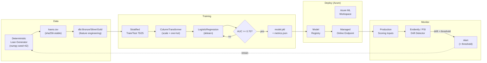

# ML Lifecycle Example — Loan Default Classifier

> [**Examples**](../README.md) > **ML Lifecycle**

> **Last Updated:** 2026-04-20 | **Status:** Active | **Audience:** ML Engineers, Data Scientists, Platform Engineers

> **TL;DR** — End-to-end, reproducible Azure ML pipeline: deterministic synthetic data → dbt feature engineering → scikit-learn training with AUC >= 0.70 → managed online endpoint → data-drift monitoring. Works offline for tests; documented for Azure-side deployment.

---

## Table of Contents

- [Architecture](#architecture)
- [Prerequisites](#prerequisites)
- [Cost Estimate](#cost-estimate)
- [Directory Structure](#directory-structure)
- [Quick Start (Offline)](#quick-start-offline)
- [Full Azure Deployment](#full-azure-deployment)
- [Training](#training)
- [Scoring](#scoring)
- [Drift Monitoring](#drift-monitoring)
- [Teardown](#teardown)
- [Testing](#testing)
- [Contracts](#contracts)

---

## Architecture



See [ARCHITECTURE.md](./ARCHITECTURE.md) for detailed component breakdown.

---

## Prerequisites

| Tool | Version | Notes |
|---|---|---|
| Python | 3.10+ | 3.12 tested |
| pip | latest | |
| Azure CLI | 2.56+ | only for Azure deployment |
| `az ml` extension | 2.x | `az extension add -n ml` |
| dbt-core + dbt-duckdb | 1.7+ | only for dbt parse/compile |

Python packages (installed locally or via the `ml` extra group):

- `numpy`, `pandas`, `scikit-learn>=1.4`, `joblib`
- `evidently` (optional — PSI fallback works without it)
- `azure-ai-ml`, `azure-identity` (optional — only for `az ml` automation)

---

## Cost Estimate

| Component | Est. Monthly (USD) |
|---|---|
| Azure ML workspace (Basic) | $0 |
| Storage (ADLS Gen2, ~10 GB) | ~$0.50 |
| Key Vault (standard, ~1k ops) | ~$0.05 |
| Application Insights (low-volume) | ~$5 |
| Managed online endpoint (1x Standard_DS3_v2, 24/7) | ~$140 |
| **Total (dev/demo, DS3 always-on)** | **~$145** |

Cut ~75% by stopping the endpoint when idle (`az ml online-endpoint update ... --traffic blue=0`) or deploying to a serverless compute option when available.

---

## Directory Structure

```
examples/ml-lifecycle/
  README.md                    (this file)
  ARCHITECTURE.md              (component diagram + flow)
  data/
    generators/
      generate_loan_data.py    (seeded synthetic CSV)
      tests/
        test_generate_loan_data.py
  domains/
    dbt/
      dbt_project.yml
      models/
        schema.yml             (sources + docs)
        bronze/brz_loan_applications.sql
        silver/slv_loan_features.sql
        gold/gld_training_features.sql
      seeds/
        loan_applications.csv  (small deterministic seed for CI)
  training/
    train.py                   (sklearn pipeline, AUC >= 0.70 guarantee)
    score.py                   (Azure ML online endpoint handler)
    conda.yaml
    mlproject.yaml             (Azure ML pipeline spec)
    tests/
      test_train.py            (AUC assertion end-to-end)
      test_score.py
  deploy/
    bicep/
      main.bicep               (AML + Storage + KV + AppI + endpoint)
      params.dev.json
    register_model.sh
    deploy_endpoint.sh
  monitoring/
    drift_detection.py         (Evidently + PSI fallback)
    tests/
      test_drift_detection.py
  contracts/
    loan_training_features.yaml
    loan_prediction_contract.yaml
```

---

## Quick Start (Offline)

Everything below runs **without Azure**, using only the synthetic generator.

### Generate deterministic data

```bash
python examples/ml-lifecycle/data/generators/generate_loan_data.py \
  --rows 5000 --seed 42 \
  --output outputs/loans.csv
```

Same seed → same SHA-256.

### Train

```bash
python examples/ml-lifecycle/training/train.py \
  --rows 5000 --seed 42 \
  --output-dir outputs/ml
# → AUC=0.84, accuracy=0.82, model.pkl + metrics.json written.
```

### Run tests

```bash
pytest examples/ml-lifecycle/ -v
```

---

## Full Azure Deployment

```bash
# 1. Provision AML workspace + endpoint shell
az deployment group create \
  --resource-group csa-mllife-rg \
  --template-file examples/ml-lifecycle/deploy/bicep/main.bicep \
  --parameters @examples/ml-lifecycle/deploy/bicep/params.dev.json

# 2. Train locally
python examples/ml-lifecycle/training/train.py --output-dir examples/ml-lifecycle/training/outputs

# 3. Register the model
./examples/ml-lifecycle/deploy/register_model.sh \
  csa-mllife-rg csamllife-aml-dev

# 4. Deploy to the endpoint
./examples/ml-lifecycle/deploy/deploy_endpoint.sh \
  csa-mllife-rg csamllife-aml-dev csamllife-loan-default-dev

# 5. Smoke test
az ml online-endpoint invoke \
  --name csamllife-loan-default-dev \
  --request-file examples/ml-lifecycle/training/tests/sample_request.json
```

---

## Training

See [`training/train.py`](./training/train.py).

- Stratified 75/25 split (seeded).
- `ColumnTransformer` pipeline: `StandardScaler` for numerics, `OneHotEncoder(handle_unknown="ignore")` for categoricals.
- `LogisticRegression(max_iter=500, solver="lbfgs")`.
- Writes `model.pkl` (joblib) and `metrics.json`.

**Contract:** [`test_train.py`](./training/tests/test_train.py) asserts `AUC >= 0.70`. Typical AUC on the synthetic data is ~0.84.

---

## Scoring

See [`training/score.py`](./training/score.py).

Request (POST body):
```json
{
  "data": [
    {"applicant_age": 35, "annual_income": 72500, ...}
  ]
}
```

Response:
```json
{
  "predictions": [
    {"probability_default": 0.18, "prediction": 0}
  ]
}
```

Same handler works standalone (import `score_records`) and inside the Azure ML inference server (via `init()` + `run()`).

---

## Drift Monitoring

See [`monitoring/drift_detection.py`](./monitoring/drift_detection.py).

- Preferred backend: Evidently (`DataDriftPreset`).
- Fallback: Population Stability Index (PSI) — pure NumPy, zero extra deps.

```bash
python examples/ml-lifecycle/monitoring/drift_detection.py \
  --reference outputs/train_snapshot.csv \
  --current   outputs/prod_snapshot.csv
# Exit code 0 = no drift, 1 = drift detected.
```

Schedule via cron / Container Apps Job / Data Factory. The contract in `contracts/loan_prediction_contract.yaml` specifies a 6-hour cadence by default.

---

## Teardown

```bash
az group delete --name csa-mllife-rg --yes --no-wait
```

---

## Testing

- **Offline (no Azure):**
  ```bash
  pytest examples/ml-lifecycle/ -v
  ```
- **dbt parse + compile:**
  ```bash
  cd examples/ml-lifecycle/domains/dbt
  dbt parse --profiles-dir <stub-profiles> --target ci
  dbt compile --profiles-dir <stub-profiles> --target ci
  ```
  The stub profile matches `.github/workflows/dbt-ci.yml` — `csa_ml_lifecycle` is already in that workflow's profile block.

---

## Contracts

- [`contracts/loan_training_features.yaml`](./contracts/loan_training_features.yaml) — training feature schema + AUC contract.
- [`contracts/loan_prediction_contract.yaml`](./contracts/loan_prediction_contract.yaml) — prediction response + drift SLOs.
