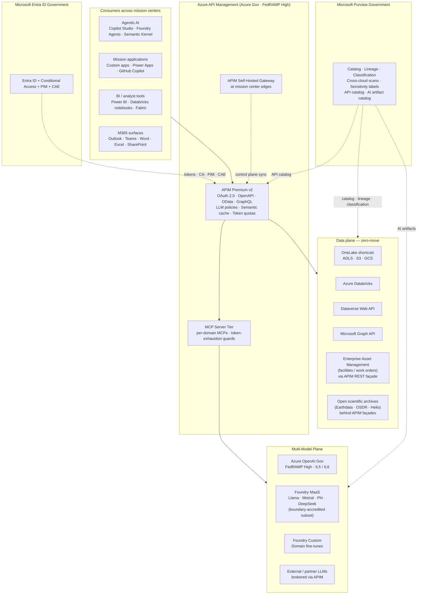

# NASA — API-First Multi-Model Analytics Platform

> [**Examples**](../README.md) > **NASA API-First**


> [!TIP]
> **TL;DR** — API-first, multi-model, zero-move analytics platform built on Azure Cloud Scale Analytics for NASA-style federated mission environments. Azure API Management Premium v2 in Azure Government brokers data and AI calls across distributed centers, partner clouds, and mission systems. Microsoft Entra ID Government provides identity. Microsoft Purview catalogs APIs and data together. Azure OpenAI + Foundry MaaS deliver the multi-model layer behind APIM. All artifacts are synthetic or reference public open-data sources (NASA Open Data Portal, Earthdata, Heliophysics, OSDR).


---

## 📋 Table of Contents
- [Overview](#overview)
  - [Key Features](#-key-features)
  - [Data Sources (public, open-data)](#data-sources-public-open-data)
  - [The Five Pillars This Platform Implements](#the-five-pillars-this-platform-implements)
- [Architecture Overview](#architecture-overview)
- [Prerequisites](#prerequisites)
- [Quick Start](#quick-start)
  - [1. Environment Setup](#1-environment-setup)
  - [2. Deploy the API-First Foundation](#2-deploy-the-api-first-foundation)
  - [3. Identity and Conditional Access](#3-identity-and-conditional-access)
  - [4. Self-Hosted Gateway at Edge Centers](#4-self-hosted-gateway-at-edge-centers)
  - [5. Onboard the First Backend](#5-onboard-the-first-backend)
  - [6. Add the MCP Server Tier](#6-add-the-mcp-server-tier)
  - [7. Ship the First Copilot Studio Agent](#7-ship-the-first-copilot-studio-agent)
  - [8. Register in Purview](#8-register-in-purview)
- [Sample Scenarios](#sample-scenarios)
  - [1. Cross-Center Facilities Q&A](#1-cross-center-facilities-qa)
  - [2. Open-Science Data Discovery](#2-open-science-data-discovery)
  - [3. Multi-Model Routing with Cost Governance](#3-multi-model-routing-with-cost-governance)
- [Data Products](#data-products)
- [Configuration](#configuration)
- [Azure Government Notes](#azure-government-notes)
- [Monitoring & Alerts](#monitoring--alerts)
- [Troubleshooting](#troubleshooting)
- [Contributing](#contributing)
- [License](#license)
- [Acknowledgments](#acknowledgments)

A comprehensive API-first multi-model analytics platform built on Azure Cloud Scale Analytics (CSA). It demonstrates how a NASA-style federated, multi-center, multi-vendor mission environment can be unified into a single governed integration surface on Azure Government — without moving data and without rip-and-replace of existing investments.

---

## 📋 Overview

NASA operates a distributed enterprise of mission centers (Goddard, Marshall, JPL, JSC, KSC, Langley, Ames, Glenn, Stennis, Armstrong, Headquarters and field stations), a federated portfolio of mission directorates, decades of scientific archives, and a public catalog of open data spanning Earth science, heliophysics, planetary science, astrophysics, biological & physical sciences, and aeronautics. This example shows how that shape of distributed mission organization can be supported on Azure with an API-first, multi-model, zero-move architecture.

### ✨ Key Features

- **Universal API gateway** — Azure API Management Premium v2 in Azure Government brokers REST, OData, GraphQL, and WebSocket traffic across centers and partner platforms
- **Multi-model AI plane** — Azure OpenAI + Foundry Models-as-a-Service + Foundry custom deployments + external models brokered via APIM, all behind a single consumer contract
- **Zero-move data** — OneLake shortcuts to ADLS / S3 / GCS, APIM façades over on-prem mission systems, Synapse OPENROWSET for ad-hoc query
- **Identity-grounded zero-trust** — Microsoft Entra ID Government with Conditional Access, PIM, and Continuous Access Evaluation on every API call
- **LLM-aware gateway** — APIM `azure-openai-token-limit`, `azure-openai-semantic-cache-*`, `llm-content-safety`, and `azure-openai-emit-token-metric` policies for cost governance and chargeback
- **MCP server tier** — per-domain Model Context Protocol servers behind APIM expose tools and resources to agents with consistent identity, rate limit, and observability
- **Cross-platform reach** — Microsoft Graph for M365 content, Dataverse Web API for Power Platform data, Data API Builder for SQL backends, APIM façades for legacy mission systems
- **Unified governance** — Microsoft Purview Government catalogs data, APIs, and AI artifacts together with cross-cloud lineage and sensitivity labels
- **FedRAMP High posture** — every primary component (APIM, Entra, AOAI, Purview, Databricks) accredited; same Bicep deploys to GCC High and DoD IL5

### Data Sources (public, open-data)

This example references only **public NASA open data** and **synthetic facilities datasets**. No proprietary or non-public NASA data is included.

| Source | Purpose |
|---|---|
| [NASA Open Data Portal](https://data.nasa.gov/) | Catalog reference; demonstrates open-data discovery patterns |
| [NASA Earthdata](https://www.earthdata.nasa.gov/) | Reference for Earth science data discovery (OPeNDAP, Hyrax, STAC) |
| [NASA OSDR (Open Science Data Repository)](https://www.nasa.gov/osdr/) | Biological / physical sciences open repository reference |
| [NASA Heliophysics Data Portal](https://heliophysicsdata.gsfc.nasa.gov/) | Solar / space-weather reference |
| Synthetic EAM / facilities dataset | Generated locally; no real facilities data is included |

### The Five Pillars This Platform Implements

Federated mission environments converge on the same five architectural pillars. The Microsoft mapping is direct:

| Pillar | Microsoft capability in this example |
|---|---|
| **Multi-Model Future** | Azure OpenAI + Foundry MaaS + Foundry custom-deploy + external models brokered via APIM |
| **Distributed Data** | OneLake shortcuts + APIM façades + Purview cross-cloud catalog |
| **API-First Mandate** | APIM as universal gateway, OpenAPI / OData metadata everywhere |
| **Zero-Move Data** | OneLake shortcuts to S3 / GCS / ADLS, Synapse OPENROWSET, APIM proxy to in-place systems |
| **Interoperability** | One identity (Entra), one gateway (APIM), one governance plane (Purview) — across any system |

---

## Architecture Overview



---

## Prerequisites

### Azure Government resources

| Item | How to confirm |
|---|---|
| Azure Government subscription with Owner / Contributor + User Access Administrator | `az account show` after `az cloud set --name AzureUSGovernment && az login` |
| Entra ID Government tenant with App Registration permissions | `az ad signed-in-user show` |
| Azure OpenAI quota in Azure Gov | Quota request via Azure Portal if not pre-provisioned |
| Purview Government account (or permissions to create one) | `az purview account list` |
| Power Platform Government environment with Copilot Studio | Power Platform admin |

### Tools required

- Azure CLI (`az`) ≥ 2.60
- Bicep CLI (bundled with `az`)
- `kubectl` and Helm (if deploying self-hosted gateway on AKS)
- Python ≥ 3.11 with `azure-identity`, `httpx`, `mcp` for the optional MCP server skeleton
- `git` and a clone of this repository

### API access

This example uses synthetic facilities data and public NASA open-data references. No NASA credentials are required for the quick-start path. Pulling Earthdata / OSDR / Heliophysics data requires a free NASA Earthdata account.

---

## Quick Start

### 1. Environment Setup

```bash
# Clone the repo
git clone https://github.com/fgarofalo56/csa-inabox.git
cd csa-inabox

# Switch to Azure Government
az cloud set --name AzureUSGovernment
az login
az account set --subscription "<subscription-id>"
```

### 2. Deploy the API-First Foundation

This step uses the `apim-api-first-starter` Bicep — APIM Premium v2, Log Analytics, App Insights, Key Vault, a user-assigned managed identity, an optional Azure OpenAI account with the LLM policy chain pre-applied, and a role assignment so APIM calls AOAI via managed identity (no shared keys on disk).

```bash
# Resource group
az group create \
  --name rg-nasa-apifirst \
  --location usgovvirginia

# Deploy
az deployment group create \
  --resource-group rg-nasa-apifirst \
  --template-file examples/apim-api-first-starter/bicep/main.bicep \
  --parameters \
      apimPublisherEmail="apifirst-admin@your-tenant.onmicrosoft.us" \
      apimPublisherName="API-First Mission Platform" \
      apimSku="PremiumV2" \
      apimCapacity=2 \
      deployOpenAi=true \
      deploySampleBackend=false
```

Capture outputs:

```bash
APIM_NAME=$(az deployment group show -g rg-nasa-apifirst -n main \
              --query properties.outputs.apimName.value -o tsv)
APIM_GW=$(az deployment group show -g rg-nasa-apifirst -n main \
              --query properties.outputs.apimGatewayUrl.value -o tsv)
echo "APIM: $APIM_NAME ($APIM_GW)"
```

Smoke test the LLM policy chain:

```bash
SUB_KEY=$(az apim subscription show -g rg-nasa-apifirst \
              --service-name $APIM_NAME --sid master \
              --query primaryKey -o tsv)

curl -i -H "Ocp-Apim-Subscription-Key: $SUB_KEY" \
        -H "Authorization: Bearer $(az account get-access-token \
              --resource https://cognitiveservices.azure.com \
              --query accessToken -o tsv)" \
        -H "Content-Type: application/json" \
        -d '{"messages":[{"role":"user","content":"Summarize the API-first multi-model pattern."}],"max_tokens":80}' \
        "$APIM_GW/aoai/openai/deployments/gpt-4o-mini/chat/completions?api-version=2024-10-21"
```

You should see a `200`, an `x-ratelimit-remaining-tokens` header, and an `x-correlation-id` header. The token-limit, semantic-cache, content-safety, and emit-token-metric policies are live.

### 3. Identity and Conditional Access

```bash
APP_ID=$(az ad app create \
  --display-name "API-First Mission Platform" \
  --sign-in-audience AzureADMyOrg \
  --query appId -o tsv)
az ad app update --id $APP_ID --identifier-uris "api://$APP_ID"
```

In the Entra Government portal, define API scopes (`Facilities.Read`, `Facilities.Write`, `Science.Read`, etc.) and author Conditional Access on this app requiring: compliant device, MFA, no high-risk sign-in. Enable Continuous Access Evaluation. Configure PIM for `*.Write` and `*.Admin` scopes.

### 4. Self-Hosted Gateway at Edge Centers

```bash
GW_TOKEN=$(az rest --method post \
  --uri "https://management.usgovcloudapi.net/subscriptions/<sub>/resourceGroups/rg-nasa-apifirst/providers/Microsoft.ApiManagement/service/$APIM_NAME/gateways/center-east/token?api-version=2023-09-01-preview" \
  --body '{"keyType":"primary","expiry":"2027-12-31T00:00:00Z"}' \
  --query value -o tsv)

docker run -d \
  --name apim-gw-center-east \
  -p 8080:8080 -p 8081:8081 \
  -e config.service.endpoint="$APIM_NAME.configuration.azure-api.us" \
  -e config.service.auth="GatewayKey $GW_TOKEN" \
  mcr.microsoft.com/azure-api-management/gateway:2
```

Or as a Helm install on AKS at the mission center. Repeat per edge site.

### 5. Onboard the First Backend

Document the backend's surface as OpenAPI 3.x. For the synthetic facilities example, the spec ships in this example. Import and apply policies:

```bash
az apim api import \
  --resource-group rg-nasa-apifirst \
  --service-name $APIM_NAME \
  --api-id facilities \
  --display-name "Facilities (EAM) API" \
  --path facilities \
  --specification-format OpenApi \
  --specification-path examples/nasa-api-first/openapi/facilities.openapi.yaml
```

Add the Dataverse Web API, Microsoft Graph, and OneLake-backed Data API Builder endpoints the same way — each becomes a peer API behind the same gateway with the same identity and observability.

### 6. Add the MCP Server Tier

Deploy a per-domain MCP server (Container App in a private VNet, reachable from APIM only) using the skeleton in [`examples/apim-api-first-starter/`](../apim-api-first-starter/README.md). Each MCP exposes domain tools (`get_work_orders`, `list_open_datasets`, `search_publications`, etc.) and is fronted by APIM with the LLM policy chain, so cross-tool token budget enforcement and chargeback work uniformly.

### 7. Ship the First Copilot Studio Agent

In Copilot Studio (Government environment):

1. Create a new agent: e.g., **Facilities Assistant** or **Open-Science Discovery**
2. Add a custom connector built from the APIM Developer Portal's OpenAPI export
3. Configure OAuth 2.0 auth against the Entra app from step 3
4. Author topics that route user questions to the OpenAPI operations (e.g., "What's the open work-order backlog at site X?" → `get_work_orders(site=X, status=open)`)
5. Test and publish to Teams for a pilot user group

### 8. Register in Purview

```bash
# APIM as a Purview catalog source
az purview source create \
  --account-name <purview-account> \
  --name apim-prod \
  --type ApiManagementService \
  --properties "{\"endpoint\":\"$APIM_NAME.azure-api.us\"}"
```

Register Dataverse, Databricks, and AWS / GCS sources the same way. Sensitivity labels propagate from MIP; lineage links flow from data source → APIM endpoint → consuming agent → response.

---

## Sample Scenarios

### 1. Cross-Center Facilities Q&A

A maintenance manager in Teams asks: *"What is the open work-order backlog at the launch complex by priority?"* Copilot Studio routes the question through APIM. The facilities MCP queries the synthetic EAM dataset behind a self-hosted gateway at the center. AOAI synthesizes the answer with token-budget enforcement and semantic cache applied. The whole transaction is identity-grounded, rate-limited, chargeback-tagged, audit-logged, and Purview-catalogued.

### 2. Open-Science Data Discovery

A researcher asks Copilot Studio: *"Find recent Earth-science datasets relevant to wildfire smoke transport."* The science MCP server queries the open Earthdata catalog (read-only public access), returns matching datasets, and the agent presents them with citation-ready metadata. Public open-data only; no proprietary inputs.

### 3. Multi-Model Routing with Cost Governance

An agent asks a low-complexity question that routes to Foundry MaaS (Mistral / Phi) — cheaper, faster. A reasoning-heavy question routes to AOAI `o-series`. The routing is policy-driven inside APIM; the agent does not know which model answered. Token usage is emitted with `model-id` dimension so the chargeback dashboard tracks cost per model per center.

---

## Data Products

| Data product | Endpoint | Notes |
|---|---|---|
| Facilities — work orders | `/facilities/work-orders` | Synthetic; OData-style filter / sort / projection |
| Facilities — assets | `/facilities/assets/{id}` | Synthetic |
| Open-science catalog | `/science/datasets` | Reference to public Earthdata STAC; read-only |
| Multi-model chat | `/aoai/openai/...` | AOAI with full LLM policy bundle |
| Embeddings | `/aoai/openai/.../embeddings` | For RAG over open-data corpora |

Each data product carries:

- **Owner** — named team / on-call
- **SLA** — availability and p95 latency target
- **Classification** — public, internal, restricted (synthetic data is public; the controls apply equally to real workloads)
- **Lineage** — source → API → consumer
- **Schema** — OpenAPI / OData metadata link

---

## Configuration

### APIM SKU and capacity

| Tier | When to use |
|---|---|
| **Developer** | Non-prod single-instance |
| **PremiumV2** (default) | Production: AZ-resilient, capacity-priced, multi-region capable |

### Environment variables

| Variable | Purpose |
|---|---|
| `APIM_NAME` | APIM instance name |
| `APIM_GW` | Gateway URL |
| `AOAI_ENDPOINT` | Azure OpenAI endpoint (Gov) |
| `PURVIEW_ACCOUNT` | Purview Government account |
| `ENTRA_APP_ID` | Entra app registration for the API surface |

### dbt profiles (optional analytics layer)

If pairing this example with a Databricks-on-Azure-Gov analytics layer, the dbt profile points at the Databricks SQL warehouse — APIM does not block dbt's direct path; APIM is the seam for application / agent consumers.

---

## Azure Government Notes

| Topic | Notes |
|---|---|
| **Boundary** | This example targets Azure Government (GCC / GCC High). Same Bicep parameterizes for DoD IL5 / IL6 — model availability varies. |
| **Endpoint URLs** | Sign-in `login.microsoftonline.us`; Graph `graph.microsoft.us`; Dataverse Gov `*.api.crm.microsoftdynamics.us`; AOAI Gov regional endpoints |
| **Service accreditation** | APIM, Entra ID Government, AOAI (most current models), Foundry (curated subset), Purview, Databricks — all FedRAMP High in Azure Gov |
| **Partner-product FedRAMP-High reciprocity** | Where partner LLM gateways or data fabrics have FedRAMP-High accreditation, APIM brokers them as additional backends without crossing accreditation lines |
| **ITAR / CUI** | Sensitivity labels (MIP) classify controlled data; APIM enforces label-required-headers on outbound; Purview DLP applies at exit |

---

## Monitoring & Alerts

Built-in KQL queries (App Insights):

```kql
// Tokens consumed per center per day
customMetrics
| where name == "Total tokens"
| extend center = tostring(customDimensions["subscription-id"])
| extend model  = tostring(customDimensions["model-id"])
| summarize tokens = sum(value) by center, model, bin(timestamp, 1d)
| render columnchart

// Semantic cache hit rate
ApiManagementGatewayLogs
| where ApiId == "aoai-chat"
| extend cached = iif(Cache == "hit", 1, 0)
| summarize hit_rate = avg(cached) * 100 by bin(TimeGenerated, 1h)
| render timechart

// 429 incidents (rate-limit or token-budget hits)
ApiManagementGatewayLogs
| where ResponseCode == 429
| summarize count() by ApimSubscriptionId, ApiId
| top 20 by count_
```

Set Azure Monitor alerts on:

- Per-subscription token budget at 80% of monthly cap
- Sustained 429 rate above 5% over 15 min
- Backend ejection from APIM circuit breaker
- Auth failure spike

---

## Troubleshooting

### Common Issues

| Symptom | Likely cause | Fix |
|---|---|---|
| `401 Unauthorized` at APIM | Missing / expired Entra token | Confirm scope and audience; refresh token |
| `403` from backend | Backend identity rejected | Confirm APIM managed identity has the right backend role |
| `429 Too Many Requests` | Rate limit or token budget hit | Review per-subscription budget; consider tier upgrade |
| Self-hosted gateway stale | Lost control-plane sync | Check outbound connectivity from edge to `*.configuration.azure-api.us`; restart container |
| Semantic cache always miss | Embeddings deployment misconfigured | Confirm `embeddings-backend-id` and `embeddings-deployment-id` in `aoai-chat.xml` |
| LLM responses blocked unexpectedly | Content-safety threshold too aggressive | Tune the `llm-content-safety` policy categories |

---

## Contributing

Improvements welcome — see [`CONTRIBUTING.md`](../../CONTRIBUTING.md) at the repo root. Keep contributions:

- Vendor-neutral on partner products beyond what the takedown comparisons need
- Public-data-only for any new dataset references
- Synthetic for facilities / mission-system payloads
- Bicep-first for infrastructure changes; Bicep deploys identically across Azure Commercial and Azure Government

---

## License

This example is part of CSA-in-a-Box and is licensed under the repository's [LICENSE](../../LICENSE).

---

## Acknowledgments

- NASA's published open-data ecosystem (Earthdata, OSDR, Heliophysics, NASA Open Data Portal) for reference data sources
- The Microsoft Azure API Management product team for the LLM-policy capabilities that make this pattern work
- The Model Context Protocol working group for the standardized tool interface that the MCP tier implements
