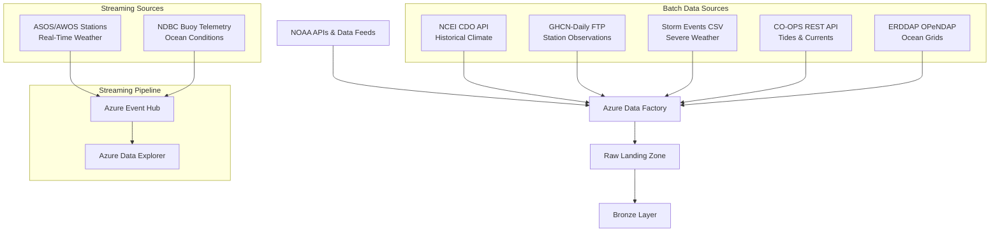
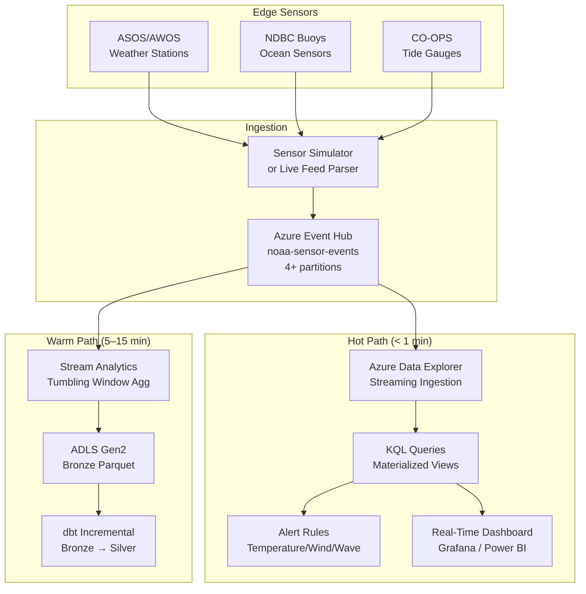
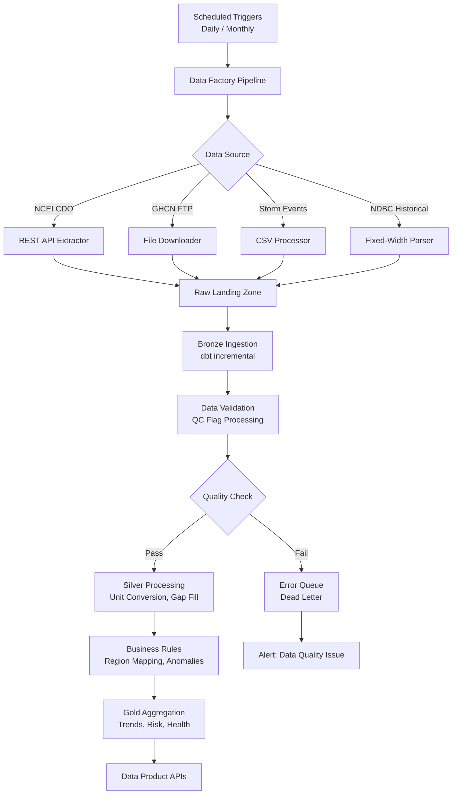
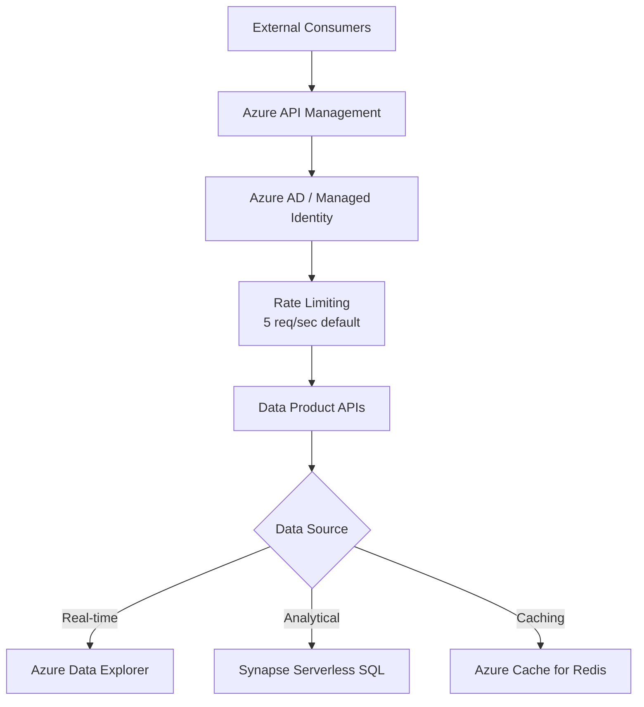

# NOAA Climate & Environmental Analytics Architecture

> [**Examples**](../README.md) > [**NOAA**](README.md) > **Architecture**

> **Last Updated:** 2026-04-15 | **Status:** Active | **Audience:** Architects / Data Engineers

> [!TIP]
> **TL;DR** — Climate analytics architecture with real-time weather station and ocean buoy streaming alongside batch GHCN/Storm Events/CO-OPS ingestion. Features QC flag processing, gap-filling interpolation, and marine ecosystem health scoring.


---

## 📋 Table of Contents
- [Overview](#overview)
- [Domain Context](#domain-context)
  - [Environmental Data Landscape](#environmental-data-landscape)
  - [Data Characteristics](#data-characteristics)
- [Architecture Layers](#architecture-layers)
  - [Data Ingestion Layer](#data-ingestion-layer)
  - [Bronze Layer (Raw Data)](#bronze-layer-raw-data)
  - [Silver Layer (Cleaned & Conformed)](#silver-layer-cleaned--conformed)
  - [Gold Layer (Business Analytics)](#gold-layer-business-analytics)
- [Streaming Architecture](#streaming-architecture)
  - [Real-Time Weather & Ocean Data Pipeline](#real-time-weather--ocean-data-pipeline)
  - [Event Schema](#event-schema)
  - [ADX Table Design](#adx-table-design)
- [Data Flow Architecture](#data-flow-architecture)
  - [Batch Processing Pipeline](#batch-processing-pipeline)
  - [Real-Time + Batch Convergence](#real-time--batch-convergence)
- [Integration Patterns](#integration-patterns)
  - [API Gateway Architecture](#api-gateway-architecture)
  - [Data Contracts](#data-contracts)
- [Security Architecture](#security-architecture)
  - [Data Protection](#data-protection)
  - [Federal Compliance](#federal-compliance)
- [Performance Optimization](#performance-optimization)
  - [Partitioning Strategy](#partitioning-strategy)
  - [Caching Strategy](#caching-strategy)
- [Monitoring & Observability](#monitoring--observability)
  - [Data Quality Monitoring](#data-quality-monitoring)
  - [Streaming Pipeline Health](#streaming-pipeline-health)
  - [Alerting Strategy](#alerting-strategy)
- [Disaster Recovery](#disaster-recovery)
  - [Backup Strategy](#backup-strategy)
  - [Business Continuity](#business-continuity)
- [Technology Stack](#technology-stack)
  - [Core Platform](#core-platform)
  - [Development Tools](#development-tools)
  - [Programming Languages](#programming-languages)


---

## 📋 Overview

The NOAA Climate & Environmental Analytics platform is built on Azure Cloud Scale Analytics (CSA) and follows a domain-driven design approach. It ingests data from multiple NOAA observation networks — including real-time streaming from weather stations and ocean buoys — transforms it through a medallion architecture (Bronze → Silver → Gold), and provides analytical insights for severe weather prediction, climate trend analysis, and marine ecosystem health monitoring.


---

## 📋 Domain Context

### Environmental Data Landscape

NOAA operates the most extensive environmental observation network on Earth:

- **GHCN-Daily (Global Historical Climatology Network)**: 100,000+ stations with daily temperature, precipitation, snowfall, and wind observations dating back to the 1800s
- **NDBC (National Data Buoy Center)**: 100+ moored buoys and coastal stations measuring wave height, sea surface temperature, wind, air pressure, and ocean currents
- **Storm Events Database**: Detailed records of severe weather events including tornadoes, hurricanes, hail, floods, and winter storms with damage estimates and fatalities
- **CO-OPS (Center for Operational Oceanographic Products)**: 200+ tide gauge stations providing water levels, tidal predictions, and current measurements
- **GOES-16/17 Satellites**: Geostationary satellite imagery with derived products for cloud cover, fire detection, and sea surface temperature
- **ERDDAP**: Gridded oceanographic datasets including sea surface temperature, chlorophyll concentration, and fisheries survey data

### Data Characteristics

- **Volume**: Billions of daily observations across weather stations, buoys, and satellite imagery
- **Velocity**: Real-time sensor data every 5–60 seconds from automated stations; hourly satellite passes
- **Variety**: Structured (weather observations, storm records), semi-structured (buoy telemetry JSON), raster (satellite imagery), geospatial (station coordinates, storm tracks)
- **Veracity**: NOAA applies multi-stage quality control; however, raw observations contain gaps, sensor drift, and equipment failures that require careful handling


---

## 🏗️ Architecture Layers

### 🔄 Data Ingestion Layer



#### Ingestion Patterns

**GHCN-Daily Data**
- FTP/HTTPS bulk download from NCEI servers
- CSV files with fixed-width formatting per station
- Update frequency: Daily, with 1–2 day lag
- Historical backfill: 1800s–present for long-running stations

**NCEI Climate Data Online API**
- REST API with pagination (max 1,000 results per request)
- Rate limit: 5 requests/second with CDO token
- Data format: JSON with nested station/observation structure
- Supports date range, location, and dataset filtering

**Storm Events Database**
- Monthly CSV bulk files from NCEI FTP
- Annual finalized datasets with full QC
- Fields: event type, magnitude, begin/end dates, damage, fatalities, narrative
- Coverage: 1950–present for all U.S. states and territories

**NDBC Buoy Data**
- Real-time: RSS/text feeds every 10 minutes
- Historical: Monthly summary files in fixed-width text
- Standard and supplemental meteorological observations
- Spectral wave data for detailed ocean state

**CO-OPS API**
- REST API with no authentication required
- 6-minute interval water level observations
- Tidal predictions, datums, and harmonic constituents
- Response formats: JSON, CSV, XML

### 🗄️ Bronze Layer (Raw Data)

The Bronze layer stores raw, unprocessed data exactly as received from NOAA source systems, with metadata for lineage tracking.

```sql
-- Example: Bronze weather station observations
CREATE TABLE bronze.brz_weather_stations (
    source_system STRING,
    ingestion_timestamp TIMESTAMP,
    station_id STRING,
    station_name STRING,
    latitude DECIMAL(9,6),
    longitude DECIMAL(9,6),
    elevation_m DECIMAL(7,2),
    observation_date DATE,
    element STRING,          -- TMAX, TMIN, PRCP, SNOW, SNWD, AWND, etc.
    value_raw STRING,        -- Raw value as reported (tenths of degree C, tenths of mm)
    measurement_flag STRING, -- Quality flag from source
    quality_flag STRING,     -- QC flag from NCEI
    source_flag STRING,      -- Data source identifier
    load_time TIMESTAMP,
    _source_file_name STRING,
    _source_file_timestamp TIMESTAMP,
    record_hash STRING
)
USING DELTA
PARTITIONED BY (observation_date)
```

#### Data Lineage Tracking

- Source file metadata preserved (filename, timestamp, format version)
- Ingestion timestamps for complete audit trails
- Original quality flags from NOAA retained for traceability
- MD5 record hashes for deduplication across incremental loads

### 🗄️ Silver Layer (Cleaned & Conformed)

The Silver layer applies NOAA-specific business rules, quality control, unit conversions, and gap-filling logic.

#### Transformation Patterns

**Unit Standardization**
- GHCN temperatures: convert from tenths of °C to °C and °F
- Precipitation: convert from tenths of mm to mm and inches
- Wind speed: standardize to m/s from various source units
- Buoy wave heights: meters with two decimal places

**Quality Control Processing**
- Apply NOAA QC flag interpretation (pass/suspect/fail/missing)
- Sensor range validation (e.g., temperature between -90°C and 60°C)
- Temporal consistency checks (sudden jumps flagged)
- Spatial consistency (comparison with neighboring stations)

**Gap Filling and Interpolation**
- Short gaps (1–3 days): linear interpolation with quality flag
- Medium gaps (4–14 days): climatological normal substitution with flag
- Long gaps (>14 days): no fill, marked as missing
- All interpolated values carry `is_interpolated = TRUE` flag

**Geographic Enrichment**
- Map stations to NOAA climate regions (9 U.S. regions)
- Assign climate divisions and county FIPS codes
- Calculate distance to coast for maritime influence analysis
- Associate buoys with marine ecological regions

```sql
-- Example: Silver layer weather observations
CREATE TABLE silver.slv_weather_observations (
    observation_sk STRING,
    station_id STRING,
    station_name STRING,
    climate_region STRING,
    state_code STRING,
    latitude DECIMAL(9,6),
    longitude DECIMAL(9,6),
    elevation_m DECIMAL(7,2),
    observation_date DATE,
    
    -- Standardized measurements
    temp_max_celsius DECIMAL(5,2),
    temp_min_celsius DECIMAL(5,2),
    temp_avg_celsius DECIMAL(5,2),
    precip_mm DECIMAL(8,2),
    snowfall_mm DECIMAL(8,2),
    snow_depth_mm DECIMAL(8,2),
    wind_speed_ms DECIMAL(6,2),
    wind_direction_deg INT,
    
    -- Quality indicators
    quality_flag STRING,
    is_interpolated BOOLEAN,
    is_valid BOOLEAN,
    data_quality_score DECIMAL(3,2),
    
    -- Metadata
    source_system STRING,
    processed_timestamp TIMESTAMP,
    _dbt_loaded_at TIMESTAMP
)
USING DELTA
PARTITIONED BY (observation_date)
```

### 🗄️ Gold Layer (Business Analytics)

The Gold layer contains aggregated, enriched data optimized for the three key analytics scenarios.

#### Analytical Models

**1. Severe Weather Risk Assessment**
- Storm event frequency and severity by county, season, and event type
- Warning lead time analysis (issued time vs. event onset)
- Damage normalization to current-year dollars using CPI
- Population exposure estimates from Census data
- Seasonal probability models by region

**2. Climate Trend Analysis**
- Multi-decadal temperature and precipitation anomalies vs. 1901–2000 baseline
- Linear regression trend slopes with statistical significance (p-values)
- Extreme event frequency analysis (days above/below thresholds)
- Regional comparison and ranking
- Growing season length trends

**3. Marine Ecosystem Health**
- Sea surface temperature anomaly tracking
- Salinity and pH monitoring from buoy networks
- Chlorophyll-a concentration as primary productivity proxy
- Fish stock health indicators from NMFS survey data
- Coral bleaching risk index based on Degree Heating Weeks
- Composite health score combining all indicators

```sql
-- Example: Gold climate trends model
CREATE TABLE gold.gld_climate_trends (
    climate_region STRING,
    state_code STRING,
    decade STRING,
    year INT,
    
    -- Temperature metrics
    avg_annual_temp_celsius DECIMAL(5,2),
    temp_anomaly_vs_baseline DECIMAL(5,2),
    days_above_35c INT,
    days_below_0c INT,
    growing_season_days INT,
    
    -- Precipitation metrics
    total_annual_precip_mm DECIMAL(8,2),
    precip_anomaly_vs_baseline DECIMAL(8,2),
    max_daily_precip_mm DECIMAL(8,2),
    consecutive_dry_days INT,
    
    -- Trend statistics
    trend_slope_per_decade DECIMAL(6,4),
    trend_p_value DECIMAL(6,4),
    trend_classification STRING,
    
    -- Metadata
    report_date DATE,
    station_count INT,
    _dbt_loaded_at TIMESTAMP
)
USING DELTA
PARTITIONED BY (climate_region, decade)
```


---

## ⚡ Streaming Architecture

### Real-Time Weather & Ocean Data Pipeline

The streaming pipeline handles sub-minute sensor data for operational weather monitoring and ocean condition alerting.



### ⚙️ Event Schema

```json
{
  "schema_version": "1.0",
  "source_type": "weather_station",
  "station_id": "KORD",
  "event_time": "2024-01-15T14:30:00Z",
  "measurements": {
    "temperature_celsius": -5.2,
    "dewpoint_celsius": -8.1,
    "relative_humidity_pct": 72.4,
    "wind_speed_ms": 8.3,
    "wind_direction_deg": 290,
    "pressure_hpa": 1013.2,
    "visibility_km": 12.0,
    "precip_1hr_mm": 0.0
  },
  "quality": {
    "flags": [],
    "sensor_status": "operational"
  }
}
```

### 🗄️ ADX Table Design

```kql
// Create streaming ingestion table
.create table WeatherStationEvents (
    schema_version: string,
    source_type: string,
    station_id: string,
    event_time: datetime,
    temperature_celsius: real,
    dewpoint_celsius: real,
    relative_humidity_pct: real,
    wind_speed_ms: real,
    wind_direction_deg: int,
    pressure_hpa: real,
    visibility_km: real,
    precip_1hr_mm: real,
    quality_flags: dynamic,
    sensor_status: string,
    ingestion_time: datetime
)

// Retention policy: 30 days hot, 1 year warm
.alter table WeatherStationEvents policy retention softdelete = 365d

// Continuous aggregation for 5-minute windows
.create materialized-view WeatherStation5MinAgg on table WeatherStationEvents {
    WeatherStationEvents
    | summarize 
        avg_temp = avg(temperature_celsius),
        max_temp = max(temperature_celsius),
        min_temp = min(temperature_celsius),
        avg_wind = avg(wind_speed_ms),
        max_wind = max(wind_speed_ms),
        total_precip = sum(precip_1hr_mm),
        readings = count()
      by station_id, bin(event_time, 5m)
}
```


---

## 🔄 Data Flow Architecture

### 🔄 Batch Processing Pipeline



### Real-Time + Batch Convergence

The Gold layer merges batch-processed historical data with near-real-time streaming aggregations:

- **Batch path**: Daily GHCN observations → Bronze → Silver → Gold (T+1 day)
- **Streaming path**: Live sensor → Event Hub → ADX (sub-minute) → warm path parquet → Bronze (T+5 min)
- **Gold reconciliation**: Gold models use `COALESCE(streaming_latest, batch_latest)` to present the freshest data


---

## 🔌 Integration Patterns

### 🔌 API Gateway Architecture



### 🔌 Data Contracts

Each data product exposes a versioned contract:

```yaml
apiVersion: v1
kind: DataProduct
metadata:
  name: climate-trends
  version: "1.0.0"
  domain: noaa-climate
spec:
  schema:
    format: delta
    primary_key: [climate_region, year]
  sla:
    freshness_hours: 720  # Monthly updates
    availability: 99.5%
  quality:
    completeness: 95%
    accuracy: 99%
    station_coverage: "500+ stations with 30+ year records"
```


---

## 🔒 Security Architecture

### 🔒 Data Protection

- **Encryption at Rest**: Azure Storage Service Encryption (SSE) with Microsoft-managed keys
- **Encryption in Transit**: TLS 1.2+ for all API and Event Hub communications
- **Network Security**: VNet integration with private endpoints for storage and ADX
- **Access Control**: Azure AD with RBAC; separate roles for data engineers, analysts, and API consumers

### 🔒 Federal Compliance

- **FedRAMP**: Azure Government regions meet FedRAMP High baseline
- **FISMA**: Aligned with NIST 800-53 controls for federal information systems
- **Section 508**: Dashboard accessibility compliance
- **Open Data**: All NOAA source data is public domain; derived products follow data.gov standards


---

## ⚡ Performance Optimization

### Partitioning Strategy

- **Time-based**: `observation_date` for weather observations (daily partitions)
- **Geographic**: `climate_region` for trend analysis queries
- **Event type**: `event_type` for storm event filtering
- **Station**: Station ID for single-station time series queries

### Caching Strategy

- **ADX Result Cache**: Materialized views for common 5-minute and 1-hour aggregations
- **Redis Cache**: Frequently accessed climate normals and trend summaries (24-hour TTL)
- **CDN**: Static reference data (station metadata, climate region boundaries)
- **Synapse Result Cache**: Gold layer query results (12-hour TTL)


---

## 📊 Monitoring & Observability

### 📊 Data Quality Monitoring

- **NOAA QC Flag Analysis**: Track percentage of observations with suspect/fail flags
- **dbt Tests**: Schema validation, range checks, and temporal consistency tests
- **Completeness Monitoring**: Alert when station reporting drops below 90%
- **Anomaly Detection**: Statistical outlier flagging for temperature and precipitation

### ⚡ Streaming Pipeline Health

- **Event Hub Metrics**: Incoming messages, throughput units, consumer lag
- **ADX Ingestion**: Ingestion latency, failure rate, batch size
- **End-to-end Latency**: Sensor event time to dashboard visibility (target: < 60 seconds)

### Alerting Strategy

```yaml
alerts:
  - name: "GHCN Daily File Missing"
    condition: "latest_file_date < CURRENT_DATE - 2"
    severity: high
    channels: ["#noaa-data-eng", "email:noaa-team@contoso.com"]
    
  - name: "Buoy Station Offline"
    condition: "last_observation_time > 6 hours ago"
    severity: medium
    channels: ["#noaa-data-eng"]
    
  - name: "Streaming Ingestion Lag"
    condition: "adx_ingestion_lag > 5 minutes"
    severity: critical
    channels: ["#noaa-data-eng", "pagerduty:noaa-oncall"]
```


---

## 🔒 Disaster Recovery

### Backup Strategy

- **Automated Backups**: Daily incremental for Delta tables, continuous for ADX
- **Cross-region Replication**: Primary (East US 2), Secondary (West US 2)
- **Point-in-time Recovery**: 30-day retention for Bronze/Silver, 90-day for Gold
- **ADX Follower Databases**: Read replicas in secondary region for DR

### Business Continuity

- **RTO**: 2 hours for streaming pipeline, 4 hours for batch analytics
- **RPO**: 5 minutes for streaming data, 24 hours for batch data
- **Failover**: Automated for ADX (follower promotion), manual for ADF pipelines


---

## 📎 Technology Stack

### Core Platform
- **Compute**: Azure Databricks, Azure Data Explorer, Azure Functions
- **Storage**: Azure Data Lake Storage Gen2, Azure SQL Database
- **Streaming**: Azure Event Hubs, Azure Stream Analytics
- **Orchestration**: Azure Data Factory, Azure Logic Apps
- **Analytics**: Azure Synapse Analytics, Power BI

### 🚀 Development Tools
- **Data Modeling**: dbt (1.7+), Great Expectations
- **Version Control**: Git, Azure DevOps / GitHub
- **CI/CD**: Azure Pipelines, GitHub Actions
- **Monitoring**: Azure Monitor, Application Insights, Grafana

### Programming Languages
- **Data Processing**: Python, SQL, Scala
- **Streaming**: Python (azure-eventhub SDK), KQL
- **Web APIs**: Python (FastAPI)
- **Infrastructure**: Bicep, Terraform
- **Analytics**: Python (pandas, scipy, xarray), R

---

## 🔗 Related Documentation

- [NOAA README](README.md) — Deployment guide, quick start, and analytics scenarios
- [Platform Architecture](../../docs/ARCHITECTURE.md) — Core CSA platform architecture
- [Platform Services](../../docs/PLATFORM_SERVICES.md) — Shared Azure service configurations
- [EPA Architecture](../epa/ARCHITECTURE.md) — Related environmental/climate architecture
- [USDA Architecture](../usda/ARCHITECTURE.md) — Related agriculture/environment architecture
