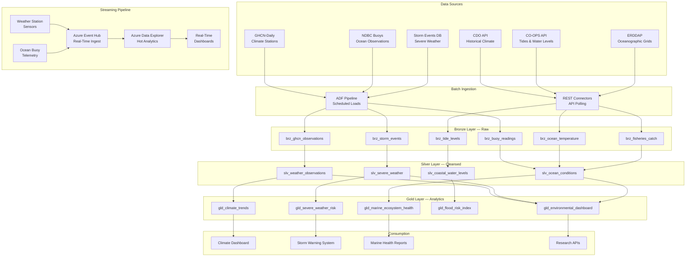
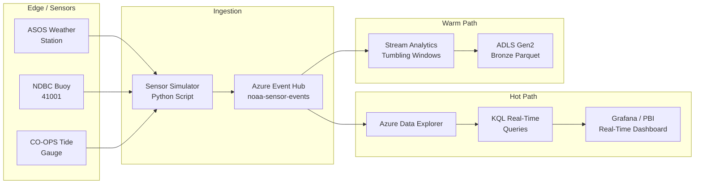

# NOAA Climate & Environmental Analytics Platform

> [**Examples**](../README.md) > **NOAA**

> **Last Updated:** 2026-04-15 | **Status:** Active | **Audience:** Data Engineers

> [!TIP]
> **TL;DR** — Climate and environmental analytics with real-time weather station streaming, 100K+ GHCN stations, ocean buoy telemetry, and storm event correlation. Provides multi-decadal climate trend analysis and severe weather early warning.


---

## 📋 Table of Contents
- [Overview](#overview)
  - [Key Features](#key-features)
  - [Data Sources](#data-sources)
- [Architecture Overview](#architecture-overview)
- [Real-Time Streaming Architecture](#real-time-streaming-architecture)
  - [Streaming Quick Start](#streaming-quick-start)
  - [Sample KQL — Real-Time Weather](#sample-kql--real-time-weather)
- [Prerequisites](#prerequisites)
  - [Azure Resources](#azure-resources)
  - [Tools Required](#tools-required)
  - [API Access](#api-access)
- [Quick Start](#quick-start)
  - [1. Environment Setup](#1-environment-setup)
  - [2. Configure API Keys](#2-configure-api-keys)
  - [3. Generate Sample Data](#3-generate-sample-data)
  - [4. Deploy Infrastructure](#4-deploy-infrastructure)
  - [5. Run dbt Models](#5-run-dbt-models)
- [Sample Analytics Scenarios](#sample-analytics-scenarios)
  - [1. Severe Weather Early Warning](#1-severe-weather-early-warning)
  - [2. Climate Trend Dashboard](#2-climate-trend-dashboard)
  - [3. Marine Ecosystem Health Index](#3-marine-ecosystem-health-index)
- [Data Products](#data-products)
  - [Climate Trends](#climate-trends-climate-trends)
  - [Severe Weather Risk](#severe-weather-risk-severe-weather-risk)
  - [Marine Ecosystem Health](#marine-ecosystem-health-marine-health)
- [Configuration](#configuration)
  - [dbt Profiles](#dbt-profiles)
  - [Environment Variables](#environment-variables)
- [Azure Government Notes](#azure-government-notes)
- [Monitoring & Alerts](#monitoring--alerts)
- [Troubleshooting](#troubleshooting)
  - [Common Issues](#common-issues)
- [Contributing](#contributing)
- [License](#license)
- [Acknowledgments](#acknowledgments)

A comprehensive climate and environmental analytics platform built on Azure Cloud Scale Analytics (CSA), providing insights into weather patterns, climate trends, marine ecosystems, and natural hazards using official NOAA data sources — including real-time streaming from weather stations and ocean buoys.


---

## 📋 Overview

NOAA operates the world's largest environmental monitoring network: 11,000+ weather stations, 100+ ocean buoys, a constellation of weather satellites, and decades of climate records. This platform ingests both batch and real-time streaming data from NOAA's observation networks to enable severe weather early warning, climate trend analysis, and marine ecosystem health monitoring. The streaming pipeline demonstrates real-time sensor data flowing through Azure Event Hub into Azure Data Explorer (ADX) for sub-second analytics.

### ✨ Key Features

- **Real-Time Weather Monitoring**: Live station data via Event Hub with ADX for hot analytics
- **Climate Trend Dashboards**: Multi-decadal temperature, precipitation, and sea-level analysis
- **Severe Weather Early Warning**: Storm event correlation with NWS alert integration
- **Marine Ecosystem Health**: Ocean temperature, salinity, and fisheries stock indicators
- **Satellite Imagery Processing**: GOES-16/17 and JPSS derived product ingestion
- **Tides & Currents**: Coastal water level monitoring with flood risk scoring

### 🗄️ Data Sources

| Source | Description | URL |
|--------|-------------|-----|
| GHCN-Daily | Global Historical Climatology Network — 100K+ stations worldwide | https://www.ncei.noaa.gov/products/land-based-station/global-historical-climatology-network-daily |
| Climate Data Online (CDO) | NCEI climate data API — historical observations | https://www.ncdc.noaa.gov/cdo-web/webservices/v2 |
| CO-OPS API | Tides, currents, water levels — 200+ coastal stations | https://api.tidesandcurrents.noaa.gov/api/prod/ |
| NDBC | National Data Buoy Center — ocean buoy observations | https://www.ndbc.noaa.gov/data/ |
| Storm Events Database | Severe weather events with damage estimates | https://www.ncdc.noaa.gov/stormevents/ |
| ERDDAP | Oceanographic and fisheries gridded data server | https://coastwatch.pfeg.noaa.gov/erddap/index.html |
| ISD | Integrated Surface Database — hourly surface weather | https://www.ncei.noaa.gov/products/land-based-station/integrated-surface-database |


---

## 🏗️ Architecture Overview




---

## ⚡ Real-Time Streaming Architecture

This example includes a streaming pipeline for near-real-time weather and ocean buoy data:



### 🚀 Streaming Quick Start

```bash
# Start the NOAA sensor simulator (generates realistic weather station data)
python streaming/noaa_sensor_simulator.py \
  --event-hub-connection "$EVENTHUB_CONNECTION_STRING" \
  --stations "KORD,KJFK,KLAX,KDEN" \
  --interval-seconds 30

# Deploy ADX table and ingestion mapping
az kusto script create \
  --cluster-name noaa-adx \
  --database-name weather \
  --resource-group rg-noaa-analytics \
  --script-content @streaming/adx/create_tables.kql
```

### Sample KQL — Real-Time Weather

```kql
// Temperature anomalies in the last hour
WeatherStationEvents
| where ingestion_time() > ago(1h)
| summarize avg_temp = avg(temperature_celsius),
            max_temp = max(temperature_celsius),
            min_temp = min(temperature_celsius)
    by station_id, bin(event_time, 5m)
| extend temp_spread = max_temp - min_temp
| where temp_spread > 10
| order by event_time desc
```


---

## 📎 Prerequisites

### Azure Resources
- Azure subscription with contributor access
- Azure Data Factory or Synapse Analytics
- Azure Data Lake Storage Gen2
- Azure Data Explorer cluster (for streaming)
- Azure Event Hub namespace (for streaming)
- Azure Key Vault for API credentials

### Tools Required
- Azure CLI (2.55.0 or later)
- dbt CLI (1.7.0 or later)
- Python 3.9+
- Git

### API Access
- NCEI CDO API token (free at https://www.ncdc.noaa.gov/cdo-web/token)
- CO-OPS API (no key required — open access)
- ERDDAP (no key required — open access)


---

## 🚀 Quick Start

### 1. Environment Setup

```bash
# Clone the repository
git clone <repository-url>
cd csa-inabox/examples/noaa

# Install Python dependencies
pip install -r requirements.txt

# Install dbt packages
cd domains/dbt
dbt deps
```

### 2. Configure API Keys

```bash
# Add to Azure Key Vault or local environment
export NCEI_CDO_TOKEN="your-cdo-api-token"
export EVENTHUB_CONNECTION_STRING="your-eventhub-connection"  # For streaming
```

### 3. Generate Sample Data

```bash
# Generate synthetic weather and ocean data
python data/generators/generate_noaa_data.py --output-dir domains/dbt/seeds

# Or fetch real data from APIs
python data/open-data/fetch_ghcn.py --stations "USW00094846,USW00023174" --years "2020,2021,2022"
python data/open-data/fetch_tides.py --station 8518750 --begin-date 20230101 --end-date 20231231
python data/open-data/fetch_buoy.py --station 41001 --year 2023
```

### 4. Deploy Infrastructure

```bash
# Configure parameters
cp deploy/params.dev.json deploy/params.local.json
# Edit params.local.json with your values

# Deploy using Azure CLI
az deployment group create \
  --resource-group rg-noaa-analytics \
  --template-file ../../deploy/bicep/DLZ/main.bicep \
  --parameters @deploy/params.local.json
```

### 5. Run dbt Models

```bash
cd domains/dbt

# Test connections
dbt debug

# Load seed data
dbt seed

# Run models
dbt run

# Run tests
dbt test

# Generate documentation
dbt docs generate
dbt docs serve
```


---

## 💡 Sample Analytics Scenarios

### 1. Severe Weather Early Warning

Correlate storm events with observation data to build risk models that improve warning lead times.

```sql
-- Recent severe weather with impact assessment
SELECT
    event_date,
    state,
    event_type,
    magnitude,
    injuries_direct,
    deaths_direct,
    damage_property_usd,
    damage_crops_usd,
    warning_lead_time_minutes,
    population_exposed
FROM gold.gld_severe_weather_risk
WHERE event_date >= '2023-01-01'
    AND damage_property_usd > 1000000
ORDER BY damage_property_usd DESC
LIMIT 25;
```

### 2. Climate Trend Dashboard

Analyze multi-decadal temperature and precipitation trends to identify statistically significant shifts by region.

```sql
-- Temperature trend by decade and climate region
SELECT
    climate_region,
    decade,
    avg_annual_temp_celsius,
    temp_anomaly_vs_baseline,
    avg_annual_precip_mm,
    precip_anomaly_vs_baseline,
    trend_slope_per_decade,
    trend_p_value
FROM gold.gld_climate_trends
WHERE decade >= '1970s'
ORDER BY climate_region, decade;
```

### 3. Marine Ecosystem Health Index

Combine ocean temperature, salinity, chlorophyll, and fisheries data to assess ecosystem health by marine region.

```sql
-- Marine ecosystem health scores
SELECT
    marine_region,
    assessment_year,
    sea_surface_temp_anomaly_c,
    salinity_index,
    chlorophyll_concentration,
    fish_stock_health_index,
    coral_bleaching_risk,
    composite_health_score
FROM gold.gld_marine_ecosystem_health
WHERE assessment_year = 2023
ORDER BY composite_health_score ASC;
```


---

## ✨ Data Products

### Climate Trends (`climate-trends`)
- **Description**: Multi-decadal temperature and precipitation trends by climate region
- **Freshness**: Monthly updates with annual recalibration
- **Coverage**: CONUS + Alaska + Hawaii, 1895–present
- **API**: `/api/v1/climate-trends`

### Severe Weather Risk (`severe-weather-risk`)
- **Description**: Storm event records with damage, casualties, and warning effectiveness
- **Freshness**: Monthly (prelim) / Annual (final QC'd)
- **Coverage**: All U.S. states and territories, 1950–present
- **API**: `/api/v1/severe-weather-risk`

### Marine Ecosystem Health (`marine-health`)
- **Description**: Composite ocean health index from buoy, satellite, and fisheries data
- **Freshness**: Quarterly assessments
- **Coverage**: All U.S. EEZ marine regions
- **API**: `/api/v1/marine-health`


---

## ⚙️ Configuration

### ⚙️ dbt Profiles

Add to your `~/.dbt/profiles.yml`:

```yaml
noaa_analytics:
  target: dev
  outputs:
    dev:
      type: databricks
      host: "{{ env_var('DBT_HOST') }}"
      http_path: "{{ env_var('DBT_HTTP_PATH') }}"
      token: "{{ env_var('DBT_TOKEN') }}"
      schema: noaa_dev
      catalog: dev
    prod:
      type: databricks
      host: "{{ env_var('DBT_HOST_PROD') }}"
      http_path: "{{ env_var('DBT_HTTP_PATH_PROD') }}"
      token: "{{ env_var('DBT_TOKEN_PROD') }}"
      schema: noaa
      catalog: prod
```

### ⚙️ Environment Variables

```bash
# Required for data fetching
NCEI_CDO_TOKEN=your-cdo-api-token
EVENTHUB_CONNECTION_STRING=your-eventhub-connection

# Required for dbt
DBT_HOST=your-databricks-host
DBT_HTTP_PATH=your-sql-warehouse-path
DBT_TOKEN=your-access-token

# Optional
NOAA_LOG_LEVEL=INFO
NOAA_BATCH_SIZE=10000
ADX_CLUSTER_URI=https://noaa-adx.region.kusto.windows.net
```


---

## 🔒 Azure Government Notes

This example is compatible with Azure Government (US) regions. When deploying to Azure Government:

- Use `usgovvirginia` or `usgovarizona` as your Azure region
- Update ARM/Bicep endpoint references to `.usgovcloudapi.net`
- ADX is available in Azure Government — use the `.kusto.usgovcloudapi.net` endpoint
- Event Hub is available in Azure Government regions
- All NOAA data is publicly accessible from government networks
- NOAA satellite downlink data may have additional access requirements — contact NESDIS


---

## 📊 Monitoring & Alerts

- **Streaming Health**: Event Hub throughput, consumer lag, ADX ingestion latency
- **Data Freshness**: Alerts when GHCN daily files or buoy feeds go stale
- **Data Quality**: Automated tests for observation range validation and completeness
- **Cost Management**: ADX cluster auto-scaling with cost guardrails


---

## 🔧 Troubleshooting

### 🔧 Common Issues

1. **CDO API Rate Limits**: Limited to 5 requests/second and 10,000 results per request. Use pagination with `--offset` and `--limit` parameters.
2. **GHCN Data Gaps**: Historical station records contain gaps. Silver layer models apply interpolation flagging.
3. **Buoy Offline Periods**: NDBC buoys go offline for maintenance. Check `data/schemas/buoy_status.json` for known outage windows.
4. **Event Hub Partitioning**: For high-throughput scenarios, increase partition count before deployment. Default is 4 partitions.
5. **Large Satellite Files**: GOES-16 full-disk images are ~2 GB each. Use the `--product-filter` flag for specific bands.


---

## 🔗 Contributing

1. Fork the repository
2. Create a feature branch (`git checkout -b feature/new-data-source`)
3. Make changes and add tests
4. Run quality checks (`make lint test`)
5. Submit a pull request


---

## 🔗 License

This project is licensed under the MIT License. See `LICENSE` file for details.


---

## 🔗 Acknowledgments

- NOAA for maintaining the world's most comprehensive environmental observation network
- NCEI, NWS, NDBC, and CO-OPS for open data access and APIs
- Azure Cloud Scale Analytics team for the foundational platform
- Contributors and the open-source community

---

## 🔗 Related Documentation

- [NOAA Architecture](ARCHITECTURE.md) - Detailed platform architecture and design decisions
- [Examples Index](../README.md) - Overview of all CSA-in-a-Box example verticals
- [Platform Architecture](../../docs/ARCHITECTURE.md) - Core CSA platform architecture
- [Getting Started Guide](../../docs/GETTING_STARTED.md) - Platform setup and onboarding
- [EPA Environmental Analytics](../epa/README.md) - Related environmental/climate vertical
- [USDA Agricultural Analytics](../usda/README.md) - Related agriculture/environment vertical
