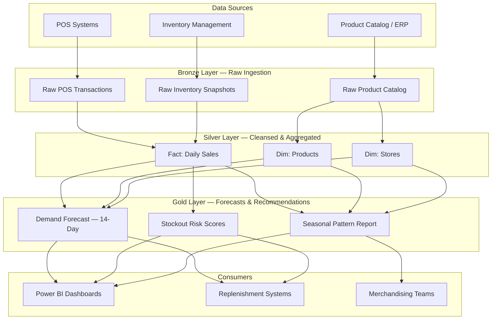

# Retail Demand Forecasting — Inventory Optimization & Seasonal Analytics

> [**Examples**](../README.md) > **Retail Demand Forecasting**

> [!TIP]
> **TL;DR** — End-to-end retail analytics platform that ingests point-of-sale transaction data, builds demand forecasts, scores stockout risk, and surfaces seasonal patterns. Raw POS events flow through a medallion architecture — bronze ingestion, silver cleansing and aggregation, gold ML-driven forecasts and inventory recommendations — to Power BI dashboards that help merchandising teams optimize replenishment and markdown timing.

---

## Table of Contents

- [Overview](#overview)
  - [Key Features](#key-features)
  - [Data Sources](#data-sources)
- [Architecture Overview](#architecture-overview)
- [Prerequisites](#prerequisites)
- [Quick Start](#quick-start)
- [Data Pipeline](#data-pipeline)
  - [Bronze Layer](#bronze-layer-raw-ingestion)
  - [Silver Layer](#silver-layer-cleansed-aggregated)
  - [Gold Layer](#gold-layer-forecasts-recommendations)
- [Sample Analytics Scenarios](#sample-analytics-scenarios)
- [Data Products](#data-products)
- [Data Contract](#data-contract)
- [Related Resources](#related-resources)
- [Contributing](#contributing)
- [License](#license)

---

## Overview

This example demonstrates a production-ready retail demand-forecasting pipeline built on Azure Cloud Scale Analytics (CSA). It shows how merchandising and supply-chain teams can transform raw POS transaction streams into forward-looking demand forecasts, stockout risk scores, and seasonal trend analyses — enabling data-driven replenishment, markdown optimization, and assortment planning.

### Key Features

- **14-Day Rolling Forecast**: Store/SKU-level demand projections using historical sales velocity and trend decomposition
- **Stockout Risk Scoring**: Probability-based alerting that flags SKUs likely to reach zero inventory before the next replenishment window
- **Seasonal Pattern Analysis**: Year-over-year decomposition of weekly sales into trend, seasonal, and residual components
- **Markdown Optimization Signals**: Identifies slow-moving inventory candidates based on sell-through rate versus category benchmarks
- **Store Clustering**: Groups locations by sales profile to support region-level planning

### Data Sources

| Source | Description | Ingestion |
|--------|-------------|-----------|
| **POS Transactions** | Line-item sales from store registers | Nightly batch to ADLS |
| **Product Catalog** | SKU master with category hierarchy and brand | CDC from ERP |
| **Inventory Snapshots** | Daily on-hand and on-order quantities by store/SKU | Nightly batch to ADLS |

> [!NOTE]
> All data in this example is **synthetic**. The `data/` folder contains fabricated sample records for demonstration purposes only.

---

## Architecture Overview



---

## Prerequisites

### Azure Resources

- Azure Subscription
- Azure Data Lake Storage Gen2 (for medallion layers)
- Azure Databricks Workspace or Azure Synapse Analytics
- Power BI Premium or Pro capacity (for dashboards)

### Tools Required

- Azure CLI >= 2.50
- dbt-core >= 1.7 with dbt-databricks or dbt-synapse adapter
- Python >= 3.10

### Permissions

- `Storage Blob Data Contributor` on ADLS Gen2
- Databricks workspace access with cluster create/attach rights

---

## Quick Start

### 1. Clone and Navigate

```bash
git clone https://github.com/your-org/csa-inabox.git
cd csa-inabox/examples/retail-demand-forecasting
```

### 2. Upload Sample Data

```bash
az storage blob upload-batch \
  --destination bronze/pos-transactions \
  --source data/ \
  --account-name csadatalakedev
```

### 3. Run dbt Models

```bash
cd domains
dbt seed --profiles-dir .
dbt run --profiles-dir .
dbt test --profiles-dir .
```

### 4. Explore Dashboards

Connect Power BI to the Gold layer tables (`rpt_demand_forecast`, `rpt_stockout_risk`, `rpt_seasonal_patterns`) and build visuals for replenishment planning.

---

## Data Pipeline

### Bronze Layer — Raw Ingestion

Raw data lands in ADLS Gen2 with minimal transformation. Each source retains its original schema.

| Table | Source | Format | Refresh |
|-------|--------|--------|---------|
| `raw_pos_transactions` | POS registers | CSV / Parquet | Nightly |
| `raw_products` | ERP product master | CSV / Parquet | CDC |
| `raw_inventory` | Inventory management system | CSV / Parquet | Nightly |

### Silver Layer — Cleansed & Aggregated

Deduplicated, type-cast, and aggregated to daily grain. Dimension tables provide lookup context.

| Table | Description | Key Joins |
|-------|-------------|-----------|
| `fct_daily_sales` | Daily sales quantity and revenue by store/SKU | `dim_products`, `dim_stores` |
| `dim_products` | Product dimension with category hierarchy | -- |
| `dim_stores` | Store dimension with region and format attributes | -- |

### Gold Layer — Forecasts & Recommendations

Business-ready outputs that drive downstream decisions.

| Table | Description | Refresh |
|-------|-------------|---------|
| `rpt_demand_forecast` | 14-day forward demand forecast per store/SKU | Daily |
| `rpt_stockout_risk` | Stockout probability scoring with days-of-supply | Daily |
| `rpt_seasonal_patterns` | Seasonal decomposition and year-over-year comparison | Weekly |

---

## Sample Analytics Scenarios

### Seasonal Demand Patterns

Identify SKUs whose weekly sales exhibit strong seasonal spikes — holiday peaks, back-to-school surges, summer dips. Use `rpt_seasonal_patterns` to compare the current week's seasonal index against historical norms and flag deviations that may require adjusted orders.

### Stockout Prediction

`rpt_stockout_risk` combines current on-hand inventory, average daily sell-through, and lead-time estimates to produce a probability that a given store/SKU combination will stock out within the next replenishment cycle. Merchandisers can filter to high-risk items and trigger expedited orders.

### Markdown Optimization

Compare an item's sell-through rate against its category average using `fct_daily_sales` and `dim_products`. SKUs with sell-through below the 25th percentile after 60 days on shelf are markdown candidates. Seasonal indices from `rpt_seasonal_patterns` prevent premature markdowns on items with predictable upcoming demand lifts.

---

## Data Products

| Data Product | Description | Consumers |
|-------------|-------------|-----------|
| **Demand Forecast** | 14-day rolling forecast at store/SKU grain with confidence intervals | Replenishment planners, auto-ordering systems |
| **Stockout Risk** | Scored list of at-risk items with estimated days-of-supply remaining | Store managers, supply-chain analysts |
| **Seasonal Trends** | Year-over-year seasonal decomposition by category and region | Merchandising directors, assortment planners |
| **Daily Sales Cube** | Cleansed, aggregated sales fact table for ad-hoc analysis | Business analysts, data science teams |

---

## Data Contract

The `contracts/sales.yml` file defines sources, column-level tests, and freshness expectations for the core sales data product. Key guarantees:

- **Freshness**: Daily sales available in Silver by 06:00 UTC following the transaction date
- **Uniqueness**: One row per store/SKU/day in `fct_daily_sales`
- **Referential integrity**: Every SKU in sales joins to `dim_products`; every store joins to `dim_stores`
- **Not-null enforcement**: Critical columns (`transaction_id`, `store_id`, `sku`) are never null

---

## Related Resources

- [Azure Data Lake Storage Gen2](https://learn.microsoft.com/en-us/azure/storage/blobs/data-lake-storage-introduction) — Scalable analytics storage
- [dbt Documentation](https://docs.getdbt.com/) — Transform data in your warehouse
- [Azure Databricks](https://learn.microsoft.com/en-us/azure/databricks/) — Unified analytics platform
- [Power BI](https://learn.microsoft.com/en-us/power-bi/) — Business intelligence dashboards
- [Time Series Forecasting](https://otexts.com/fpp3/) — Forecasting principles and practice

---

## Contributing

1. Fork the repository
2. Create a feature branch: `git checkout -b feature/retail-forecasting-enhancement`
3. Follow existing coding conventions and data contract patterns
4. Submit a pull request with test evidence

---

## License

This project is part of [CSA-in-a-Box](../../README.md) and follows the repository-level license.

## Directory Structure

```text
retail-demand-forecasting/
├── contracts/                # Data product contracts (schemas, tests)
│   └── sales.yml
├── data/                     # Synthetic sample data
│   └── sample_pos.csv
├── domains/                  # dbt models (bronze / silver / gold)
│   ├── bronze/
│   │   ├── stg_pos_transactions.sql
│   │   ├── stg_products.sql
│   │   └── stg_inventory.sql
│   ├── silver/
│   │   ├── fct_daily_sales.sql
│   │   ├── dim_products.sql
│   │   └── dim_stores.sql
│   └── gold/
│       ├── rpt_demand_forecast.sql
│       ├── rpt_stockout_risk.sql
│       └── rpt_seasonal_patterns.sql
└── README.md                 # This file
```
