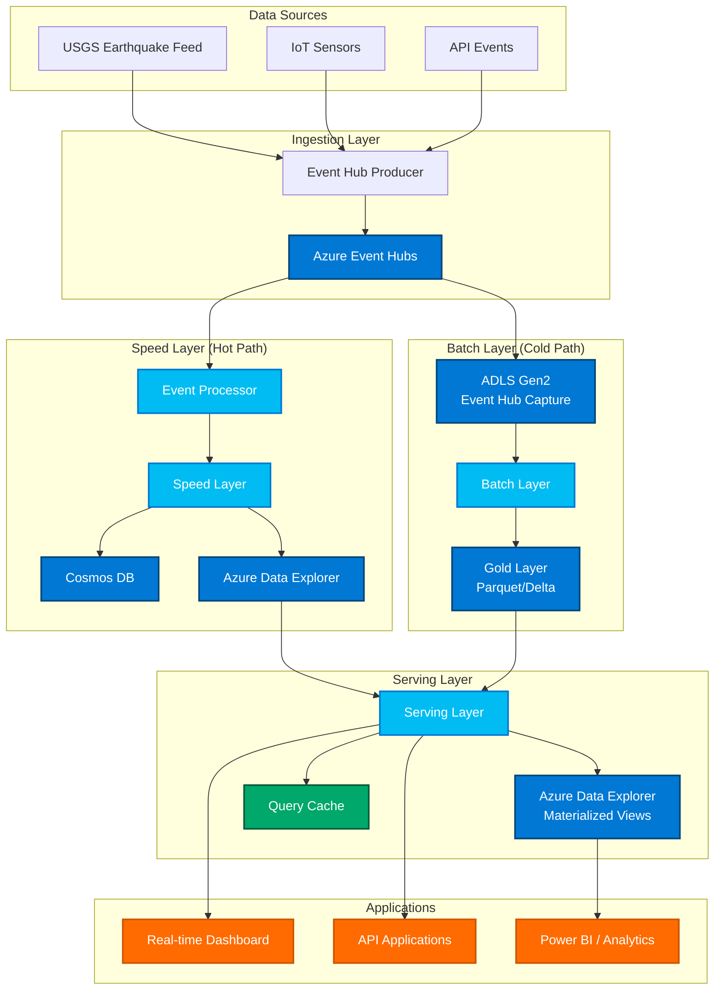

# CSA-in-a-Box Streaming Examples

This directory contains examples demonstrating the Lambda architecture implementation for real-time streaming data processing using Azure services.

## Architecture Overview

The CSA streaming platform implements the Lambda architecture pattern with three main layers:



## Components

### 1. Event Processor (`event_processor.py`)

Generic event processor that:
- Reads from Azure Event Hubs using async client
- Supports multiple event types (earthquake, weather, IoT, clickstream)
- Handles checkpointing via Azure Blob Storage
- Provides callback pattern for processing events
- Graceful shutdown handling

**Key Features:**
- Configurable batch sizes and wait times
- Automatic JSON parsing with schema validation
- Error handling and retry logic
- Checkpoint management for reliability

### 2. Speed Layer (`speed_layer.py`)

Real-time processing layer that:
- Processes events in real-time with low latency
- Applies sliding and tumbling window aggregations
- Writes to Cosmos DB for operational queries
- Writes to Azure Data Explorer for analytical queries
- In-memory event buffering with configurable limits

**Window Types:**
- **Sliding Windows**: 5-minute windows with 30-second slides
- **Tumbling Windows**: 1-minute non-overlapping windows

### 3. Batch Layer (`batch_layer.py`)

Batch processing layer that:
- Reads raw events from ADLS (Event Hubs Capture)
- Reprocesses using pandas for correctness
- Writes to Gold layer as Parquet files
- Compacts partitions for query performance
- Designed for scheduled execution (Azure Data Factory)

**Processing Features:**
- Data deduplication and validation
- Partitioned storage by event_type and date
- Automatic compaction of small files
- Checkpoint tracking for incremental processing

### 4. Serving Layer (`serving_layer.py`)

Unified query layer that:
- Merges speed layer (recent) + batch layer (historical) data
- Supports time-range queries with configurable overlap
- Provides both analytical (ADX) and operational (Cosmos) interfaces
- Handles deduplication between hot and cold paths

**Query Types:**
- Recent data from speed layer
- Historical data from batch layer  
- Merged views with overlap handling
- Operational lookups by ID/type/source

## Examples

### Earthquake Monitoring (`earthquake_monitor.py`)

Complete demonstration of the Lambda architecture using real earthquake data from USGS.

**Features:**
- Fetches earthquake data from USGS GeoJSON feeds
- Publishes events to Azure Event Hubs
- Real-time processing through speed layer
- Real-time terminal dashboard
- Magnitude-based aggregations and location tracking

**Usage:**

```bash
# Set required environment variables
export EVENTHUB_CONNECTION_STRING="Endpoint=sb://namespace.servicebus.windows.net/;..."
export EVENTHUB_NAME="earthquakes"
export COSMOS_ENDPOINT="https://account.documents.azure.com:443/"
export ADX_CLUSTER_URL="https://cluster.region.kusto.windows.net"
export ADLS_ACCOUNT_URL="https://storage.dfs.core.windows.net"

# Run producer only (fetch and publish earthquakes)
python earthquake_monitor.py --mode produce --interval 300

# Run consumer only (process events and display dashboard)
python earthquake_monitor.py --mode consume

# Run both producer and consumer
python earthquake_monitor.py --mode both
```

**Dashboard Output:**
```
================================================================================
🌍 REAL-TIME EARTHQUAKE MONITORING DASHBOARD
================================================================================

📊 STATISTICS:
   Events Processed: 145
   Total Earthquakes: 145
   Max Magnitude: 6.2
   Last Update: 2026-04-22 18:45:23

📈 MAGNITUDE DISTRIBUTION:
   1.0-2.9:   89 ████████████████████████████████████████████████████
   3.0-3.9:   32 ████████████████████████████████
   4.0-4.9:   20 ████████████████████
   5.0+:       4 ████

🌎 TOP LOCATIONS:
   California                    :  45
   Alaska                        :  23
   Japan                         :  18
   Chile                         :  12
   Indonesia                     :   8

⚡ SPEED LAYER WINDOWS:
   Active sliding windows: 12
   Active tumbling windows: 8

================================================================================
Press Ctrl+C to stop monitoring
================================================================================
```

## Prerequisites

### Required Azure Resources

1. **Azure Event Hubs Namespace**
   - Standard or Premium tier
   - Event Hub with multiple partitions
   - Capture enabled for batch processing

2. **Azure Data Lake Storage Gen2**
   - For Event Hub capture and batch processing
   - Hierarchical namespace enabled
   - Bronze/Gold layer directory structure

3. **Azure Cosmos DB** (Optional)
   - For operational queries
   - SQL API
   - Appropriate throughput provisioning

4. **Azure Data Explorer** (Optional)
   - For analytical queries
   - Cluster with appropriate compute/storage

5. **Azure Blob Storage**
   - For Event Hub checkpointing
   - Standard tier sufficient

### Python Dependencies

```bash
pip install \
    azure-eventhub \
    azure-eventhub-checkpointstoreblob-aio \
    azure-cosmos \
    azure-kusto-data \
    azure-storage-blob-aio \
    azure-storage-file-datalake-aio \
    azure-identity \
    pandas \
    pyarrow \
    aiohttp
```

### Environment Variables

```bash
# Required
export EVENTHUB_CONNECTION_STRING="Endpoint=sb://namespace.servicebus.windows.net/;SharedAccessKeyName=...;SharedAccessKey=..."
export EVENTHUB_NAME="your-event-hub"

# Optional (for full Lambda architecture)
export COSMOS_ENDPOINT="https://account.documents.azure.com:443/"
export ADX_CLUSTER_URL="https://cluster.region.kusto.windows.net"
export ADLS_ACCOUNT_URL="https://storage.dfs.core.windows.net"
export STORAGE_CONNECTION_STRING="DefaultEndpointsProtocol=https;AccountName=...;AccountKey=..."
```

## Configuration

### Event Hub Setup

1. Create Event Hubs namespace
2. Create Event Hub with 4+ partitions
3. Configure capture to ADLS for batch processing
4. Create shared access policy with Send/Listen permissions

### Azure Data Explorer Setup

```kusto
// Create database
.create database streaming

// Create realtime events table
.create table realtime_events (
    id: string,
    timestamp: datetime,
    event_type: string,
    source: string,
    payload: dynamic,
    window_start: datetime,
    window_end: datetime,
    window_type: string,
    processed_at: datetime
)

// Create batch aggregated table  
.create table batch_aggregated (
    id: string,
    timestamp: datetime,
    event_type: string,
    source: string,
    payload: dynamic,
    date: datetime,
    processing_time: datetime
)
```

### Cosmos DB Setup

```json
{
  "database": "streaming",
  "containers": [
    {
      "name": "realtime", 
      "partitionKey": "/event_type",
      "throughput": 1000
    }
  ]
}
```

## Performance Characteristics

### Speed Layer
- **Latency**: < 100ms end-to-end
- **Throughput**: 10,000+ events/second
- **Window Sizes**: 5-minute sliding, 1-minute tumbling
- **Memory Usage**: Configurable buffer limits

### Batch Layer
- **Latency**: Hours (scheduled processing)
- **Throughput**: 1M+ events/batch
- **Accuracy**: 100% (reprocessing with pandas)
- **Storage**: Partitioned Parquet/Delta format

### Serving Layer
- **Query Latency**: < 1 second
- **Overlap Window**: 15 minutes (configurable)
- **Cache TTL**: 5 minutes
- **Consistency**: Eventually consistent

## Troubleshooting

### Common Issues

1. **Event Hub Connection Errors**
   ```
   Solution: Verify connection string and network connectivity
   Check: Event Hub namespace exists and is accessible
   ```

2. **Checkpoint Failures**
   ```
   Solution: Ensure storage account and container exist
   Check: Managed identity or connection string permissions
   ```

3. **ADX Query Failures**
   ```
   Solution: Verify cluster URL and database name
   Check: Managed identity permissions and table schemas
   ```

4. **High Memory Usage**
   ```
   Solution: Reduce batch sizes and buffer limits
   Check: Event processing rate vs. consumption rate
   ```

### Monitoring

Monitor the following metrics:

- **Event Hub**: Incoming/outgoing messages, throttling errors
- **Cosmos DB**: Request units, throttling, latency
- **ADX**: Query performance, ingestion lag, cluster utilization
- **Application**: Memory usage, processing latency, error rates

## Best Practices

### Event Design
- Include timestamp and unique ID in all events
- Use consistent schema across event types
- Include source and version information
- Keep payload size reasonable (< 1MB)

### Processing
- Implement idempotent processing logic
- Use checkpointing for reliability
- Handle out-of-order events gracefully
- Monitor processing lag and errors

### Storage
- Partition data by time and event type
- Use appropriate compression (Snappy for Parquet)
- Implement data retention policies
- Monitor storage costs and performance

### Serving
- Cache frequently accessed data
- Use appropriate overlap windows
- Implement query timeouts
- Monitor query performance

## Extensions

The examples can be extended with:

- **Additional Event Types**: Weather, IoT sensors, application logs
- **Custom Aggregations**: Complex windowing logic, ML predictions
- **Real-time Alerts**: Threshold-based notifications
- **Geographic Processing**: Spatial aggregations and geo-fencing
- **Machine Learning**: Real-time inference and model serving
- **Multiple Tenants**: Multi-tenant event processing

## Related Documentation

- [Azure Event Hubs Documentation](https://docs.microsoft.com/azure/event-hubs/)
- [Azure Data Explorer Documentation](https://docs.microsoft.com/azure/data-explorer/)
- [Azure Cosmos DB Documentation](https://docs.microsoft.com/azure/cosmos-db/)
- [Lambda Architecture Pattern](https://docs.microsoft.com/azure/architecture/databases/guide/big-data-architectures#lambda-architecture)
