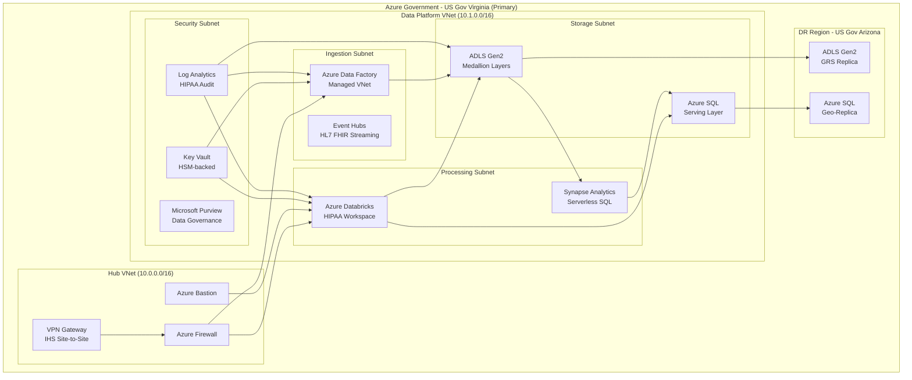
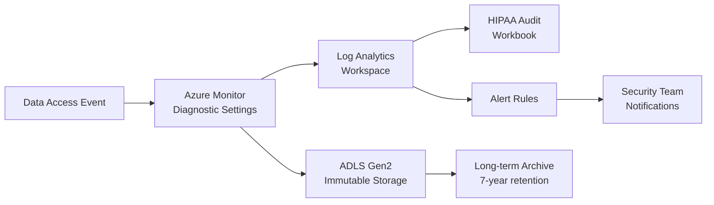
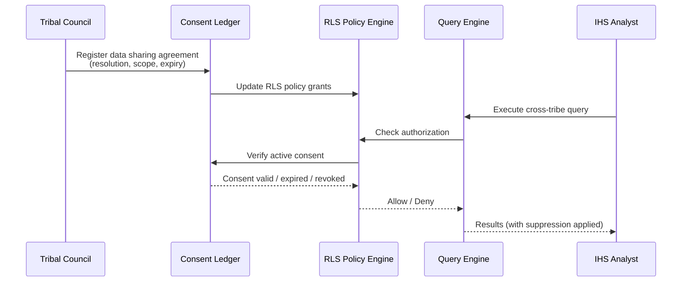
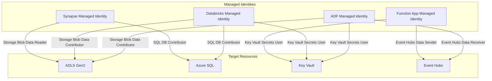

# Tribal Health Data Warehouse — Architecture

> **Last Updated:** 2026-04-15 | **Status:** Active | **Audience:** Architects / Data Engineers

## Table of Contents
- [Overview](#overview)
- [Azure Government Topology](#azure-government-topology)
  - [Region Selection](#region-selection)
- [HIPAA Compliance Architecture](#hipaa-compliance-architecture)
  - [Encryption](#encryption)
  - [Access Controls](#access-controls)
  - [Audit Logging](#audit-logging)
- [Tribal Data Sovereignty Zones](#tribal-data-sovereignty-zones)
  - [Per-Tribe Data Isolation Model](#per-tribe-data-isolation-model)
  - [Consent-Based Data Sharing](#consent-based-data-sharing)
- [HL7 FHIR Resource Mappings](#hl7-fhir-resource-mappings)
  - [FHIR Extension: Tribal Affiliation](#fhir-extension-tribal-affiliation)
- [Network Architecture](#network-architecture)
  - [Private Endpoints](#private-endpoints)
  - [Network Security Groups](#network-security-groups)
- [Managed Identity Architecture](#managed-identity-architecture)
- [Medallion Architecture Detail](#medallion-architecture-detail)
  - [Bronze Layer](#bronze-layer)
  - [Silver Layer](#silver-layer)
  - [Gold Layer](#gold-layer)
- [Disaster Recovery](#disaster-recovery)
- [Technology Stack](#technology-stack)
  - [Core Platform (Azure Government)](#core-platform-azure-government)
  - [Security & Compliance](#security--compliance)
  - [Development Tools](#development-tools)

## Overview

The Tribal Health Data Warehouse is built on Azure Cloud Scale Analytics (CSA) and deployed exclusively within Azure Government regions. The architecture enforces HIPAA compliance, FedRAMP High controls, and tribal data sovereignty at every layer — from network topology to row-level security in analytical models.

## Azure Government Topology

All resources are provisioned in Azure Government regions. No data leaves the US Government cloud boundary.



### Region Selection

| Component | Primary Region | DR Region | Justification |
|---|---|---|---|
| Compute (Databricks, Synapse) | US Gov Virginia | US Gov Arizona | FedRAMP High availability, IHS proximity |
| Storage (ADLS Gen2) | US Gov Virginia | US Gov Arizona (GRS) | Data residency, geo-redundancy |
| Networking (Firewall, VPN) | US Gov Virginia | US Gov Arizona | IHS WAN connectivity |
| Secrets (Key Vault) | US Gov Virginia | US Gov Arizona | HSM-backed, geo-replicated |

## HIPAA Compliance Architecture

### Encryption

```text
┌─────────────────────────────────────────────────────────┐
│                    Encryption Model                      │
├─────────────────────────────────────────────────────────┤
│  At Rest:                                                │
│    ├── ADLS Gen2: Microsoft-managed keys (SSE-M)        │
│    │   └── Option: Customer-managed keys (CMK) via       │
│    │       Key Vault HSM for tribal-controlled encryption│
│    ├── Azure SQL: TDE with service-managed key           │
│    ├── Databricks: Platform encryption + DBFS encryption │
│    └── Backups: Encrypted with same key hierarchy        │
│                                                          │
│  In Transit:                                             │
│    ├── TLS 1.3 enforced on all endpoints                │
│    ├── Private endpoints for all PaaS services          │
│    ├── VPN (IKEv2/IPsec) for IHS site-to-site          │
│    └── mTLS for service-to-service communication        │
│                                                          │
│  In Use:                                                 │
│    ├── Column-level encryption for SSN, DOB (if present)│
│    ├── Dynamic data masking on Silver layer              │
│    └── Always Encrypted for SQL serving layer           │
└─────────────────────────────────────────────────────────┘
```

### Access Controls

**Authentication**
- Azure AD (Gov) with MFA enforced for all interactive access
- CAC/PIV smart card support for IHS federal employees
- Managed Identity for all service-to-service authentication — no shared secrets
- Conditional Access policies: compliant device required, Gov network preferred

**Authorization**
- Azure RBAC for infrastructure access (Contributor, Reader, Data roles)
- Databricks Unity Catalog for table-level and column-level permissions
- Row-Level Security (RLS) for tribal data isolation (see Data Sovereignty section)
- Just-In-Time (JIT) access for administrative operations via Privileged Identity Management

### Audit Logging

Every data access event is captured in a tamper-evident audit chain:



Audit fields captured:
- `principal_id`: Azure AD object ID of the accessor
- `principal_upn`: User principal name
- `source_ip`: Client IP address
- `resource_accessed`: Table/column/row filter applied
- `tribal_affiliation_filter`: Which tribe's data was in scope
- `rows_returned`: Count of rows returned
- `suppression_applied`: Whether small cell suppression was triggered
- `access_purpose`: Treatment / Operations / Research / PublicHealth
- `timestamp_utc`: Event time in UTC

## Tribal Data Sovereignty Zones

### Per-Tribe Data Isolation Model

Each tribal affiliation maps to an isolated data zone enforced through multiple layers:

```text
┌───────────────────────────────────────────────────────────────┐
│                    Data Sovereignty Layers                     │
├───────────────────────────────────────────────────────────────┤
│                                                               │
│  Layer 1: Storage (ADLS Gen2)                                │
│    ├── /bronze/tribal-health/all/         (combined ingest)  │
│    ├── /silver/tribal-health/tribe=NAV/   (partitioned)      │
│    ├── /silver/tribal-health/tribe=CHE/   (partitioned)      │
│    └── /gold/tribal-health/tribe=NAV/     (partitioned)      │
│         └── ACL: sg-tribal-nav-health-readers                │
│                                                               │
│  Layer 2: Compute (Databricks Unity Catalog)                 │
│    ├── RLS policy on slv_patient_demographics:               │
│    │   WHERE tribal_affiliation = current_user_tribe()       │
│    ├── RLS policy on slv_encounters:                         │
│    │   WHERE tribal_affiliation = current_user_tribe()       │
│    └── Column masking on PHI fields for non-clinical roles   │
│                                                               │
│  Layer 3: Consent Ledger (Immutable ADLS)                    │
│    ├── Data sharing agreements with expiry dates             │
│    ├── Tribal council resolution references                  │
│    ├── Revocation records (propagate within 15 min)          │
│    └── Cross-tribe query authorizations                      │
│                                                               │
│  Layer 4: Gold Aggregation                                   │
│    ├── Small cell suppression (n < 5)                        │
│    ├── Complementary suppression to prevent back-calc        │
│    └── Aggregate-only sharing mode for inter-tribal reports  │
│                                                               │
└───────────────────────────────────────────────────────────────┘
```

### Consent-Based Data Sharing



## HL7 FHIR Resource Mappings

The data models align with HL7 FHIR R4 resources to enable interoperability with tribal health IT systems and IHS modernization efforts.

| Bronze Table | FHIR Resource | Key Fields Mapped |
|---|---|---|
| `brz_patient_demographics` | Patient | identifier, birthDate (as age_group), gender, extension:tribalAffiliation |
| `brz_encounters` | Encounter | identifier, subject, period, type, diagnosis, serviceProvider |
| `brz_facilities` | Organization | identifier, name, type, address, extension:serviceUnit |
| (Gold) `gld_diabetes_prevalence` | MeasureReport | measure, period, group, population, stratifier |

### FHIR Extension: Tribal Affiliation

```json
{
  "url": "http://ihs.gov/fhir/StructureDefinition/tribal-affiliation",
  "valueCodeableConcept": {
    "coding": [{
      "system": "http://ihs.gov/fhir/CodeSystem/tribal-affiliation",
      "code": "NAV",
      "display": "Navajo Nation"
    }]
  }
}
```

## Network Architecture

### Private Endpoints

All data-path communication uses Azure Private Link — no data traverses the public internet.

| Service | Private Endpoint | Subnet |
|---|---|---|
| ADLS Gen2 | pe-adls-tribalhealth | Storage Subnet |
| Azure SQL | pe-sql-tribalhealth | Storage Subnet |
| Key Vault | pe-kv-tribalhealth | Security Subnet |
| Databricks | pe-dbr-tribalhealth | Processing Subnet |
| Event Hubs | pe-eh-tribalhealth | Ingestion Subnet |
| Synapse | pe-syn-tribalhealth | Processing Subnet |
| Purview | pe-pur-tribalhealth | Security Subnet |

### Network Security Groups

```text
Ingestion Subnet NSG:
  ├── Allow: VPN Gateway → ADF (443)
  ├── Allow: ADF → ADLS PE (443)
  ├── Deny: All inbound from Internet
  └── Deny: All outbound to Internet

Processing Subnet NSG:
  ├── Allow: Bastion → Databricks (443)
  ├── Allow: Databricks → ADLS PE (443)
  ├── Allow: Databricks → SQL PE (1433)
  ├── Allow: Databricks → Key Vault PE (443)
  ├── Deny: All inbound from Internet
  └── Deny: All outbound to Internet (except control plane)
```

## Managed Identity Architecture

No shared secrets, passwords, or long-lived tokens. All service-to-service authentication uses Azure Managed Identity.



## Medallion Architecture Detail

### Bronze Layer

- **Purpose**: Raw data landing with minimal transformation
- **Storage**: ADLS Gen2, Delta format, partitioned by `ingestion_date`
- **Retention**: 7 years (HIPAA retention requirement)
- **Access**: Data engineering team only
- **Encryption**: Platform-managed keys (option for CMK)

### Silver Layer

- **Purpose**: Cleaned, validated, de-identified, clinically standardized data
- **Storage**: ADLS Gen2, Delta format, partitioned by `tribal_affiliation` and `encounter_year`
- **Tribal Isolation**: RLS policies enforced at this layer
- **Quality Gates**: ICD-10 validation, age-appropriate diagnosis checks, PHI de-identification verification
- **Access**: Data engineering, tribal health analysts (RLS-filtered)

### Gold Layer

- **Purpose**: Aggregated analytics models with small cell suppression
- **Storage**: ADLS Gen2 + Azure SQL serving layer, Delta format
- **Suppression**: All outputs with n < 5 are suppressed; complementary suppression applied
- **Access**: Tribal health authorities, IHS area epidemiologists, public health researchers (aggregate only)
- **Freshness**: Monthly rebuild aligned with GPRA reporting cycles

## Disaster Recovery

| Metric | Target | Implementation |
|---|---|---|
| RTO | 4 hours | Automated failover for SQL, manual for Databricks |
| RPO | 1 hour | GRS replication for ADLS, continuous geo-replication for SQL |
| Retention | 7 years | HIPAA minimum; immutable storage for audit logs |
| DR Region | US Gov Arizona | All critical services replicated |

## Technology Stack

### Core Platform (Azure Government)
- **Compute**: Azure Databricks (HIPAA workspace), Azure Functions
- **Storage**: Azure Data Lake Storage Gen2, Azure SQL Database
- **Orchestration**: Azure Data Factory, Azure Logic Apps
- **Analytics**: Synapse Analytics Serverless, Power BI (Gov)
- **Governance**: Microsoft Purview (Gov), Unity Catalog

### Security & Compliance
- **Identity**: Azure AD (Gov), Conditional Access, PIM
- **Secrets**: Key Vault with HSM backing
- **Networking**: Azure Firewall, Private Link, NSGs
- **Monitoring**: Azure Monitor, Log Analytics, Microsoft Sentinel (Gov)

### Development Tools
- **Data Modeling**: dbt (1.7+), Great Expectations
- **Version Control**: Azure DevOps (Gov) or GitHub Enterprise
- **CI/CD**: Azure Pipelines with Gov agent pools
- **IaC**: Bicep (Azure-native)

---

## Related Documentation

- [Tribal Health README](README.md) — Deployment guide, quick start, and analytics scenarios
- [Platform Architecture](../../docs/ARCHITECTURE.md) — Core CSA platform architecture
- [Platform Services](../../docs/PLATFORM_SERVICES.md) — Shared Azure service configurations
- [Interior Architecture](../interior/ARCHITECTURE.md) — Related federal/tribal architecture
- [Casino Analytics Architecture](../casino-analytics/ARCHITECTURE.md) — Related tribal operations architecture
