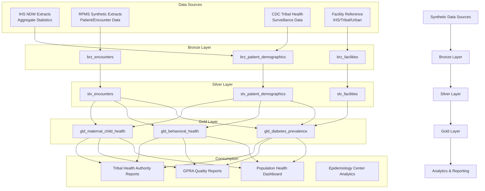

# Tribal Health Data Warehouse — IHS & Tribal Health Analytics

A population health analytics platform built on Azure Cloud Scale Analytics (CSA) for Indian Health Service (IHS) area offices, tribal health organizations, and urban Indian health programs. Deployed exclusively in Azure Government with HIPAA, FedRAMP High, and tribal data sovereignty compliance.

## Overview

The Indian Health Service provides healthcare to approximately 2.6 million American Indians and Alaska Natives across 574 federally recognized tribes. Tribal health systems face unique challenges: vast geographic service areas, complex jurisdictional relationships, chronic disease burdens significantly exceeding national averages, and critical behavioral health needs. This platform ingests, transforms, and analyzes health data from IHS service units and tribal health programs to provide actionable insights for population health management, resource allocation, and health equity measurement.

The platform follows the medallion architecture (Bronze → Silver → Gold), uses HL7 FHIR-aligned data models, and enforces tribal data sovereignty at every layer.

> **⚠️ CRITICAL: All Data Is Synthetic**
>
> Individual-level tribal health data is **restricted by tribal law, federal policy, and HIPAA**. This platform uses only:
> - **Aggregate IHS public statistics** (published reports and fact sheets)
> - **Fully synthetic RPMS-compatible data** generated for demonstration purposes
> - **HL7 FHIR R4 schemas** for interoperability without exposing real patient data
>
> **No real patient data, tribal member data, or Protected Health Information (PHI) is included.** Any deployment with real data requires explicit tribal council authorization, a data sharing agreement, and IRB approval.

### Key Features

- **Azure Government Deployment**: All resources provisioned in US Gov Virginia / US Gov Arizona — FedRAMP High baseline
- **HIPAA-Compliant Architecture**: Encryption at rest (AES-256) and in transit (TLS 1.3), PHI audit logging, BAA coverage
- **Tribal Data Sovereignty**: Per-tribe data isolation via Row-Level Security, tribal-controlled access policies, data sharing consent framework
- **HL7 FHIR Alignment**: Data models map to FHIR R4 resources (Patient, Encounter, Organization, Condition) for interoperability
- **Population Health Analytics**: Chronic disease tracking, behavioral health metrics, maternal/child health outcomes
- **De-identified Reporting**: Automated suppression of small cell sizes (<5) per IHS data release policy

### Data Sources

All source data is synthetic. The architecture supports these real-world source patterns:

| Source | Type | Description | Access |
|---|---|---|---|
| IHS National Data Warehouse (NDW) | Aggregate | Published health statistics by IHS area | https://www.ihs.gov/dps/ |
| RPMS (Resource & Patient Management System) | Synthetic | EHR data via synthetic RPMS-compatible extracts | Included generator |
| CDC Tribal Health Data | Aggregate | SVI, BRFSS tribal supplement, vital statistics | https://wonder.cdc.gov/ |
| CMS Quality Measures | Reference | HEDIS/GPRA clinical quality measures | https://www.cms.gov/ |
| Tribal Epidemiology Centers | Aggregate | Regional health surveillance (consent-based) | By arrangement |

### Compliance Framework

| Regulation | Requirement | Implementation |
|---|---|---|
| HIPAA | PHI protection, audit controls | Encryption, RBAC, audit logging, BAA |
| FedRAMP High | Federal cloud security baseline | Azure Government, NIST 800-53 controls |
| Tribal Data Sovereignty | Tribal ownership of member health data | Per-tribe RLS, consent ledger, data sharing agreements |
| IHS Data Policy | Small cell suppression, aggregate-only release | Automated suppression in Gold models |
| 42 CFR Part 2 | Substance use disorder record confidentiality | Segmented access, SUD consent tracking |
| FISMA | Federal information security | Continuous monitoring, POA&M tracking |

## Architecture Overview



## Prerequisites

### Azure Government Resources

> **IMPORTANT**: This example deploys EXCLUSIVELY to Azure Government (usgovvirginia / usgovarizona). Azure Commercial is not supported for this workload due to FedRAMP High and IHS compliance requirements.

- Azure Government subscription with contributor access
- Azure Data Factory (Gov) or Synapse Analytics (Gov)
- Azure Data Lake Storage Gen2 (Gov) with hierarchical namespace enabled
- Azure Databricks (Gov) or Synapse SQL Pool
- Azure Key Vault (Gov) with HSM backing for tribal-controlled encryption keys
- Azure Monitor (Gov) with HIPAA-compliant diagnostic settings
- Azure API for FHIR (Gov) — endpoint: `.fhir.azurehealthcareapis.us`

### Tools Required

- Azure CLI (2.55.0+) configured for Azure Government (`az cloud set --name AzureUSGovernment`)
- dbt CLI (1.7.0+)
- Python 3.9+
- Git

### Compliance Prerequisites

- FedRAMP High ATO or equivalent authorization
- HIPAA BAA with Microsoft (included with Azure Government)
- Tribal council data sharing agreement (for any real data deployment)
- IRB approval (for research use cases)

## Quick Start

### 1. Configure Azure Government Environment

```bash
# Set cloud environment to Azure Government
az cloud set --name AzureUSGovernment
az login --tenant <your-gov-tenant-id>

# Verify you're in Gov cloud
az cloud show --query name
# Expected output: "AzureUSGovernment"
```

### 2. Generate Synthetic Data

```bash
# Install dependencies
pip install -r requirements.txt

# Generate synthetic patient, encounter, and facility data
# CRITICAL: This generates ENTIRELY SYNTHETIC data. No real patient data.
python data/generators/generate_tribal_health_data.py \
    --patients 25000 \
    --days 730 \
    --facilities 50 \
    --output-dir domains/dbt/seeds \
    --seed 42

# Small dataset for quick testing
python data/generators/generate_tribal_health_data.py \
    --patients 1000 \
    --days 90 \
    --facilities 15 \
    --output-dir domains/dbt/seeds \
    --seed 42
```

### 3. Deploy Infrastructure

```bash
# Configure deployment parameters
cp deploy/params.dev.json deploy/params.local.json
# Edit params.local.json — ensure region is usgovvirginia or usgovarizona

# Deploy to Azure Government
az deployment group create \
    --resource-group rg-tribal-health-analytics \
    --template-file ../../deploy/bicep/DLZ/main.bicep \
    --parameters @deploy/params.local.json \
    --parameters azureEnvironment=AzureUSGovernment
```

### 4. Run dbt Models

```bash
cd domains/dbt

# Verify connectivity
dbt debug

# Load synthetic seed data
dbt seed

# Run Bronze → Silver → Gold models
dbt run

# Execute data quality tests (including HIPAA validation)
dbt test

# Generate documentation
dbt docs generate
dbt docs serve
```

## Analytics Scenarios

### 1. Diabetes Prevalence Tracking

Type 2 diabetes affects American Indian/Alaska Native populations at 2-3x the national average. This model tracks prevalence by service unit, A1C control rates, complication rates, and intervention effectiveness with year-over-year trends.

```sql
-- Diabetes prevalence and A1C control by service unit
SELECT
    service_unit,
    reporting_period,
    total_diabetic_patients,
    total_population,
    prevalence_rate_per_1000,
    a1c_controlled_pct,
    a1c_poor_control_pct,
    complication_rate_pct,
    retinopathy_screening_pct,
    nephropathy_screening_pct,
    foot_exam_pct,
    yoy_prevalence_change_pct
FROM gold.gld_diabetes_prevalence
WHERE reporting_period >= '2023-01-01'
ORDER BY prevalence_rate_per_1000 DESC;
```

### 2. Behavioral Health Resource Allocation

Behavioral health services are critically under-resourced in many tribal communities. This model surfaces substance use trends, mental health service utilization, provider-to-population ratios, waitlist metrics, and crisis intervention counts.

```sql
-- Behavioral health service gaps and resource needs
SELECT
    service_unit,
    reporting_period,
    sud_encounter_rate_per_1000,
    mh_encounter_rate_per_1000,
    total_bh_encounters,
    unique_bh_patients,
    provider_ratio_per_10000,
    avg_waitlist_days,
    crisis_intervention_count,
    telehealth_utilization_pct,
    no_show_rate_pct
FROM gold.gld_behavioral_health
WHERE reporting_period >= '2023-01-01'
ORDER BY avg_waitlist_days DESC;
```

### 3. Maternal & Child Health Outcomes

Tracking prenatal visit completion, birth outcomes, immunization rates, and well-child visit adherence to reduce MCH disparities.

```sql
-- MCH outcomes by service unit and age cohort
SELECT
    service_unit,
    reporting_period,
    total_pregnancies,
    prenatal_first_trimester_pct,
    adequate_prenatal_visits_pct,
    low_birth_weight_pct,
    preterm_birth_pct,
    immunization_series_complete_pct,
    well_child_0to1_adherence_pct,
    well_child_1to2_adherence_pct,
    well_child_3to5_adherence_pct,
    teen_pregnancy_rate_per_1000
FROM gold.gld_maternal_child_health
WHERE reporting_period >= '2023-01-01'
ORDER BY prenatal_first_trimester_pct ASC;
```

## Data Sovereignty

### Tribal Control Over Health Data

This platform is designed with tribal data sovereignty as a foundational principle, not an afterthought.

**Per-Tribe Data Isolation**
- Each tribal affiliation maps to an Azure AD security group
- Row-Level Security (RLS) policies on Silver and Gold tables restrict queries to authorized tribal data only
- Tribal health directors control who can access their nation's data
- Cross-tribe queries require explicit data sharing agreements registered in the consent ledger

**Data Sharing Consent Framework**
- Every data sharing action is logged to an immutable audit ledger in ADLS Gen2
- Tribal councils can revoke data access at any time — revocation propagates within 15 minutes
- Aggregate-only sharing mode: tribes can share de-identified aggregate statistics without exposing row-level data
- IHS area office access requires a current Tribal Resolution or equivalent authorization

**De-Identification & Small Cell Suppression**
- Gold-layer models automatically suppress any cell with fewer than 5 individuals
- Secondary suppression (complementary suppression) prevents back-calculation
- De-identification follows the HIPAA Safe Harbor method with tribal-specific additional protections
- Re-identification risk assessments run quarterly

```yaml
# Example: Data sharing agreement configuration
tribal_data_sharing:
  tribe_code: "NAV"
  tribe_name: "Navajo Nation"
  sharing_level: "aggregate_only"
  authorized_consumers:
    - "IHS_Navajo_Area_Office"
    - "Navajo_Epi_Center"
  excluded_categories:
    - "substance_use_disorder"  # 42 CFR Part 2
    - "behavioral_health_individual"
  consent_expiry: "2025-12-31"
  tribal_resolution_number: "CJN-42-24"
```

## Data Products

### Population Health Summary (`population-health`)
- **Description**: Aggregated population health metrics by service unit and tribal affiliation
- **Classification**: CUI // SP-HLTH (Controlled Unclassified Information — Health)
- **Freshness**: Monthly updates
- **Coverage**: All 12 IHS service units, 730 days of history
- **Access**: Tribal health authorities, IHS area epidemiologists

### Diabetes Registry (`diabetes-registry`)
- **Description**: De-identified diabetes cohort metrics with A1C tracking
- **Classification**: CUI // SP-HLTH
- **Freshness**: Quarterly updates aligned with GPRA reporting
- **Coverage**: Type 2 diabetes population across all service units

### Behavioral Health Dashboard (`behavioral-health`)
- **Description**: Service utilization, provider capacity, and access metrics
- **Classification**: CUI // SP-HLTH, 42 CFR Part 2 restricted
- **Freshness**: Monthly updates
- **Coverage**: Mental health and SUD services

## Configuration

### dbt Profiles

Add to your `~/.dbt/profiles.yml`:

```yaml
tribal_health_analytics:
  target: dev
  outputs:
    dev:
      type: databricks
      host: "{{ env_var('DBT_HOST') }}"
      http_path: "{{ env_var('DBT_HTTP_PATH') }}"
      token: "{{ env_var('DBT_TOKEN') }}"
      schema: tribal_health_dev
      catalog: dev
    staging:
      type: databricks
      host: "{{ env_var('DBT_HOST_STAGING') }}"
      http_path: "{{ env_var('DBT_HTTP_PATH_STAGING') }}"
      token: "{{ env_var('DBT_TOKEN_STAGING') }}"
      schema: tribal_health_staging
      catalog: staging
    prod:
      type: databricks
      host: "{{ env_var('DBT_HOST_PROD') }}"
      http_path: "{{ env_var('DBT_HTTP_PATH_PROD') }}"
      token: "{{ env_var('DBT_TOKEN_PROD') }}"
      schema: tribal_health
      catalog: prod
```

### Environment Variables

```bash
# Azure Government configuration
AZURE_ENVIRONMENT=AzureUSGovernment
AZURE_GOV_TENANT_ID=your-gov-tenant-id

# dbt connectivity (Azure Databricks on Gov)
DBT_HOST=adb-xxxxxxxxxxxx.xx.azuredatabricks.us    # Note: .us for Gov
DBT_HTTP_PATH=/sql/1.0/warehouses/xxxxxxxxxxxx
DBT_TOKEN=dapi-xxxxxxxxxxxx

# HIPAA audit logging
AUDIT_LOG_STORAGE_ACCOUNT=stauditlogstribalhealth
AUDIT_LOG_CONTAINER=hipaa-audit-logs

# Data sovereignty
TRIBAL_DATA_CONSENT_LEDGER=tribal-consent-ledger
DATA_SHARING_CONFIG_PATH=./config/data-sharing-agreements.yaml

# Monitoring
LOG_LEVEL=INFO
HIPAA_AUDIT_ENABLED=true
SMALL_CELL_THRESHOLD=5
```

## Monitoring & Compliance

### HIPAA-Compliant Logging

All data access is logged to a tamper-evident audit trail:

- **Who** accessed data (Azure AD principal, IP address)
- **What** data was queried (table, columns, row count, tribal affiliation filter)
- **When** the access occurred (UTC timestamp)
- **Why** — linked to authorized purpose code (treatment, operations, research)
- **Outcome** — query success/failure, rows returned, suppression applied

```bash
# Query audit logs (Azure Monitor / Log Analytics)
az monitor log-analytics query \
    --workspace $LOG_ANALYTICS_WORKSPACE_ID \
    --analytics-query "
        TribalHealthAudit_CL
        | where TimeGenerated > ago(24h)
        | where AccessType_s == 'PHI_QUERY'
        | summarize QueryCount=count() by Principal_s, TableAccessed_s
        | order by QueryCount desc
    "
```

### Data Quality Monitoring

- **dbt Tests**: Schema validation, referential integrity, clinical value range checks
- **HIPAA Validation**: PHI field encryption verification, access control audit
- **Clinical Validity**: ICD-10 code validation, age-appropriate diagnosis checks
- **Small Cell Suppression**: Automated verification that no Gold-layer output contains cells < 5
- **Data Freshness**: Alerts when source data hasn't updated within SLA

## Development

### Adding New Health Domains

1. Create Bronze model in `domains/dbt/models/bronze/` with source mapping
2. Add HIPAA-relevant data quality tests in `schema.yml`
3. Create Silver model with clinical data standardization and de-identification flags
4. Add Gold aggregation with small cell suppression logic
5. Update data contracts in `contracts/` with CUI classification
6. Register new tribal data access policies

### Testing

```bash
# Unit tests for data generator
pytest data/tests/

# dbt model tests (includes HIPAA validation)
dbt test

# Test specific compliance tags
dbt test --select tag:hipaa_compliance
dbt test --select tag:data_sovereignty

# Integration tests
pytest data/tests/integration/
```

## Troubleshooting

### Common Issues

1. **Azure Government Login**: Ensure `az cloud set --name AzureUSGovernment` before `az login`. Gov endpoints differ from commercial Azure.

2. **dbt Connection to Gov Databricks**: Gov Databricks URLs end in `.azuredatabricks.us` not `.azuredatabricks.net`. Verify your DBT_HOST.

3. **Small Cell Suppression Errors**: If Gold models fail validation, check that all aggregate outputs have n >= 5. Adjust grouping granularity if needed.

4. **Tribal RLS Policy Conflicts**: Ensure the querying principal belongs to exactly one tribal AD group. Multi-tribe membership requires explicit cross-tribe authorization.

5. **42 CFR Part 2 Access Denied**: Substance use disorder data requires separate consent. Verify the SUD consent flag in the consent ledger.

### Logs

- Application logs: `logs/tribal-health-analytics.log`
- dbt logs: `domains/dbt/logs/dbt.log`
- HIPAA audit logs: Azure Monitor → Log Analytics workspace
- Data pipeline logs: Azure Data Factory monitoring (Gov portal)

## Ethical Considerations

This platform was designed with the following ethical principles:

1. **Tribal Sovereignty**: Tribes own their data. No deployment with real data proceeds without explicit tribal council authorization.
2. **Community Benefit**: Analytics must serve the health needs of tribal communities, not external research agendas.
3. **Transparency**: All algorithms and scoring methods are documented and auditable.
4. **No Harm**: Aggregate statistics are published at levels that prevent re-identification of individuals or small communities.
5. **Reciprocity**: Findings and dashboards are shared with tribal health programs, not locked behind paywalls.

## Contributing

1. Fork the repository
2. Create a feature branch (`git checkout -b feature/new-health-domain`)
3. Ensure HIPAA compliance in any new data models
4. Add appropriate data quality tests
5. Run `dbt test --select tag:hipaa_compliance` before submitting
6. Submit a pull request with security review tag

## License

This project is licensed under the MIT License. See `LICENSE` file for details.

## Acknowledgments

- Indian Health Service for publicly available aggregate health statistics
- Tribal Epidemiology Centers for population health methodology guidance
- HL7 FHIR community for interoperability standards
- Azure Government team for FedRAMP High platform support
- Azure Cloud Scale Analytics team for the foundational platform architecture

## Disclaimer

This example uses **entirely synthetic data** generated to reflect publicly available aggregate health statistics from IHS annual reports. No real patient data, tribal member data, or Protected Health Information (PHI) is included. The synthetic data generator produces statistically plausible distributions for development and demonstration purposes only. Any resemblance to real individuals is coincidental.
