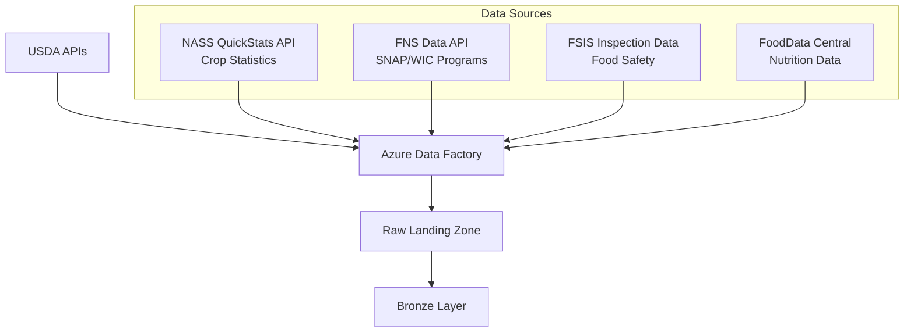
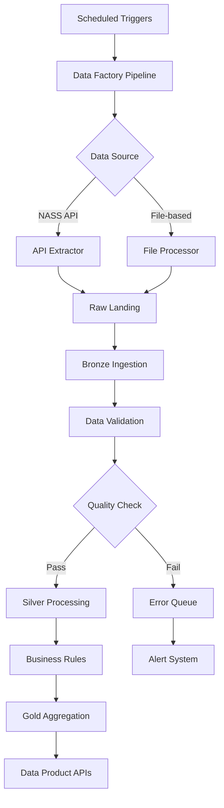
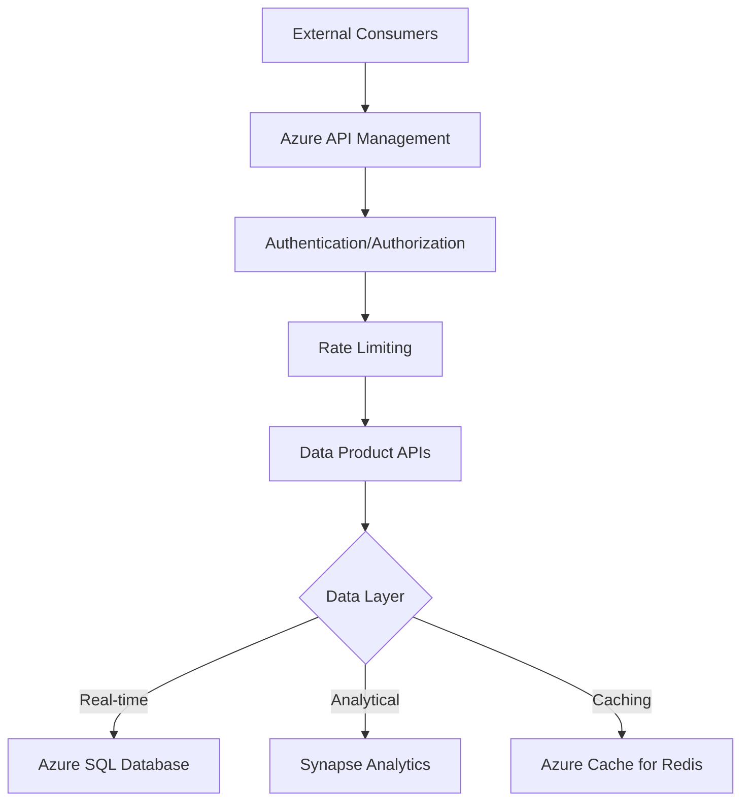
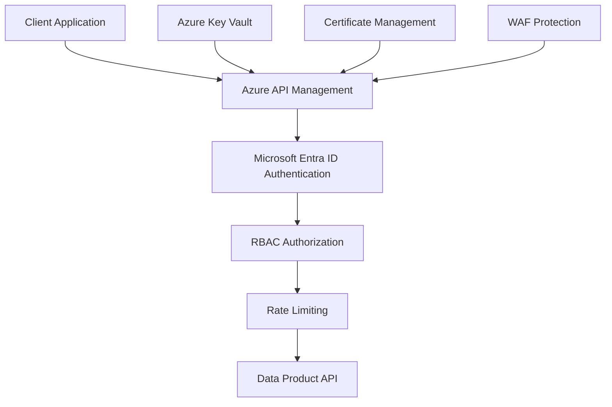
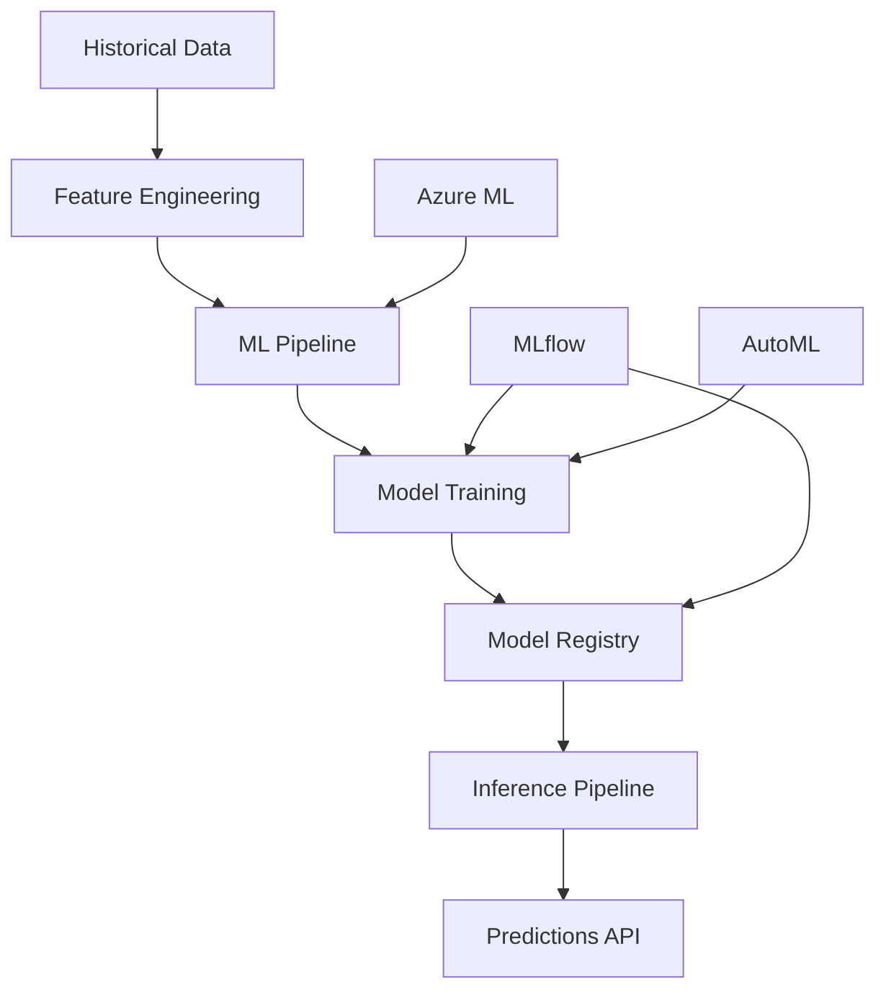

# USDA Agricultural Analytics Architecture

> [**Examples**](../README.md) > [**USDA**](README.md) > **Architecture**

> **Last Updated:** 2026-04-15 | **Status:** Active | **Audience:** Architects / Data Engineers

> [!TIP]
> **TL;DR** — Agricultural analytics architecture ingesting NASS crop statistics, FNS SNAP data, and FSIS inspection records through a medallion pipeline. Features crop yield forecasting with ML integration and API-first data product delivery.


---

## 📋 Table of Contents
- [Overview](#overview)
- [Domain Context](#domain-context)
  - [Agricultural Data Landscape](#agricultural-data-landscape)
  - [Data Characteristics](#data-characteristics)
- [Architecture Layers](#architecture-layers)
  - [Data Ingestion Layer](#data-ingestion-layer)
  - [Bronze Layer (Raw Data)](#bronze-layer-raw-data)
  - [Silver Layer (Cleaned & Conformed)](#silver-layer-cleaned--conformed)
  - [Gold Layer (Business Analytics)](#gold-layer-business-analytics)
- [Data Flow Architecture](#data-flow-architecture)
  - [Batch Processing Pipeline](#batch-processing-pipeline)
  - [Real-time Processing (Future)](#real-time-processing-future)
- [Integration Patterns](#integration-patterns)
  - [API Gateway Architecture](#api-gateway-architecture)
  - [Data Contracts](#data-contracts)
- [Security Architecture](#security-architecture)
  - [Data Protection](#data-protection)
  - [Compliance](#compliance)
  - [API Security](#api-security)
- [Performance Optimization](#performance-optimization)
  - [Data Partitioning Strategy](#data-partitioning-strategy)
  - [Caching Strategy](#caching-strategy)
  - [Indexing Strategy](#indexing-strategy)
- [Monitoring & Observability](#monitoring--observability)
  - [Data Quality Monitoring](#data-quality-monitoring)
  - [Pipeline Monitoring](#pipeline-monitoring)
  - [Alerting Strategy](#alerting-strategy)
- [Disaster Recovery](#disaster-recovery)
  - [Backup Strategy](#backup-strategy)
  - [Business Continuity](#business-continuity)
- [Cost Optimization](#cost-optimization)
  - [Resource Management](#resource-management)
  - [Query Optimization](#query-optimization)
- [Future Architecture](#future-architecture)
  - [Machine Learning Integration](#machine-learning-integration)
  - [Advanced Analytics](#advanced-analytics)
  - [Edge Computing](#edge-computing)
- [Technology Stack](#technology-stack)
  - [Core Platform](#core-platform)
  - [Development Tools](#development-tools)
  - [Programming Languages](#programming-languages)


---

## 📋 Overview

The USDA Agricultural Analytics platform is built on Azure Cloud Scale Analytics (CSA) and follows a domain-driven design approach. It ingests data from multiple USDA agencies, transforms it through a medallion architecture, and provides analytical insights for agricultural decision-making.


---

## 📋 Domain Context

### Agricultural Data Landscape

The USDA ecosystem produces vast amounts of agricultural data through multiple agencies:

- **NASS (National Agricultural Statistics Service)**: Crop production, yield, and economic data
- **FNS (Food and Nutrition Service)**: Nutrition assistance program data (SNAP, WIC, etc.)
- **FSIS (Food Safety and Inspection Service)**: Meat, poultry, and processed egg inspection data
- **FoodData Central**: Nutritional composition and food survey data
- **ERS (Economic Research Service)**: Agricultural economic indicators and analysis

### Data Characteristics

- **Volume**: Billions of records across crop yields, inspections, and program enrollment
- **Velocity**: Daily crop reports, monthly program statistics, continuous inspection data
- **Variety**: Structured (yields, enrollment), semi-structured (inspection reports), geospatial (farm locations)
- **Veracity**: Government-grade data quality with standardized collection processes


---

## 🏗️ Architecture Layers

### 🔄 Data Ingestion Layer



#### Ingestion Patterns

**NASS QuickStats API**
- REST API with pagination support
- Rate limit: 1000 requests/day (free tier)
- Data format: JSON with nested structures
- Update frequency: Daily for current year, monthly for historical

**FNS SNAP Data**
- CSV file downloads from data.gov
- Monthly updates with 2-month lag
- State and county-level granularity
- Historical data back to 2009

**FSIS Inspection Data**
- Real-time inspection reports via web services
- XML format with complex schemas
- Daily batch processing recommended
- Retention: 3+ years of historical data

### 🗄️ Bronze Layer (Raw Data)

The Bronze layer stores raw, unprocessed data exactly as received from source systems.

```sql
-- Example: Bronze crop yields table structure
CREATE TABLE bronze.brz_crop_yields (
    source_system STRING,
    ingestion_timestamp TIMESTAMP,
    raw_data STRING,  -- JSON blob of original API response
    year INT,
    state_fips_code STRING,
    county_code STRING,
    commodity_desc STRING,
    data_item STRING,
    domain_desc STRING,
    value STRING,  -- Raw string value from API
    cv_pct STRING,
    load_time TIMESTAMP,
    _source_file_name STRING,
    _source_file_timestamp TIMESTAMP
)
USING DELTA
PARTITIONED BY (year, state_fips_code)
```

#### Data Lineage Tracking

- Source file metadata preserved
- Ingestion timestamps for audit trails
- Original API responses stored for reprocessing
- Change data capture for incremental loads

### 🗄️ Silver Layer (Cleaned & Conformed)

The Silver layer applies business rules, data quality checks, and standardization.

#### Transformation Patterns

**Data Standardization**
- FIPS codes for consistent geographic identifiers
- Commodity naming standardization across agencies
- Date format normalization (ISO 8601)
- Unit conversions (acres, bushels, tons)

**Data Quality Rules**
- Null value handling and default assignments
- Outlier detection and flagging
- Cross-reference validation (e.g., valid county codes)
- Business rule validation (e.g., planted_acres >= harvested_acres)

**Slowly Changing Dimensions**
- Type 2 SCD for establishment changes (FSIS)
- Type 1 SCD for data corrections
- Effective date tracking for policy changes

```sql
-- Example: Silver layer with quality indicators
CREATE TABLE silver.slv_crop_yields (
    crop_yield_sk STRING,  -- Surrogate key
    year INT,
    state_code STRING,  -- Standardized 2-letter codes
    state_name STRING,
    county_code STRING,
    county_name STRING,
    commodity STRING,  -- Standardized commodity names
    yield_per_acre DECIMAL(10,2),
    production_bushels BIGINT,
    planted_acres BIGINT,
    harvested_acres BIGINT,
    
    -- Data quality indicators
    is_valid BOOLEAN,
    validation_errors STRING,
    data_quality_score DECIMAL(3,2),
    
    -- Metadata
    source_system STRING,
    processed_timestamp TIMESTAMP,
    _dbt_loaded_at TIMESTAMP
)
USING DELTA
PARTITIONED BY (year, state_code)
```

### 🗄️ Gold Layer (Business Analytics)

The Gold layer contains aggregated, enriched data optimized for analytics and reporting.

#### Analytical Models

**Crop Yield Forecasting**
- Historical trend analysis with 3/5/10-year moving averages
- Weather correlation analysis
- Regional comparison metrics
- Yield volatility indicators

**SNAP Program Analytics**
- Enrollment trends with demographic overlays
- Economic correlation analysis
- Geographic distribution patterns
- Program effectiveness metrics

**Food Safety Risk Scoring**
- Inspection frequency analysis
- Violation severity scoring
- Establishment risk profiles
- Predictive risk indicators

```sql
-- Example: Gold analytical model
CREATE TABLE gold.gld_crop_yield_forecast (
    report_date DATE,
    state_code STRING,
    commodity STRING,
    
    -- Historical metrics
    yield_current_year DECIMAL(10,2),
    yield_3yr_avg DECIMAL(10,2),
    yield_5yr_avg DECIMAL(10,2),
    yield_10yr_avg DECIMAL(10,2),
    
    -- Trend indicators
    yield_trend_3yr STRING,  -- 'increasing', 'stable', 'decreasing'
    yield_volatility_score DECIMAL(3,2),
    yield_pct_change_1yr DECIMAL(5,2),
    
    -- Forecasting
    yield_forecast_next_year DECIMAL(10,2),
    forecast_confidence_interval STRING,
    forecast_method STRING,
    
    -- Contextual data
    economic_index DECIMAL(10,2),
    weather_impact_score DECIMAL(3,2),
    acreage_change_pct DECIMAL(5,2)
)
USING DELTA
PARTITIONED BY (report_date, state_code)
```


---

## 🔄 Data Flow Architecture

### 🔄 Batch Processing Pipeline



### Real-time Processing (Future)

For time-sensitive data like food safety inspections:

- Azure Event Hubs for streaming ingestion
- Azure Stream Analytics for real-time processing
- Delta Live Tables for streaming transformations
- Real-time dashboards via Power BI streaming datasets


---

## 🔌 Integration Patterns

### 🔌 API Gateway Architecture



### 🔌 Data Contracts

Each data product exposes a versioned contract:

```yaml
# Example: Crop yields data contract
apiVersion: v1
kind: DataProduct
metadata:
  name: crop-yields
  version: "1.2.0"
spec:
  schema:
    format: parquet
    primary_key: [state_code, commodity, year]
  sla:
    freshness_hours: 24
    availability: 99.5%
  quality:
    completeness: 98%
    accuracy: 99%
```


---

## 🔒 Security Architecture

### 🔒 Data Protection

- **Encryption at Rest**: Azure Storage Service Encryption (SSE)
- **Encryption in Transit**: TLS 1.2+ for all API communications
- **Network Security**: VNet integration with private endpoints
- **Access Control**: Microsoft Entra ID integration with RBAC

### Compliance

- **FISMA**: Federal Information Security Modernization Act compliance
- **Section 508**: Accessibility compliance for dashboards
- **Open Data**: Public data products follow data.gov standards

### API Security




---

## ⚡ Performance Optimization

### Data Partitioning Strategy

- **Time-based partitioning**: Year/month for historical data
- **Geographic partitioning**: State/region for spatial queries  
- **Commodity partitioning**: Crop type for specialized analytics

### Caching Strategy

- **Redis Cache**: Frequently accessed aggregations (30-day TTL)
- **CDN**: Static resources and dashboard assets
- **Query Result Cache**: Synapse SQL result caching (24-hour TTL)

### Indexing Strategy

```sql
-- Optimized for common query patterns
CREATE INDEX idx_crop_yields_state_year 
ON silver.slv_crop_yields (state_code, year, commodity);

CREATE INDEX idx_snap_enrollment_trend 
ON silver.slv_snap_enrollment (state_code, enrollment_date);
```


---

## 📊 Monitoring & Observability

### 📊 Data Quality Monitoring

- **Great Expectations**: Automated data validation
- **dbt Tests**: Schema and business logic validation
- **Custom Monitors**: Domain-specific quality checks

### 📊 Pipeline Monitoring

- **Azure Monitor**: Infrastructure and pipeline health
- **Application Insights**: API performance and errors
- **Log Analytics**: Centralized logging with KQL queries

### Alerting Strategy

```yaml
# Example: Data freshness alert
alert:
  name: "NASS Data Freshness"
  condition: "last_update_time > 36 hours ago"
  severity: "high"
  notification:
    - slack: "#data-engineering"
    - email: "usda-data-team@contoso.com"
```


---

## 🔒 Disaster Recovery

### Backup Strategy

- **Automated Backups**: Daily incremental, weekly full
- **Cross-region Replication**: Primary (East US 2), Secondary (West US 2)
- **Point-in-time Recovery**: 30-day retention for all layers

### Business Continuity

- **RTO**: 4 hours for critical analytics
- **RPO**: 24 hours maximum data loss
- **Failover**: Automated for infrastructure, manual for data pipelines


---

## ⚡ Cost Optimization

### Resource Management

- **Auto-scaling**: Databricks clusters based on workload
- **Reserved Capacity**: 3-year reservations for predictable workloads
- **Storage Tiering**: Hot/Cool/Archive based on access patterns

### Query Optimization

- **Materialized Views**: Pre-computed aggregations
- **Partition Pruning**: Minimize data scanning
- **Compression**: Delta table optimization


---

## 🚀 Future Architecture

### Machine Learning Integration



### Advanced Analytics

- **Geospatial Analytics**: ArcGIS integration for precision agriculture
- **Time Series Forecasting**: ARIMA/Prophet models for yield prediction
- **Anomaly Detection**: Unsupervised learning for food safety incidents
- **Natural Language Processing**: Automated report generation

### Edge Computing

- **IoT Integration**: Farm sensor data via Azure IoT Hub
- **Edge Analytics**: Real-time processing on farm equipment
- **Hybrid Cloud**: On-premises data centers with cloud analytics


---

## 📎 Technology Stack

### Core Platform
- **Compute**: Azure Databricks, Azure Functions
- **Storage**: Azure Data Lake Storage Gen2, Azure SQL Database
- **Orchestration**: Azure Data Factory, Azure Logic Apps
- **Analytics**: Azure Synapse Analytics, Power BI

### 🚀 Development Tools
- **Data Modeling**: dbt, Great Expectations
- **Version Control**: Git, Azure DevOps
- **CI/CD**: Azure Pipelines, GitHub Actions
- **Monitoring**: Azure Monitor, Application Insights

### Programming Languages
- **Data Processing**: Python, Scala, SQL
- **Web APIs**: Python (FastAPI), Node.js
- **Infrastructure**: Bicep, Terraform
- **Analytics**: Python (pandas, scikit-learn), R

---

## 🔗 Related Documentation

- [USDA README](README.md) — Deployment guide, quick start, and analytics scenarios
- [Platform Architecture](../../docs/ARCHITECTURE.md) — Core CSA platform architecture
- [Platform Services](../../docs/PLATFORM_SERVICES.md) — Shared Azure service configurations
- [EPA Architecture](../epa/ARCHITECTURE.md) — Related agriculture/environment architecture
- [NOAA Architecture](../noaa/ARCHITECTURE.md) — Related environmental data architecture