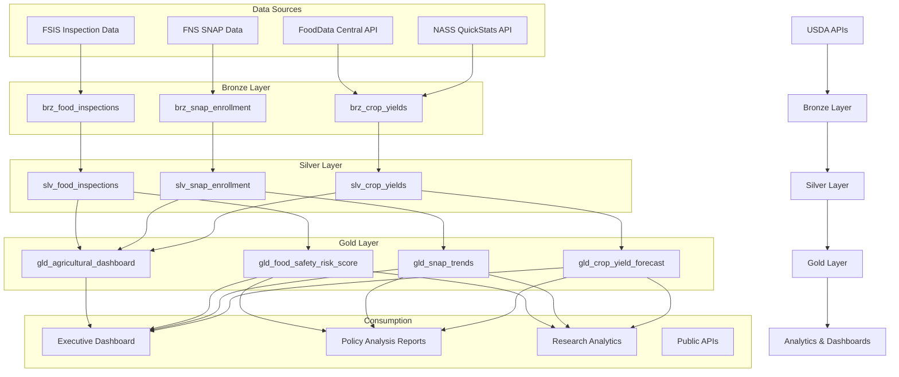

# USDA Agricultural Analytics Platform

> **Last Updated:** 2026-04-15 | **Status:** Active | **Audience:** Data Engineers

## Table of Contents
- [Overview](#overview)
  - [Key Features](#key-features)
  - [Data Sources](#data-sources)
- [Architecture Overview](#architecture-overview)
- [Prerequisites](#prerequisites)
  - [Azure Resources](#azure-resources)
  - [Tools Required](#tools-required)
  - [API Access](#api-access)
- [Quick Start](#quick-start)
  - [1. Environment Setup](#1-environment-setup)
  - [2. Configure API Keys](#2-configure-api-keys)
  - [3. Generate Sample Data](#3-generate-sample-data)
  - [4. Deploy Infrastructure](#4-deploy-infrastructure)
  - [5. Run dbt Models](#5-run-dbt-models)
- [Sample Analytics Scenarios](#sample-analytics-scenarios)
  - [1. Crop Yield Forecasting](#1-crop-yield-forecasting)
  - [2. SNAP Enrollment Analysis](#2-snap-enrollment-analysis)
  - [3. Food Safety Risk Assessment](#3-food-safety-risk-assessment)
  - [4. Agricultural Dashboard Summary](#4-agricultural-dashboard-summary)
- [Data Products](#data-products)
  - [Crop Yields](#crop-yields-crop-yields)
  - [SNAP Enrollment](#snap-enrollment-snap-enrollment)
  - [Food Safety Risk](#food-safety-risk-food-safety-risk)
- [Configuration](#configuration)
  - [dbt Profiles](#dbt-profiles)
  - [Environment Variables](#environment-variables)
- [Monitoring & Alerts](#monitoring--alerts)
- [Development](#development)
  - [Adding New Data Sources](#adding-new-data-sources)
  - [Testing](#testing)
- [Troubleshooting](#troubleshooting)
  - [Common Issues](#common-issues)
  - [Logs](#logs)
- [Contributing](#contributing)
- [License](#license)
- [Support](#support)
- [Acknowledgments](#acknowledgments)

A comprehensive agricultural analytics platform built on Azure Cloud Scale Analytics (CSA), providing insights into crop yields, food safety, nutrition assistance programs, and agricultural economic indicators using official USDA data sources.

## Overview

This platform ingests, processes, and analyzes data from multiple USDA agencies to provide actionable insights for agricultural decision-making, policy analysis, and research. The platform follows the medallion architecture (Bronze → Silver → Gold) and implements modern data engineering best practices.

### Key Features

- **Real-time Agricultural Data**: Automated ingestion from USDA NASS, FNS, FSIS, and FoodData Central
- **Crop Yield Analytics**: Historical trends, forecasting, and regional comparisons
- **Food Safety Monitoring**: FSIS inspection tracking with risk scoring
- **SNAP Program Analytics**: Enrollment trends and demographic analysis
- **Interactive Dashboards**: Executive dashboards with KPIs and drill-down capabilities
- **API-First Architecture**: RESTful APIs for all data products

### Data Sources

- **NASS (National Agricultural Statistics Service)**: Crop yields, planted acres, production data
- **FNS (Food and Nutrition Service)**: SNAP enrollment and benefits data
- **FSIS (Food Safety and Inspection Service)**: Meat, poultry, and egg inspection records
- **FoodData Central**: Nutritional information and food composition data

## Architecture Overview



## Prerequisites

### Azure Resources
- Azure subscription with contributor access
- Azure Data Factory or Synapse Analytics
- Azure Data Lake Storage Gen2
- Azure SQL Database or Synapse SQL Pool
- Azure Key Vault for API credentials

### Tools Required
- Azure CLI (2.55.0 or later)
- dbt CLI (1.7.0 or later)
- Python 3.9+
- Git

### API Access
- USDA NASS QuickStats API key (free registration at https://quickstats.nass.usda.gov/api)
- Data.gov API key (optional, for enhanced rate limits)

## Quick Start

### 1. Environment Setup

```bash
# Clone the repository
git clone <repository-url>
cd csa-inabox/examples/usda

# Install Python dependencies
pip install -r requirements.txt

# Install dbt packages
cd domains/dbt
dbt deps
```

### 2. Configure API Keys

```bash
# Add to Azure Key Vault or local environment
export NASS_API_KEY="your-nass-api-key"
export DATAGOV_API_KEY="your-datagov-api-key"  # Optional
```

### 3. Generate Sample Data

```bash
# Generate sample data (fallback if APIs unavailable)
python data/generators/generate_usda_data.py --output-dir domains/dbt/seeds

# Or fetch real data from APIs
python data/open-data/fetch_nass.py --api-key $NASS_API_KEY --states "IA,IL,IN" --years "2020,2021,2022"
```

### 4. Deploy Infrastructure

```bash
# Configure parameters
cp deploy/params.dev.json deploy/params.local.json
# Edit params.local.json with your values

# Deploy using Azure CLI
az deployment group create \
  --resource-group rg-usda-analytics \
  --template-file ../../deploy/bicep/DLZ/main.bicep \
  --parameters @deploy/params.local.json
```

### 5. Run dbt Models

```bash
cd domains/dbt

# Test connections
dbt debug

# Load seed data
dbt seed

# Run models
dbt run

# Run tests
dbt test

# Generate documentation
dbt docs generate
dbt docs serve
```

## Sample Analytics Scenarios

### 1. Crop Yield Forecasting

```sql
-- Get corn yield trend for Iowa
SELECT 
    year,
    commodity,
    state_code,
    yield_per_acre,
    yield_3yr_avg,
    yield_pct_change
FROM gold.gld_crop_yield_forecast
WHERE commodity = 'CORN' 
    AND state_code = 'IA'
    AND year >= 2018
ORDER BY year DESC;
```

### 2. SNAP Enrollment Analysis

```sql
-- States with highest SNAP enrollment growth
SELECT 
    state_code,
    latest_enrollment,
    enrollment_change_1yr,
    enrollment_pct_change_1yr
FROM gold.gld_snap_trends
WHERE year = 2023
ORDER BY enrollment_pct_change_1yr DESC
LIMIT 10;
```

### 3. Food Safety Risk Assessment

```sql
-- High-risk food establishments
SELECT 
    establishment_id,
    establishment_name,
    risk_score,
    inspection_frequency,
    violation_rate,
    last_inspection_date
FROM gold.gld_food_safety_risk_score
WHERE risk_score >= 75
ORDER BY risk_score DESC;
```

### 4. Agricultural Dashboard Summary

```sql
-- Executive summary metrics
SELECT 
    report_date,
    total_crop_production_value,
    snap_enrollment_total,
    food_safety_incidents,
    agricultural_employment
FROM gold.gld_agricultural_dashboard
WHERE report_date = CURRENT_DATE
ORDER BY report_date DESC;
```

## Data Products

### Crop Yields (`crop-yields`)
- **Description**: Historical and forecasted crop yield data by commodity, state, and county
- **Freshness**: Daily updates
- **Coverage**: 2000-present, all major commodities
- **API**: `/api/v1/crop-yields`

### SNAP Enrollment (`snap-enrollment`) 
- **Description**: Supplemental Nutrition Assistance Program enrollment and benefits data
- **Freshness**: Monthly updates
- **Coverage**: 2010-present, state and county level
- **API**: `/api/v1/snap-enrollment`

### Food Safety Risk (`food-safety-risk`)
- **Description**: FSIS inspection data with computed risk scores by establishment
- **Freshness**: Weekly updates  
- **Coverage**: 2015-present, all inspected facilities
- **API**: `/api/v1/food-safety-risk`

## Configuration

### dbt Profiles

Add to your `~/.dbt/profiles.yml`:

```yaml
usda_analytics:
  target: dev
  outputs:
    dev:
      type: databricks
      host: "{{ env_var('DBT_HOST') }}"
      http_path: "{{ env_var('DBT_HTTP_PATH') }}"
      token: "{{ env_var('DBT_TOKEN') }}"
      schema: usda_dev
      catalog: dev
    prod:
      type: databricks
      host: "{{ env_var('DBT_HOST_PROD') }}"
      http_path: "{{ env_var('DBT_HTTP_PATH_PROD') }}"
      token: "{{ env_var('DBT_TOKEN_PROD') }}"
      schema: usda
      catalog: prod
```

### Environment Variables

```bash
# Required for data fetching
NASS_API_KEY=your-nass-api-key
DATAGOV_API_KEY=your-datagov-api-key

# Required for dbt
DBT_HOST=your-databricks-host
DBT_HTTP_PATH=your-sql-warehouse-path
DBT_TOKEN=your-access-token

# Optional
USDA_LOG_LEVEL=INFO
USDA_BATCH_SIZE=1000
```

## Monitoring & Alerts

The platform includes built-in monitoring for:

- **Data Freshness**: Alerts when data sources haven't updated within SLA
- **Data Quality**: Automated tests on all models with Slack notifications
- **API Performance**: Response time and error rate monitoring
- **Cost Management**: Daily spend alerts and optimization recommendations

## Development

### Adding New Data Sources

1. Create Bronze model in `domains/dbt/models/bronze/`
2. Add data quality tests in `schema.yml`
3. Create corresponding Silver model with transformations
4. Add to Gold aggregations as needed
5. Update data contracts in `contracts/`

### Testing

```bash
# Unit tests
pytest data/tests/

# dbt tests
dbt test

# Integration tests
pytest data/tests/integration/

# Load tests
python data/tests/load_test.py
```

## Troubleshooting

### Common Issues

1. **API Rate Limits**: NASS API has rate limits. Use the `--delay` parameter in data generation scripts.

2. **Authentication Errors**: Ensure API keys are properly configured in environment variables or Key Vault.

3. **dbt Connection Issues**: Verify Databricks credentials and network connectivity.

4. **Large Data Volumes**: Use incremental models and partitioning for historical data loads.

### Logs

- Application logs: `logs/usda-analytics.log`
- dbt logs: `domains/dbt/logs/dbt.log` 
- Data pipeline logs: Azure Data Factory monitoring

## Contributing

1. Fork the repository
2. Create a feature branch (`git checkout -b feature/new-data-source`)
3. Make changes and add tests
4. Run quality checks (`make lint test`)
5. Submit a pull request

## License

This project is licensed under the MIT License. See `LICENSE` file for details.

## Support

- **Documentation**: https://csa-inabox.docs.microsoft.com/usda
- **Issues**: Use GitHub Issues for bug reports and feature requests
- **Security**: Report security issues to security@contoso.com
- **Community**: Join our Slack channel `#csa-usda-analytics`

## Acknowledgments

- USDA for providing comprehensive public agricultural data APIs
- Azure Cloud Scale Analytics team for the foundational platform
- Contributors and the open-source community

---

## Related Documentation

- [USDA Architecture](ARCHITECTURE.md) — Detailed platform architecture and design decisions
- [USDA Implementation Summary](IMPLEMENTATION_SUMMARY.md) — Implementation details and file structure
- [Examples Index](../README.md) — Overview of all CSA-in-a-Box example verticals
- [Platform Architecture](../../docs/ARCHITECTURE.md) — Core CSA platform architecture
- [Getting Started Guide](../../docs/GETTING_STARTED.md) — Platform setup and onboarding
- [EPA Environmental Analytics](../epa/README.md) — Related agriculture/environment vertical
- [NOAA Climate Analytics](../noaa/README.md) — Related environmental data vertical