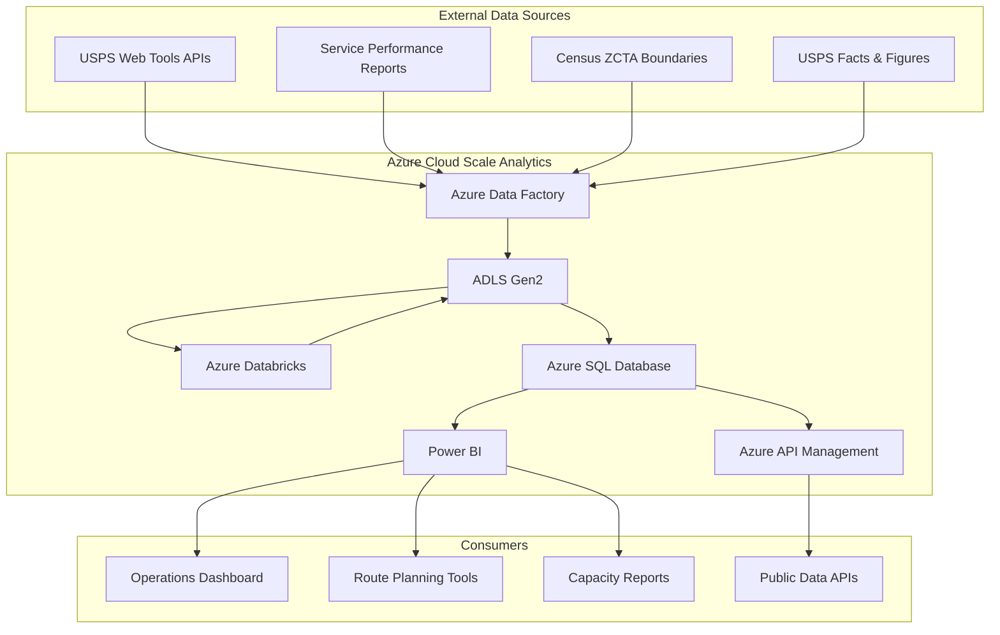
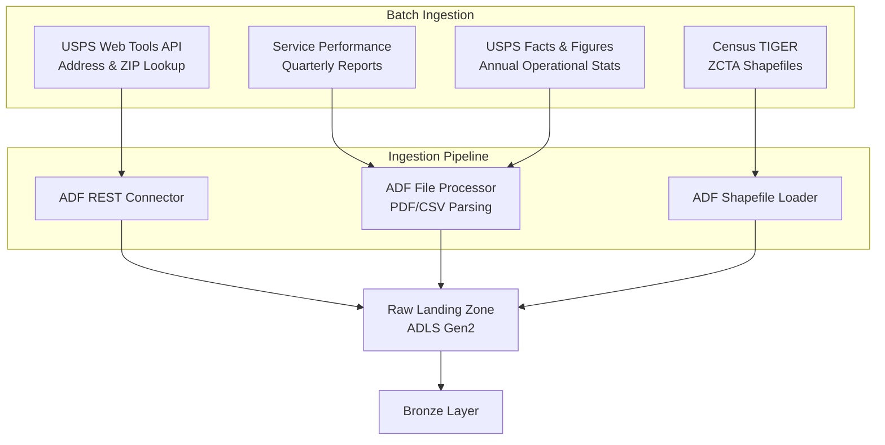
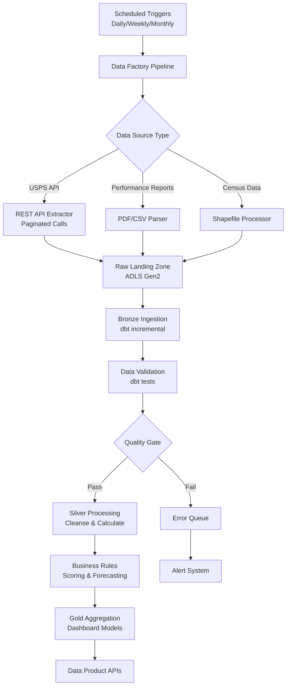

# USPS Postal Operations Analytics Architecture

> **Last Updated:** 2026-04-15 | **Status:** Active | **Audience:** Architects / Data Engineers

## Table of Contents
- [Overview](#overview)
- [Domain Context](#domain-context)
  - [Postal Operations Data Landscape](#postal-operations-data-landscape)
  - [Data Characteristics](#data-characteristics)
- [System Context](#system-context)
- [Architecture Layers](#architecture-layers)
  - [Data Ingestion Layer](#data-ingestion-layer)
  - [Bronze Layer (Raw Data)](#bronze-layer-raw-data)
  - [Silver Layer (Cleaned & Conformed)](#silver-layer-cleaned--conformed)
  - [Gold Layer (Business Analytics)](#gold-layer-business-analytics)
- [Data Flow Architecture](#data-flow-architecture)
  - [Batch Processing Pipeline](#batch-processing-pipeline)
- [Integration Points](#integration-points)
  - [Power BI Dashboards](#power-bi-dashboards)
- [Security Architecture](#security-architecture)
  - [Data Protection](#data-protection)
  - [Data Classification Notes](#data-classification-notes)
  - [Compliance](#compliance)
- [Performance Optimization](#performance-optimization)
  - [Data Partitioning Strategy](#data-partitioning-strategy)
  - [Caching Strategy](#caching-strategy)
- [Monitoring & Observability](#monitoring--observability)
  - [Data Quality Monitoring](#data-quality-monitoring)
  - [Alerting](#alerting)
- [Technology Stack](#technology-stack)
  - [Core Platform](#core-platform)
  - [Development Tools](#development-tools)
  - [Programming Languages](#programming-languages)

## Overview

The USPS Postal Operations Analytics platform is built on Azure Cloud Scale Analytics (CSA) and follows a domain-driven design approach. It ingests data from USPS public APIs, Census geographic data, and operational reporting to analyze delivery performance, facility utilization, and mail volume trends across the nation's largest logistics network.

## Domain Context

### Postal Operations Data Landscape

The United States Postal Service operates one of the world's largest logistics networks, generating vast operational data:

- **Address & ZIP Code Data**: 160+ million delivery points, 41,000+ ZIP codes, address validation services
- **Delivery Performance**: On-time delivery rates by product class (First Class, Priority, Parcels), region, and season
- **Facility Operations**: 34,000+ post offices, 200+ processing and distribution centers, equipment utilization
- **Mail Volume**: Piece counts by product class (letters, flats, parcels), daily/monthly/annual trends
- **Census Geography**: ZIP Code Tabulation Areas (ZCTAs) with demographic overlays

### Data Characteristics

- **Volume**: 127 billion mail pieces annually, 50,000+ delivery records per day (synthetic), 200+ facility metrics
- **Velocity**: Daily delivery performance, weekly facility throughput, monthly volume reporting
- **Variety**: Structured (volumes, performance rates), geospatial (ZIP boundaries, route geometries), time-series (seasonal patterns)
- **Veracity**: USPS service performance published quarterly; Census ZCTAs updated decennially with annual supplements

## System Context



## Architecture Layers

### Data Ingestion Layer



#### Ingestion Patterns

**USPS Web Tools APIs**
- XML-based REST APIs for address validation, ZIP lookup, rate calculation
- Requires USPS User ID (free registration)
- Rate limit: ~5 requests/second
- Batch API available for bulk address validation (up to 25 addresses per call)

**Service Performance Reports**
- Published quarterly as PDFs and spreadsheets at about.usps.com
- On-time delivery rates by product class and district
- Parsed using custom extraction scripts

**Census ZCTA Boundaries**
- TIGER/Line shapefiles updated annually
- ZIP Code Tabulation Areas approximate USPS ZIP code boundaries
- Demographic data from American Community Survey (ACS) overlays

**USPS Facts & Figures**
- Annual operational statistics: total mail volume, revenue, facility counts
- Published as web pages and downloadable datasets
- Historical data available back to 2000

### Bronze Layer (Raw Data)

The Bronze layer stores raw, unprocessed data exactly as received from source systems.

```sql
-- Example: Bronze delivery performance table
CREATE TABLE bronze.brz_delivery_performance (
    source_system STRING,
    ingestion_timestamp TIMESTAMP,
    tracking_id STRING,
    origin_zip STRING,
    destination_zip STRING,
    product_class STRING,
    service_type STRING,
    acceptance_date DATE,
    expected_delivery_date DATE,
    actual_delivery_date DATE,
    delivery_status STRING,
    delivery_time_days DECIMAL(8, 2),
    facility_origin STRING,
    facility_destination STRING,
    district STRING,
    region STRING,
    carrier_route STRING,
    delivery_attempt_count INT,
    load_time TIMESTAMP,
    raw_json STRING,
    record_hash STRING,
    _dbt_loaded_at TIMESTAMP
)
USING DELTA
PARTITIONED BY (product_class, YEAR(acceptance_date))
```

### Silver Layer (Cleaned & Conformed)

#### Transformation Patterns

**Address & Geographic Standardization**
- ZIP code validation (5-digit and ZIP+4 formats)
- ZCTA-to-ZIP crosswalk reconciliation
- Regional hierarchy: ZIP -> District -> Area -> Region
- Lat/lon centroid assignment from ZCTA boundaries

**Performance Metric Calculation**
- On-time delivery rate: delivered_on_time / total_delivered
- Service standard compliance by product class
- Delivery density: deliveries per square mile per day
- Route efficiency: stops per mile, time per stop

**Volume Normalization**
- Daily volume smoothed to business-day-adjusted figures
- Seasonal decomposition (trend + seasonal + residual)
- Year-over-year growth rates with working day correction

### Gold Layer (Business Analytics)

#### Analytical Models

**Route Optimization** (`gld_route_optimization`)
- Route-level performance metrics with efficiency scoring
- Delivery density and stop clustering analysis
- Time-of-day delivery pattern optimization
- Estimated savings from route restructuring

**Volume Forecast** (`gld_volume_forecast`)
- Time-series forecasting by product class and region
- Seasonal pattern decomposition with peak identification
- Year-over-year growth trends
- Staffing and resource recommendations

**Facility Analysis** (`gld_facility_analysis`)
- Processing facility utilization rates (actual vs. capacity)
- Catchment area overlap analysis for consolidation candidates
- Equipment utilization and maintenance scheduling
- Geographic coverage gap identification

## Data Flow Architecture

### Batch Processing Pipeline



## Integration Points

### Power BI Dashboards

**1. Operations Dashboard**
- National delivery performance heatmap
- Product class on-time rates with targets
- Volume trend charts with forecast overlay
- District and region scorecards

**2. Route Planning Console**
- Route efficiency ranking table
- Geographic stop density visualization
- Time-of-day delivery pattern charts
- Optimization opportunity alerts

**3. Facility Capacity Report**
- Processing plant utilization gauges
- Throughput trend by facility type
- Consolidation candidate map
- Equipment utilization breakdown

## Security Architecture

### Data Protection

- **Encryption at Rest**: Azure SSE with Microsoft-managed keys
- **Encryption in Transit**: TLS 1.2+ for all communications
- **Network Security**: VNet integration with private endpoints
- **Access Control**: Azure AD RBAC for role-based access

### Data Classification Notes

- **Public**: Aggregate volume statistics, service performance rates, ZIP code boundaries
- **Sensitive-Operational**: Route-level delivery data, facility throughput, carrier performance
- **Confirm with AO**: Granular route geometry and individual delivery tracking data may require additional classification review

### Compliance

- **FISMA**: Federal compliance for systems handling postal operational data
- **Privacy Act**: Individual-level address data requires Privacy Act protections
- **Postal Accountability and Enhancement Act**: Service performance reporting requirements

## Performance Optimization

### Data Partitioning Strategy

| Layer | Table | Partition Key | Z-Order |
|-------|-------|--------------|---------|
| Bronze | brz_delivery_performance | product_class, acceptance_year | destination_zip |
| Bronze | brz_facility_operations | facility_type | report_date |
| Bronze | brz_mail_volume | product_class | volume_date |
| Silver | slv_delivery_performance | product_class, delivery_year | on_time_flag |
| Gold | gld_route_optimization | region | optimization_score |
| Gold | gld_volume_forecast | product_class | forecast_month |

### Caching Strategy

- **Redis Cache**: Dashboard aggregations with 15-minute TTL
- **CDN**: ZIP code boundary tiles and static assets
- **Query Result Cache**: Gold layer results with 1-hour TTL

## Monitoring & Observability

### Data Quality Monitoring

- **dbt Tests**: ZIP code format validation, delivery date logic, volume non-negative
- **Custom Monitors**: Service standard compliance tracking, facility capacity alerts
- **Anomaly Detection**: Unusual volume spikes/drops, delivery time outliers

### Alerting

```yaml
alerts:
  - name: "Volume Anomaly"
    condition: "daily_volume deviates > 3 std from 30-day average"
    severity: "high"
    channel: "#usps-data-engineering"

  - name: "Service Performance Drop"
    condition: "on_time_rate < 85% for any product class"
    severity: "warning"
    channel: "#usps-operations"

  - name: "Facility Overcapacity"
    condition: "utilization_pct > 95% for 3 consecutive days"
    severity: "critical"
    channel: "#usps-facilities"
```

## Technology Stack

### Core Platform

- **Compute**: Azure Databricks, Azure Functions
- **Storage**: Azure Data Lake Storage Gen2, Azure SQL Database
- **Orchestration**: Azure Data Factory, Azure Logic Apps
- **Analytics**: Azure Synapse Analytics, Power BI

### Development Tools

- **Data Modeling**: dbt, Great Expectations
- **Version Control**: Git, Azure DevOps
- **CI/CD**: Azure Pipelines, GitHub Actions
- **Monitoring**: Azure Monitor, Application Insights

### Programming Languages

- **Data Processing**: Python, SQL
- **Geospatial**: Python (geopandas, shapely)
- **Web APIs**: Python (FastAPI)
- **Infrastructure**: Bicep, Terraform
- **Analytics**: Python (pandas, statsmodels, prophet)

---

## Related Documentation

- [USPS README](README.md) — Deployment guide, quick start, and analytics scenarios
- [Platform Architecture](../../docs/ARCHITECTURE.md) — Core CSA platform architecture
- [Platform Services](../../docs/PLATFORM_SERVICES.md) — Shared Azure service configurations
- [Commerce Architecture](../commerce/ARCHITECTURE.md) — Related logistics/trade architecture
- [DOT Architecture](../dot/ARCHITECTURE.md) — Related federal logistics architecture
