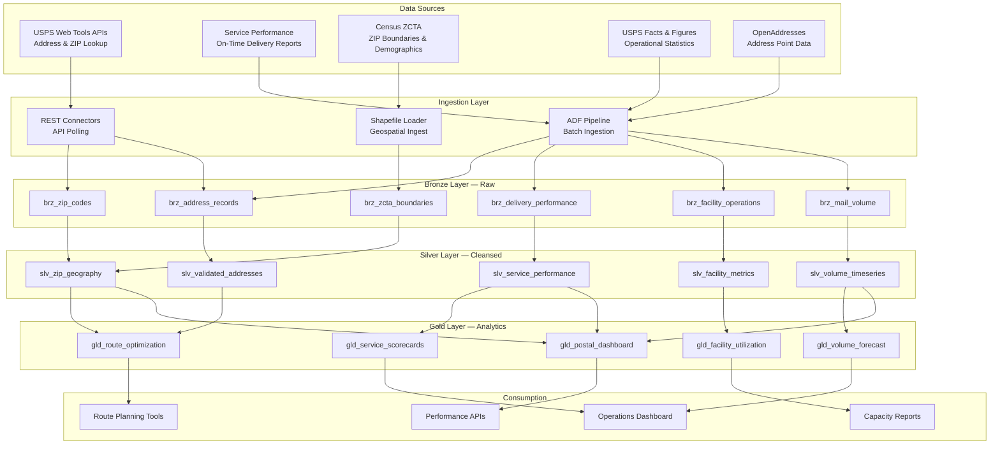

# USPS Postal Operations Analytics Platform

> [**Examples**](../README.md) > **USPS**


> [!TIP]
> **TL;DR** — Postal operations analytics for delivery performance, route optimization, and facility capacity planning across 34,000+ post offices and 230,000+ routes with seasonal volume prediction.


---

## 📋 Table of Contents
- [Overview](#overview)
  - [Key Features](#key-features)
  - [Data Sources](#data-sources)
- [Architecture Overview](#architecture-overview)
- [Prerequisites](#prerequisites)
  - [Azure Resources](#azure-resources)
  - [Tools Required](#tools-required)
  - [API Access](#api-access)
- [Quick Start](#quick-start)
  - [1. Environment Setup](#1-environment-setup)
  - [2. Configure API Keys](#2-configure-api-keys)
  - [3. Generate Sample Data](#3-generate-sample-data)
  - [4. Deploy Infrastructure](#4-deploy-infrastructure)
  - [5. Run dbt Models](#5-run-dbt-models)
- [Sample Analytics Scenarios](#sample-analytics-scenarios)
  - [1. Last-Mile Delivery Optimization](#1-last-mile-delivery-optimization)
  - [2. Seasonal Volume Prediction](#2-seasonal-volume-prediction)
  - [3. Facility Consolidation Analysis](#3-facility-consolidation-analysis)
- [Data Products](#data-products)
  - [Route Optimization](#route-optimization-route-optimization)
  - [Volume Forecast](#volume-forecast-volume-forecast)
  - [Facility Utilization](#facility-utilization-facility-utilization)
- [Configuration](#configuration)
  - [dbt Profiles](#dbt-profiles)
  - [Environment Variables](#environment-variables)
- [Azure Government Notes](#azure-government-notes)
- [Monitoring & Alerts](#monitoring--alerts)
- [Troubleshooting](#troubleshooting)
  - [Common Issues](#common-issues)
- [Contributing](#contributing)
- [License](#license)
- [Acknowledgments](#acknowledgments)

A comprehensive postal operations analytics platform built on Azure Cloud Scale Analytics (CSA), providing insights into delivery performance, facility utilization, geographic coverage, and volume forecasting using USPS public data and APIs.


---

## 📋 Overview

The United States Postal Service delivers 127 billion pieces of mail annually through a network of 34,000+ post offices, 230,000+ delivery routes, and 640,000+ employees. This platform ingests, processes, and analyzes USPS operational data — ZIP code geography, address validation, delivery performance, and facility metrics — to enable route optimization, capacity planning, and service-level management.

### ✨ Key Features

- **Last-Mile Delivery Analytics**: Route-level performance with geospatial optimization
- **Volume Forecasting**: Seasonal and trend-based mail/parcel volume prediction
- **Facility Utilization**: Processing plant and post office capacity analysis
- **Address Intelligence**: Address validation, geocoding, and deliverability scoring
- **Service Performance Dashboards**: On-time delivery rates by product, region, and season
- **ZIP Code Demographics**: Market analytics overlaying Census data on postal geography

### 🗄️ Data Sources

| Source | Description | URL |
|--------|-------------|-----|
| USPS Web Tools APIs | Address validation, ZIP lookup, tracking, rate calculation | https://www.usps.com/business/web-tools-apis/ |
| USPS Service Performance | Quarterly on-time delivery reports by product class | https://about.usps.com/what/performance/ |
| ZIP Code Tabulation Areas | Census ZCTA boundaries with demographic overlays | https://www.census.gov/cgi-bin/geo/shapefiles/index.php?year=2023&layergroup=ZIP+Code+Tabulation+Areas |
| USPS Facts & Figures | Annual operational statistics (volume, revenue, facilities) | https://facts.usps.com/ |
| USPS Postal Bulletin | Rate changes, service updates, new ZIP codes | https://about.usps.com/postal-bulletin/ |
| OpenAddresses | Open-source address point data for geocoding | https://openaddresses.io/ |


---

## 🏗️ Architecture Overview




---

## 📎 Prerequisites

### Azure Resources
- Azure subscription with contributor access
- Azure Data Factory or Synapse Analytics
- Azure Data Lake Storage Gen2
- Azure SQL Database or Synapse SQL Pool
- Azure Key Vault for API credentials

### Tools Required
- Azure CLI (2.55.0 or later)
- dbt CLI (1.7.0 or later)
- Python 3.9+
- Git

### API Access
- USPS Web Tools API credentials (free registration at https://www.usps.com/business/web-tools-apis/documentation-updates.htm)
- Census API key (free at https://api.census.gov/data/key_signup.html) for demographic overlays


---

## 🚀 Quick Start

### 1. Environment Setup

```bash
# Clone the repository
git clone <repository-url>
cd csa-inabox/examples/usps

# Install Python dependencies
pip install -r requirements.txt

# Install dbt packages
cd domains/dbt
dbt deps
```

### 2. Configure API Keys

```bash
# Add to Azure Key Vault or local environment
export USPS_USER_ID="your-usps-user-id"
export CENSUS_API_KEY="your-census-api-key"  # Optional for demographic overlays
```

### 3. Generate Sample Data

```bash
# Generate synthetic postal operations data
python data/generators/generate_usps_data.py --output-dir domains/dbt/seeds

# Or fetch real ZIP code data
python data/open-data/fetch_zip_codes.py --states "CA,TX,NY,FL"
python data/open-data/fetch_zcta_boundaries.py --year 2023
python data/open-data/fetch_service_performance.py --quarters "2023Q1,2023Q2,2023Q3,2023Q4"
```

### 4. Deploy Infrastructure

```bash
# Configure parameters
cp deploy/params.dev.json deploy/params.local.json
# Edit params.local.json with your values

# Deploy using Azure CLI
az deployment group create \
  --resource-group rg-usps-analytics \
  --template-file ../../deploy/bicep/DLZ/main.bicep \
  --parameters @deploy/params.local.json
```

### 5. Run dbt Models

```bash
cd domains/dbt

# Test connections
dbt debug

# Load seed data
dbt seed

# Run models
dbt run

# Run tests
dbt test

# Generate documentation
dbt docs generate
dbt docs serve
```


---

## 💡 Sample Analytics Scenarios

### 1. Last-Mile Delivery Optimization

Analyze delivery route performance to identify inefficiencies and recommend consolidation or re-sequencing opportunities.

```sql
-- Routes with highest optimization potential
SELECT
    route_id,
    zip_code,
    carrier_type,
    avg_delivery_time_minutes,
    stops_per_route,
    miles_per_route,
    packages_per_stop,
    time_per_stop_minutes,
    optimization_score,
    estimated_savings_minutes
FROM gold.gld_route_optimization
WHERE optimization_score >= 70
    AND carrier_type = 'CITY'
ORDER BY estimated_savings_minutes DESC
LIMIT 25;
```

### 2. Seasonal Volume Prediction

Forecast mail and parcel volumes by product class and region to pre-position resources for peak seasons (Holiday, Tax, Election).

```sql
-- Volume forecast for upcoming quarter
SELECT
    region,
    product_class,
    forecast_month,
    predicted_volume,
    lower_bound_95,
    upper_bound_95,
    yoy_growth_pct,
    peak_season_flag,
    recommended_staffing_delta
FROM gold.gld_volume_forecast
WHERE forecast_month BETWEEN '2024-11-01' AND '2025-01-31'
ORDER BY region, product_class, forecast_month;
```

### 3. Facility Consolidation Analysis

Evaluate processing facility utilization rates and geographic overlap to identify consolidation candidates.

```sql
-- Under-utilized facilities with consolidation potential
SELECT
    facility_id,
    facility_name,
    facility_type,
    city,
    state,
    current_utilization_pct,
    max_throughput_daily,
    actual_throughput_daily,
    nearest_facility_miles,
    nearest_facility_spare_capacity_pct,
    consolidation_score
FROM gold.gld_facility_utilization
WHERE current_utilization_pct < 50
    AND consolidation_score >= 60
ORDER BY consolidation_score DESC;
```


---

## ✨ Data Products

### Route Optimization (`route-optimization`)
- **Description**: Delivery route metrics with optimization scoring
- **Freshness**: Weekly updates
- **Coverage**: All city and rural delivery routes
- **API**: `/api/v1/route-optimization`

### Volume Forecast (`volume-forecast`)
- **Description**: Time-series forecasts by product class, region, and season
- **Freshness**: Monthly model retraining
- **Coverage**: All mail/parcel product classes, 67 districts
- **API**: `/api/v1/volume-forecast`

### Facility Utilization (`facility-utilization`)
- **Description**: Processing plant and post office capacity metrics
- **Freshness**: Daily operational updates
- **Coverage**: 200+ processing plants, 34,000+ post offices
- **API**: `/api/v1/facility-utilization`


---

## ⚙️ Configuration

### ⚙️ dbt Profiles

Add to your `~/.dbt/profiles.yml`:

```yaml
usps_analytics:
  target: dev
  outputs:
    dev:
      type: databricks
      host: "{{ env_var('DBT_HOST') }}"
      http_path: "{{ env_var('DBT_HTTP_PATH') }}"
      token: "{{ env_var('DBT_TOKEN') }}"
      schema: usps_dev
      catalog: dev
    prod:
      type: databricks
      host: "{{ env_var('DBT_HOST_PROD') }}"
      http_path: "{{ env_var('DBT_HTTP_PATH_PROD') }}"
      token: "{{ env_var('DBT_TOKEN_PROD') }}"
      schema: usps
      catalog: prod
```

### ⚙️ Environment Variables

```bash
# Required for data fetching
USPS_USER_ID=your-usps-user-id
CENSUS_API_KEY=your-census-api-key

# Required for dbt
DBT_HOST=your-databricks-host
DBT_HTTP_PATH=your-sql-warehouse-path
DBT_TOKEN=your-access-token

# Optional
USPS_LOG_LEVEL=INFO
USPS_BATCH_SIZE=5000
```


---

## 🔒 Azure Government Notes

This example is compatible with Azure Government (US) regions. When deploying to Azure Government:

- Use `usgovvirginia` or `usgovarizona` as your Azure region
- Update ARM/Bicep endpoint references to `.usgovcloudapi.net`
- USPS APIs are accessible from government networks without special authorization
- Note: USPS operational data at the route level may be considered sensitive — confirm data classification with your AO before deploying granular route data in cloud environments


---

## 📊 Monitoring & Alerts

- **Data Freshness**: Alerts when service performance reports or volume feeds are overdue
- **Data Quality**: Automated dbt tests on address validation rates and volume anomalies
- **API Health**: USPS Web Tools API availability monitoring
- **Cost Management**: Daily compute spend tracking with budget thresholds


---

## 🔧 Troubleshooting

### 🔧 Common Issues

1. **USPS API Rate Limits**: Web Tools APIs throttle at ~5 requests/second. Use the `--delay` parameter in fetch scripts.
2. **ZCTA vs. ZIP Mismatch**: Census ZCTAs approximate but do not exactly match USPS ZIP codes. See `data/schemas/zip_zcta_crosswalk.csv` for mapping.
3. **Service Performance PDF Parsing**: Quarterly reports are published as PDFs. Use `data/parsers/parse_service_report.py` for extraction.
4. **Large Address Datasets**: OpenAddresses files can exceed 5 GB per state. Use `--county-filter` for targeted loads.


---

## 🔗 Contributing

1. Fork the repository
2. Create a feature branch (`git checkout -b feature/new-data-source`)
3. Make changes and add tests
4. Run quality checks (`make lint test`)
5. Submit a pull request


---

## 🔗 License

This project is licensed under the MIT License. See `LICENSE` file for details.


---

## 🔗 Acknowledgments

- USPS for public operational data and developer APIs
- U.S. Census Bureau for ZCTA boundary and demographic data
- Azure Cloud Scale Analytics team for the foundational platform
- Contributors and the open-source community

---

## 🔗 Related Documentation

- [USPS Architecture](ARCHITECTURE.md) — Detailed platform architecture and design decisions
- [Examples Index](../README.md) — Overview of all CSA-in-a-Box example verticals
- [Platform Architecture](../../docs/ARCHITECTURE.md) — Core CSA platform architecture
- [Getting Started Guide](../../docs/GETTING_STARTED.md) — Platform setup and onboarding
- [Commerce Economic Analytics](../commerce/README.md) — Related logistics/trade vertical
- [DOT Transportation Analytics](../dot/README.md) — Related federal logistics vertical


---

## Prerequisites / Cost / Teardown

> [!IMPORTANT]
> **Cost-safety:** this vertical deploys real Azure resources. Always run `teardown.sh` when you are done. A forgotten workshop environment can run **$120-200/day**.

### Prerequisites

- Azure CLI 2.50+ logged in (`az login`), subscription selected (`az account set --subscription <id>`)
- `jq` installed (used by teardown enumeration)
- Bicep CLI 0.25+ (`az bicep version`)
- Contributor + User Access Administrator on target subscription (or a pre-created RG with equivalent RBAC)
- `bash scripts/deploy/validate-prerequisites.sh` passes

### Cost estimate (rough, East US 2)

- **While running:** ~$$120-200/day (services: Synapse, Databricks, ADF, Storage, Key Vault)
- **Idle overnight:** roughly half if you stop compute (Databricks autostop + Synapse pause)
- **Storage + Key Vault residual:** <$5/month if you skip teardown

Numbers are indicative for a small demo dataset; production workloads vary significantly. Use `az consumption usage list` or Cost Management for live numbers.

### Runtime

- **Deploy:** ~30-45 minutes (first run; cold Bicep)
- **Teardown:** ~10-15 minutes (async RG delete completes in the background)

### Teardown

When finished, run the per-example teardown script. It enforces a typed `DESTROY-usps` confirmation, logs every step to `reports/teardown/usps-<timestamp>.log`, and deletes the resource group `rg-usps-analytics` along with any matching subscription-scope deployments.

```bash
# Interactive (recommended)
bash examples/usps/deploy/teardown.sh

# Dry run (enumerate only)
bash examples/usps/deploy/teardown.sh --dry-run

# From the repo root via Makefile
make teardown-example VERTICAL=usps
make teardown-example VERTICAL=usps DRYRUN=1

# CI automation (no prompt — only for ephemeral environments)
bash examples/usps/deploy/teardown.sh --yes
```

See [`docs/QUICKSTART.md#teardown`](../../docs/QUICKSTART.md#teardown) for the platform-wide teardown flow.
