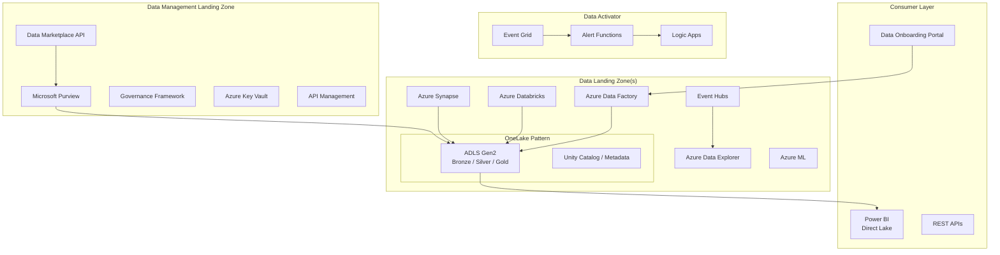

# Platform Components — Fabric-in-a-Box

This directory contains the **core platform capabilities** that replicate Microsoft Fabric
functionality using Azure PaaS services and open-source tooling.

> **Why this exists:** Microsoft Fabric is not yet available in Azure Government (status:
> "Forecasted" as of April 2026). These components provide Fabric-equivalent capabilities
> using services that ARE available in Azure Government today — ADLS Gen2, Databricks,
> Synapse, ADF, Event Hubs, Purview, and Azure ML.

## Components

| Component | Fabric Equivalent | Description |
|---|---|---|
| [onelake-pattern](onelake-pattern/) | OneLake | Unified data lake using ADLS Gen2 + Unity Catalog metadata |
| [data-activator](data-activator/) | Data Activator | Event-driven alerting with Logic Apps + Event Grid + Functions |
| [direct-lake](direct-lake/) | Direct Lake | Power BI direct access to Delta Lake via Databricks SQL |
| [data-marketplace](data-marketplace/) | Data Sharing / Marketplace | Self-service data product discovery, access request, quality tracking |
| [governance](governance/) | Purview Integration | Automated classification, lineage, MDM, sensitivity labels |
| [multi-synapse](multi-synapse/) | Multi-workspace | Shared Synapse environment with per-org isolation |
| [metadata-framework](metadata-framework/) | Data Factory (metadata-driven) | Auto-generate pipelines from source registration metadata |
| [ai-integration](ai-integration/) | Copilot / AI | RAG patterns, embeddings, model serving per domain |
| [shared-services](shared-services/) | Shared Functions | Reusable Azure Function library for data operations |
| [oss-alternatives](oss-alternatives/) | N/A (Gov gaps) | Open-source alternatives for Gov-unavailable services |

## Architecture

## Quick Start

1. Deploy the base infrastructure using the main `deploy/` templates
2. Configure the OneLake pattern for your domain structure
3. Register data sources via the metadata framework
4. Set up governance rules and classifications
5. Deploy the data marketplace for self-service discovery

## Azure Government Compatibility

All platform components are designed to work in both Azure Commercial and Azure Government.
See [deploy/bicep/gov/](../deploy/bicep/gov/) for Government-specific templates and
[oss-alternatives/](oss-alternatives/) for open-source replacements where needed.
