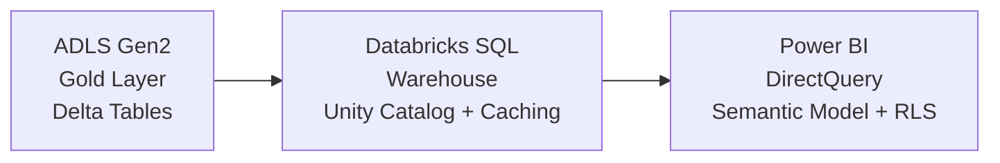

[← Platform Components](../README.md)

# Direct Lake Pattern — Power BI + Delta Lake via Databricks SQL

> **Last Updated:** 2026-04-15 | **Status:** Active | **Audience:** Platform Engineers

> [!NOTE]
> **TL;DR:** Replicates Fabric's Direct Lake mode using Databricks SQL Warehouse + ADLS Gen2 Delta tables + Power BI DirectQuery. Includes setup guide, performance tuning, RLS configuration, and a feature comparison with native Fabric Direct Lake.

> **CSA-in-a-Box equivalent of Microsoft Fabric Direct Lake mode**

## Table of Contents

- [Overview](#overview)
- [Architecture](#architecture)
- [Setup Guide](#setup-guide)
- [Performance Tuning](#performance-tuning)
- [Row-Level Security](#row-level-security)
- [Comparison: Fabric Direct Lake vs CSA-in-a-Box](#comparison-fabric-direct-lake-vs-csa-in-a-box)
- [Semantic Model Template](#semantic-model-template)
- [Related Documentation](#related-documentation)

> Direct Lake in Fabric allows Power BI to read directly from Delta Lake
> tables without importing data. CSA-in-a-Box achieves the same pattern
> using Databricks SQL endpoints connected to Delta tables in ADLS Gen2.

---

## 📋 Overview

In Fabric, Direct Lake lets a Power BI semantic model point at Delta
tables in a lakehouse, reading parquet files directly at query time.
This eliminates the need for data import or scheduled refreshes while
keeping in-memory-like performance.

CSA-in-a-Box replicates this via:

1. **Delta Lake tables** in ADLS Gen2 (gold layer)
2. **Databricks SQL Warehouse** as the SQL endpoint
3. **Power BI Desktop / Service** connecting via the Databricks ODBC/JDBC connector

---

## 🏗️ Architecture



---

## 🚀 Setup Guide

### Step 1: Configure Databricks SQL Warehouse

Create a SQL Warehouse optimized for BI workloads:

```bash
# Via Databricks CLI
databricks sql warehouses create \
  --name "csa-bi-warehouse" \
  --cluster-size "Small" \
  --auto-stop-mins 30 \
  --max-num-clusters 4 \
  --enable-photon true \
  --warehouse-type "PRO"
```

> [!TIP]
> Key settings for Direct Lake parity:
> - **Photon enabled** — columnar engine for parquet-native queries
> - **Result caching** — subsequent identical queries return cached results
> - **Query caching** — compiled query plans are cached
> - **Auto-scaling** — scales out for concurrent BI users

### Step 2: Register Delta Tables in Unity Catalog

```sql
-- Create the gold-layer catalog and schema
CREATE CATALOG IF NOT EXISTS sales_catalog;
CREATE SCHEMA IF NOT EXISTS sales_catalog.gold;

-- Register the Delta table
CREATE TABLE IF NOT EXISTS sales_catalog.gold.orders
  USING DELTA
  LOCATION 'abfss://gold@stprodsaleseus2.dfs.core.windows.net/sales/orders/';

-- Optimize for BI queries
OPTIMIZE sales_catalog.gold.orders ZORDER BY (order_date, customer_id);

-- Analyze table statistics for query planning
ANALYZE TABLE sales_catalog.gold.orders COMPUTE STATISTICS FOR ALL COLUMNS;
```

### Step 3: Connect Power BI

#### Option A: Databricks Connector (Recommended)

1. In Power BI Desktop, select **Get Data** → **Azure Databricks**
2. Enter the SQL Warehouse connection details:
   - Server hostname: `adb-<workspace-id>.azuredatabricks.net`
   - HTTP Path: `/sql/1.0/warehouses/<warehouse-id>`
3. Select **DirectQuery** mode
4. Choose the Unity Catalog tables to include

#### Option B: ODBC/JDBC (Azure Government)

For Azure Government where the native connector may not be available:

1. Install the [Simba Spark ODBC Driver](https://www.databricks.com/spark/odbc-drivers-download)
2. Configure DSN:
   ```text
   Host=adb-<workspace-id>.databricks.azure.us
   Port=443
   HTTPPath=/sql/1.0/warehouses/<warehouse-id>
   AuthMech=11
   Auth_Flow=0
   ```
3. In Power BI, use **ODBC** data source with DirectQuery

### Step 4: Build the Semantic Model

See `semantic_model_template.yaml` for a template that defines:
- Tables and their Delta Lake source paths
- Relationships between tables
- DAX measures for common KPIs
- Row-level security (RLS) roles

---

## ⚡ Performance Tuning

### Delta Lake Optimization

```sql
-- Z-ORDER on frequently filtered columns (equivalent to V-Order in Fabric)
OPTIMIZE sales_catalog.gold.orders
  ZORDER BY (order_date, region, customer_id);

-- Enable predictive optimization (auto-OPTIMIZE + auto-VACUUM)
ALTER TABLE sales_catalog.gold.orders
  SET TBLPROPERTIES ('delta.enableOptimization' = 'true');

-- Set target file size for BI workloads (smaller = faster point lookups)
ALTER TABLE sales_catalog.gold.orders
  SET TBLPROPERTIES ('delta.targetFileSize' = '64mb');
```

### SQL Warehouse Tuning

| Setting | Recommended Value | Why |
|---|---|---|
| Cluster Size | Small → Medium | Start small, scale based on concurrency |
| Max Clusters | 2-4 | Handles concurrent Power BI users |
| Auto Stop | 30 min | Cost savings during off-hours |
| Photon | Enabled | 2-8x faster for columnar queries |
| Result Cache | Enabled | Identical queries return instantly |
| Query Federation | Disabled | All data in Delta — no external sources |

### Power BI Optimizations

1. **Aggregation tables** — pre-compute common aggregations in gold layer
2. **Incremental refresh** — configure in Power BI Service for large tables
3. **Query reduction** — enable "Reduce queries sent" in report settings
4. **Composite models** — combine DirectQuery tables with imported lookups

---

## 🔒 Row-Level Security

Map Power BI RLS to Unity Catalog permissions:

```sql
-- Create a view with row-level filtering
CREATE VIEW sales_catalog.gold.orders_secured AS
  SELECT * FROM sales_catalog.gold.orders
  WHERE region IN (
    SELECT allowed_region FROM sales_catalog.security.user_regions
    WHERE user_email = current_user()
  );
```

In Power BI, define RLS roles that match:
```dax
[Region] = USERPRINCIPALNAME()  // Or use a security table lookup
```

---

## 📋 Comparison: Fabric Direct Lake vs CSA-in-a-Box

| Feature | Direct Lake (Fabric) | CSA-in-a-Box |
|---|---|---|
| Storage | OneLake (ADLS Gen2) | ADLS Gen2 |
| Table format | Delta Lake (V-Order) | Delta Lake (Z-ORDER) |
| Query engine | Fabric DW | Databricks SQL + Photon |
| Connector | Native (built-in) | Databricks connector / ODBC |
| Caching | Automatic column store | Result + query cache |
| Auto-refresh | On data change | Scheduled or on-demand |
| RLS | Power BI native | Unity Catalog + Power BI |
| Gov Cloud | Not available | Full support |

---

## 💡 Semantic Model Template

See `semantic_model_template.yaml` for a ready-to-use model definition
that maps to the CSA-in-a-Box gold layer tables.

---

## 🔗 Related Documentation

- [Platform Components](../README.md) — Platform component index
- [Platform Services](../../docs/PLATFORM_SERVICES.md) — Detailed platform service descriptions
- [Architecture](../../docs/ARCHITECTURE.md) — Overall system architecture
- [OneLake Pattern](../onelake-pattern/README.md) — ADLS Gen2 unified data lake
- [Multi-Synapse](../multi-synapse/README.md) — Shared analytics environment
