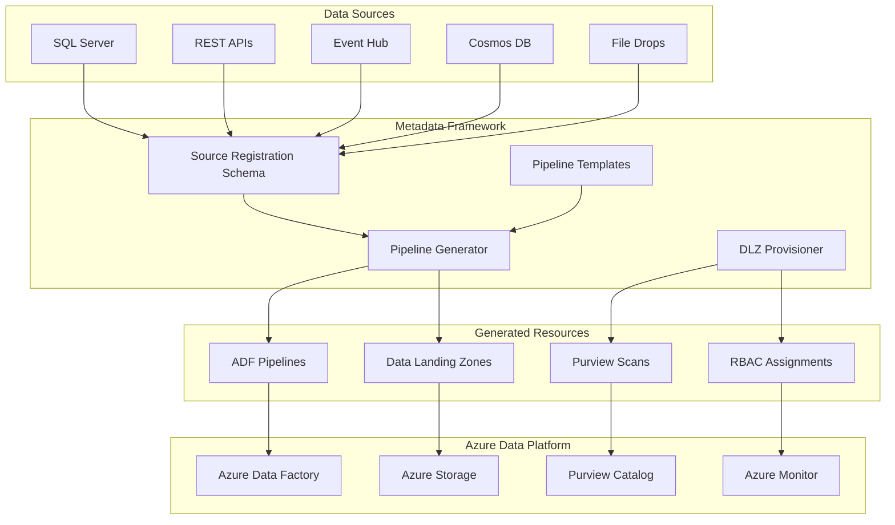
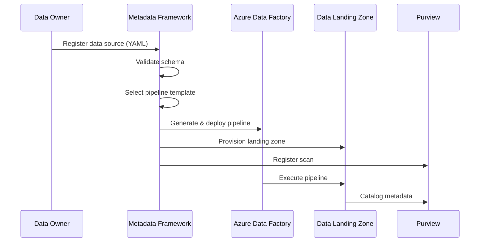

# Metadata-Driven Pipeline Framework

> **Last Updated:** 2026-04-14 | **Status:** Active | **Audience:** Platform Engineers

## Table of Contents

- [Overview](#overview)
- [Architecture](#architecture)
- [Pipeline Generation Flow](#pipeline-generation-flow)
- [Core Components](#core-components)
- [Supported Source Types](#supported-source-types)
- [Ingestion Modes](#ingestion-modes)
- [Quick Start](#quick-start)
- [Schema Detection](#schema-detection)
- [Governance Integration](#governance-integration)
- [Configuration](#configuration)
- [Examples](#examples)
- [Development](#development)
- [Monitoring and Troubleshooting](#monitoring-and-troubleshooting)
- [Security Considerations](#security-considerations)
- [Performance Guidelines](#performance-guidelines)
- [Roadmap](#roadmap)
- [Contributing](#contributing)
- [Related Documentation](#related-documentation)

The metadata-driven pipeline framework is the core engine of the CSA-in-a-Box platform that automatically generates Azure Data Factory (ADF) pipelines from metadata definitions. This framework enables a declarative, schema-driven approach to data ingestion that scales across diverse data sources and ingestion patterns.

## Overview

Instead of manually creating and maintaining hundreds of ADF pipelines, the metadata framework allows you to:

1. **Register a data source** by defining its schema, connection details, and ingestion requirements in YAML/JSON
2. **Auto-generate ADF pipelines** that implement the appropriate ingestion pattern (full load, incremental, CDC, streaming)
3. **Auto-provision landing zones** with proper RBAC, storage structure, and Purview registration
4. **Standardize across patterns** ensuring consistent data governance, quality, and security

## Architecture



## Pipeline Generation Flow



## Core Components

### 1. Source Registration Schema

JSON Schema that defines how to register a new data source. See `schema/source_registration.json`.

Key sections:
- **Source Identity**: ID, name, type, owner
- **Connection**: Type-specific connection parameters
- **Schema**: Tables/endpoints, columns, data types
- **Ingestion**: Mode (full/incremental/CDC/streaming), schedule, watermark
- **Target**: Landing zone configuration, file formats
- **Governance**: Classification, data product info, quality rules

### 2. Pipeline Templates

ADF pipeline templates for different ingestion patterns:
- `adf_batch_copy.json` - Full table loads
- `adf_incremental.json` - Watermark-based incremental loads
- `adf_cdc.json` - Change Data Capture via SQL CT or Cosmos change feed
- `adf_api_ingestion.json` - REST API with pagination support
- `adf_streaming.json` - Event Hub streaming ingestion

### 3. Pipeline Generator (`generator/pipeline_generator.py`)

Python module that:
- Validates source registration against schema
- Detects source schema automatically when possible
- Selects appropriate pipeline template based on source type and ingestion mode
- Generates parameterized ADF pipeline JSON
- Outputs deployable ARM/Bicep templates

### 4. Data Landing Zone Provisioner (`generator/dlz_provisioner.py`)

Python module that:
- Generates Bicep parameter files for new DLZs
- Creates medallion architecture storage structure (bronze/silver/gold)
- Configures RBAC assignments for source owner
- Registers Purview scan jobs
- Integrates with existing landing zone templates

## Supported Source Types

| Source Type | Ingestion Modes | Template | Notes |
|-------------|-----------------|----------|-------|
| `sql_server` | full, incremental, cdc | `adf_batch_copy.json`, `adf_incremental.json`, `adf_cdc.json` | SQL Server on-premises or Azure SQL |
| `azure_sql` | full, incremental, cdc | `adf_batch_copy.json`, `adf_incremental.json`, `adf_cdc.json` | Azure SQL Database/MI |
| `cosmos_db` | full, incremental, cdc | `adf_batch_copy.json`, `adf_incremental.json`, `adf_cdc.json` | Cosmos DB with change feed |
| `rest_api` | full, incremental | `adf_api_ingestion.json` | REST APIs with pagination |
| `file_drop` | full, incremental | `adf_batch_copy.json`, `adf_incremental.json` | File system or SFTP drops |
| `blob_storage` | full, incremental | `adf_batch_copy.json`, `adf_incremental.json` | Azure Blob Storage |
| `event_hub` | streaming | `adf_streaming.json` | Real-time event streaming |
| `kafka` | streaming | `adf_streaming.json` | Kafka topics |
| `s3` | full, incremental | `adf_batch_copy.json`, `adf_incremental.json` | AWS S3 buckets |
| `oracle` | full, incremental, cdc | `adf_batch_copy.json`, `adf_incremental.json`, `adf_cdc.json` | Oracle databases |
| `mysql` | full, incremental, cdc | `adf_batch_copy.json`, `adf_incremental.json`, `adf_cdc.json` | MySQL databases |
| `postgres` | full, incremental, cdc | `adf_batch_copy.json`, `adf_incremental.json`, `adf_cdc.json` | PostgreSQL databases |
| `sharepoint` | full, incremental | `adf_batch_copy.json`, `adf_incremental.json` | SharePoint lists/libraries |
| `dynamics365` | full, incremental | `adf_api_ingestion.json` | Dynamics 365 entities |

## Ingestion Modes

### Full Load
Complete extract and load of all data on each run. Simple but resource-intensive.

### Incremental Load
Only extract records newer than a watermark column (timestamp, ID). Efficient for append-only data.

### Change Data Capture (CDC)
Track changes (inserts, updates, deletes) using database change tracking features. Most efficient for large tables with updates.

### Streaming
Real-time ingestion of events via Event Hub, Kafka, or similar streaming platforms.

## Quick Start

### 1. Register a SQL Server Data Source

Create a source registration file:

```yaml
# examples/sales_database.yaml
source_id: "550e8400-e29b-41d4-a716-446655440000"
source_name: "Sales Database"
source_type: "sql_server"
connection:
  server: "sql-sales-prod.contoso.com"
  database: "SalesDB"
  authentication: "sql_auth"
  username_key_vault_secret: "sql-sales-username"
  password_key_vault_secret: "sql-sales-password"
schema:
  tables:
    - table_name: "Sales.Orders"
      columns:
        - name: "OrderID"
          type: "int"
          is_primary_key: true
        - name: "CustomerID"
          type: "int"
        - name: "OrderDate"
          type: "datetime"
        - name: "Amount"
          type: "decimal"
ingestion:
  mode: "incremental"
  schedule: "0 2 * * *"  # Daily at 2 AM
  watermark_column: "OrderDate"
classification: "internal"
owner:
  name: "Sales Team"
  email: "sales-data@contoso.com"
  domain: "sales"
data_product:
  name: "Sales Orders"
  domain: "sales"
  sla_freshness_minutes: 60
target:
  landing_zone: "lz-sales"
  container: "bronze"
  format: "delta"
tags: ["sales", "orders", "financial"]
```

### 2. Generate Pipeline and Landing Zone

```python
from generator.pipeline_generator import PipelineGenerator
from generator.dlz_provisioner import DLZProvisioner

# Generate ADF pipeline
generator = PipelineGenerator()
pipeline_def = generator.generate_from_file("examples/sales_database.yaml")

# Provision landing zone
provisioner = DLZProvisioner()
dlz_config = provisioner.provision_dlz_from_file("examples/sales_database.yaml")

print(f"Generated pipeline: {pipeline_def['pipeline_name']}")
print(f"Landing zone: {dlz_config['landing_zone_name']}")
```

### 3. Deploy Resources

The generator outputs ARM/Bicep templates that can be deployed via Azure DevOps, GitHub Actions, or Azure CLI:

```bash
# Deploy landing zone
az deployment group create \
  --resource-group rg-data-platform \
  --template-file dlz-sales.bicep \
  --parameters @dlz-sales.parameters.json

# Deploy ADF pipeline
az deployment group create \
  --resource-group rg-data-platform \
  --template-file pipeline-sales-orders.bicep \
  --parameters @pipeline-sales-orders.parameters.json
```

## Schema Detection

The framework includes automatic schema detection for supported source types:

```python
from generator.schema_detector import SchemaDetector

detector = SchemaDetector()
# Auto-detect schema from SQL Server
detected_schema = detector.detect_sql_server_schema(
    connection_string="...",
    tables=["Sales.Orders", "Sales.Customers"]
)

# Auto-detect REST API schema
api_schema = detector.detect_api_schema(
    base_url="https://api.contoso.com",
    endpoints=["/orders", "/customers"]
)
```

## Governance Integration

The framework integrates with CSA-in-a-Box governance features:

- **Data Classification**: Automatic tagging based on classification level
- **Purview Integration**: Auto-registration of data scans and lineage
- **RBAC**: Owner-based permissions on landing zones
- **Data Quality**: Integration with Great Expectations rules
- **Monitoring**: Azure Monitor alerts for pipeline failures

## Configuration

Framework configuration is stored in `config/framework_config.yaml`:

```yaml
# Framework settings
landing_zones:
  default_location: "East US 2"
  storage_account_suffix: "dlz"
  default_retention_days: 2555  # 7 years

purview:
  account_name: "purview-csa-prod"
  collection_name: "data-landing-zones"

azure_data_factory:
  default_location: "East US 2"
  integration_runtime: "ir-azure-default"

monitoring:
  log_analytics_workspace: "law-data-platform"
  alert_action_group: "ag-data-platform-alerts"
```

## Examples

See the `examples/` directory for complete source registrations:

- `example_sql_source.yaml` - SQL Server with incremental loading
- `example_api_source.yaml` - REST API with pagination
- `example_streaming_source.yaml` - Event Hub streaming
- `example_cosmos_source.yaml` - Cosmos DB with change feed
- `example_file_source.yaml` - File drop with pattern matching

## Development

### Prerequisites

- Python 3.10+
- Azure CLI
- Azure subscription with Data Factory, Storage, and Purview

### Setup

```bash
# Install dependencies
pip install -e ".[dev]"

# Run tests
pytest tests/

# Validate schemas
python -m generator.pipeline_generator validate examples/example_sql_source.yaml

# Generate pipeline
python -m generator.pipeline_generator generate examples/example_sql_source.yaml --output ./output/
```

### Adding New Source Types

1. Update `schema/source_registration.json` with new source type
2. Create appropriate pipeline template in `templates/`
3. Add source type mapping in `generator/pipeline_generator.py`
4. Add schema detection logic in `generator/schema_detector.py`
5. Create example in `examples/`

### Adding New Ingestion Patterns

1. Create new pipeline template in `templates/`
2. Update template selection logic in `generator/pipeline_generator.py`
3. Add configuration validation
4. Update documentation

## Monitoring and Troubleshooting

### Pipeline Monitoring

All generated pipelines include:
- Azure Monitor metrics and alerts
- Application Insights telemetry
- Structured logging with correlation IDs
- Failure notifications via Action Groups

### Common Issues

| Issue | Cause | Solution |
|-------|-------|----------|
| Schema validation fails | Invalid YAML/JSON format | Check syntax with JSON/YAML validator |
| Pipeline generation fails | Unsupported source type/mode combination | Check supported combinations table |
| DLZ provisioning fails | Insufficient permissions | Ensure service principal has Storage and RBAC permissions |
| Pipeline execution fails | Connection issues | Verify connection strings and Key Vault secrets |

### Debugging

Enable debug logging:

```python
import logging
logging.basicConfig(level=logging.DEBUG)

from governance.common.logging import configure_structlog
configure_structlog(service="metadata-framework", level="DEBUG")
```

View generated pipeline JSON before deployment:

```python
generator = PipelineGenerator(debug=True)
pipeline_def = generator.generate_from_file("source.yaml")
print(json.dumps(pipeline_def, indent=2))
```

## Security Considerations

- **Connection Strings**: Store in Azure Key Vault, never in source registration files
- **RBAC**: Follow principle of least privilege for data access
- **Network Security**: Use private endpoints and VNet integration where possible
- **Data Classification**: Implement appropriate security controls based on classification level
- **Audit Logging**: All framework operations are logged for compliance

## Performance Guidelines

- **Incremental Loading**: Preferred for large tables (>1M rows)
- **CDC**: Best for tables with frequent updates
- **Streaming**: For real-time requirements (<1 minute latency)
- **Batch Size**: Optimize based on source system capabilities
- **Parallelization**: Use multiple parallel copy activities for large datasets

## Roadmap

- **Enhanced Schema Detection**: AI-powered data profiling and classification
- **Pipeline Optimization**: Cost optimization recommendations
- **Multi-Cloud Support**: AWS and GCP data sources
- **Stream Analytics Integration**: Complex event processing patterns
- **Machine Learning Integration**: Auto-generation of ML feature pipelines
- **DataOps**: GitOps workflow for metadata changes

## Contributing

1. Create feature branch from `main`
2. Update relevant schemas, templates, and generators
3. Add comprehensive tests
4. Update documentation and examples
5. Create pull request with detailed description

## License

MIT License - see `LICENSE` file in repository root.

## Support

- **Documentation**: See `docs/` directory for detailed guides
- **Issues**: Create GitHub issues for bugs and feature requests
- **Discussion**: Use GitHub Discussions for questions and ideas
- **Enterprise Support**: Contact the CSA-in-a-Box team for enterprise support options

---

## Related Documentation

- [Platform Components](../README.md) - Platform component index
- [Platform Services](../../docs/PLATFORM_SERVICES.md) - Detailed platform service descriptions
- [Architecture](../../docs/ARCHITECTURE.md) - Overall system architecture
- [OneLake Pattern](../onelake-pattern/README.md) - ADLS Gen2 unified data lake
- [Direct Lake](../direct-lake/README.md) - Power BI direct access to Delta Lake