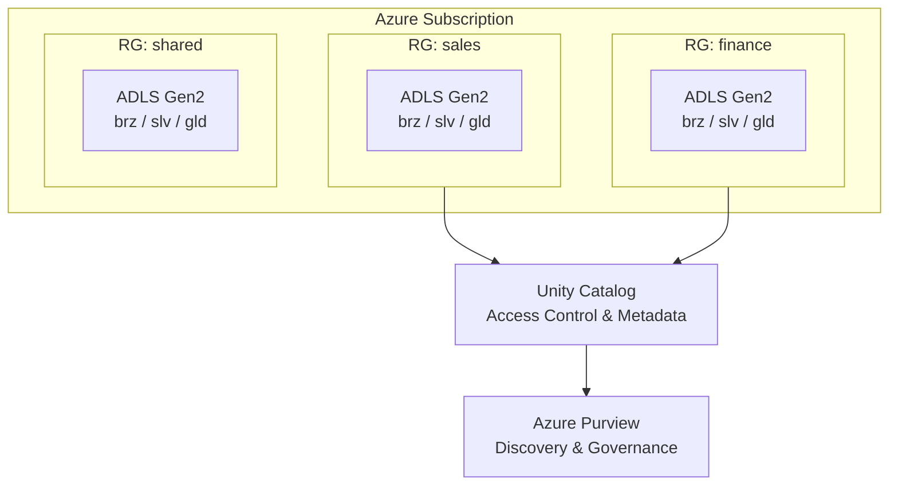

[← Platform Components](../README.md)

# OneLake Pattern — ADLS Gen2 + Unity Catalog

> **Last Updated:** 2026-04-15 | **Status:** Active | **Audience:** Platform Engineers

> [!NOTE]
> **TL;DR:** Replicates Microsoft Fabric's OneLake using ADLS Gen2 (with HNS) + Delta Lake + Databricks Unity Catalog. Provides unified data lake abstraction with Bronze/Silver/Gold medallion architecture, cross-domain "shortcut" patterns via managed identity, and a layered security model.

> **CSA-in-a-Box equivalent of Microsoft Fabric OneLake**

## Table of Contents

- [How OneLake Maps to CSA-in-a-Box](#how-onelake-maps-to-csa-in-a-box)
- [Architecture](#architecture)
- [Naming Conventions](#naming-conventions)
- [Shortcut Pattern](#shortcut-pattern)
- [Cross-Domain Access via Managed Identity](#cross-domain-access-via-managed-identity)
- [Deployment](#deployment)
- [Configuration](#configuration)
- [Security Model](#security-model)
- [Migration from Fabric](#migration-from-fabric)
- [Related Documentation](#related-documentation)

> OneLake is not available in Azure Government ("Forecasted" status). This
> pattern delivers the same logical data-lake abstraction using ADLS Gen2
> with hierarchical namespace, Delta Lake, and Databricks Unity Catalog.

---

## 📋 How OneLake Maps to CSA-in-a-Box

Microsoft Fabric's OneLake is a single, unified storage layer for every
workspace in a tenant. Under the hood it is an ADLS Gen2 account with HNS
(hierarchical namespace) enabled. CSA-in-a-Box replicates this model by
deploying one ADLS Gen2 account per data-landing zone with Bronze / Silver /
Gold containers per domain, governed by Unity Catalog for access control
and metadata.

### Conceptual Mapping

| OneLake Concept | CSA-in-a-Box Equivalent | Notes |
|---|---|---|
| **Tenant** | Azure Subscription / Management Group | Top-level security boundary |
| **Capacity** | Databricks Cluster / Synapse pool | Compute attached to storage |
| **Workspace** | Resource Group + Storage Container | Logical grouping per domain |
| **Lakehouse** | ADLS Container (bronze/silver/gold) | One container per medallion layer |
| **Table** | Delta Lake path (`/domain/product/`) | Delta format with Unity Catalog registration |
| **Shortcut** | Linked Service / SAS URI / Managed Identity | Cross-domain or cross-account references |
| **OneSecurity** | Unity Catalog + Azure RBAC + Purview | Layered access control |
| **Data Activator** | Logic Apps + Event Grid + Functions | See `platform/data-activator/` |
| **Direct Lake** | Databricks SQL Endpoint → Power BI | See `platform/direct-lake/` |
| **Dataflow Gen2** | ADF Mapping Data Flows | Spark-based ETL |
| **Notebook** | Databricks Notebooks | Interactive compute |

---

## 🏗️ Architecture



---

## 📁 Naming Conventions

CSA-in-a-Box mirrors the OneLake workspace/lakehouse naming so teams
familiar with Fabric can navigate the storage hierarchy intuitively.

### Storage Account Naming

```text
st{env}{domain}{region}     # e.g. stprodsaleseus2
```

- `env`: `dev`, `stg`, `prod`
- `domain`: lowercase domain name (max 8 chars)
- `region`: Azure region shortcode (`eus2`, `gva`, etc.)

### Container (Lakehouse) Naming

```text
bronze      # Raw ingestion layer
silver      # Cleansed and conformed
gold        # Business-ready aggregates
quarantine  # Failed quality checks
```

### Path Convention (Table Equivalent)

```text
/{container}/{domain}/{data-product}/{partition}/
```

Example:
```text
/gold/sales/orders/year=2024/month=06/part-00001.parquet
/silver/finance/invoices/_delta_log/
```

---

## 🔗 Shortcut Pattern

In Fabric, **shortcuts** let a lakehouse reference data in another
workspace without copying it. CSA-in-a-Box achieves the same via:

### 1. Managed Identity (Preferred)

Grant the consuming workspace's managed identity `Storage Blob Data Reader`
on the source container. Databricks Unity Catalog external locations
register the cross-domain path:

```sql
-- In Unity Catalog
CREATE EXTERNAL LOCATION finance_gold
  URL 'abfss://gold@stprodfinanceeus2.dfs.core.windows.net/finance/'
  WITH (STORAGE CREDENTIAL finance_cross_domain_cred);

-- Create a "shortcut" table pointing to the external location
CREATE TABLE sales_catalog.shortcuts.finance_invoices
  LOCATION 'abfss://gold@stprodfinanceeus2.dfs.core.windows.net/finance/invoices/';
```

### 2. Linked Service (ADF / Synapse Pipelines)

```json
{
  "name": "ls_finance_gold",
  "type": "AzureBlobFS",
  "typeProperties": {
    "url": "https://stprodfinanceeus2.dfs.core.windows.net",
    "credential": {
      "type": "ManagedIdentity"
    }
  }
}
```

### 3. SAS Token (External Partners)

Time-limited, scoped to a specific container and path prefix.
Generated via `az storage container generate-sas` and stored in Key Vault.

---

## 🔒 Cross-Domain Access via Managed Identity

Every resource group has a user-assigned managed identity that acts as the
domain's service principal. Cross-domain access is granted by assigning
RBAC roles to the consuming domain's managed identity on the source
storage account:

```bash
# Grant sales domain read access to finance gold layer
az role assignment create \
  --role "Storage Blob Data Reader" \
  --assignee-object-id $(az identity show \
    --name mi-sales-prod --resource-group rg-sales-prod \
    --query principalId -o tsv) \
  --scope "/subscriptions/{sub}/resourceGroups/rg-finance-prod/providers/Microsoft.Storage/storageAccounts/stprodfinanceeus2/blobServices/default/containers/gold"
```

---

## 📦 Deployment

The Bicep module at `deploy/onelake-storage.bicep` deploys a complete
OneLake-equivalent storage account. Configuration is driven by
`onelake_config.yaml`.

```bash
# Deploy for a specific domain
az deployment group create \
  --resource-group rg-sales-prod \
  --template-file platform/onelake-pattern/deploy/onelake-storage.bicep \
  --parameters \
    domainName=sales \
    environment=prod \
    location=eastus2
```

---

## ⚙️ Configuration

See `onelake_config.yaml` for the full workspace-to-storage mapping,
shortcut definitions, and lifecycle policies.

---

## 🔒 Security Model

| Layer | Technology | Purpose |
|---|---|---|
| **Network** | Private Endpoints + VNet | No public access |
| **Identity** | Managed Identity + RBAC | Domain-scoped access |
| **Data** | Unity Catalog ACLs | Table/column-level security |
| **Encryption** | CMK (Key Vault) | Customer-managed keys |
| **Classification** | Purview + auto-labeling | PII/PHI detection |
| **Audit** | Diagnostic Settings → Log Analytics | Full access audit trail |

---

## 🔄 Migration from Fabric

If your organization currently uses Fabric in commercial Azure and needs
to move to Azure Government:

1. Export Delta Lake tables from Fabric lakehouse
2. Deploy CSA-in-a-Box storage via the Bicep module
3. Upload Delta tables to the matching container/path
4. Register tables in Unity Catalog
5. Update Power BI connections to use Databricks SQL endpoint
6. Migrate Dataflow Gen2 to ADF Mapping Data Flows

> [!TIP]
> See also:
> - `platform/direct-lake/` — Power BI Direct Lake equivalent
> - `platform/data-activator/` — Data Activator equivalent
> - `platform/data_marketplace/` — Data marketplace / product discovery

---

## 🔗 Related Documentation

- [Platform Components](../README.md) — Platform component index
- [Platform Services](../../docs/PLATFORM_SERVICES.md) — Detailed platform service descriptions
- [Architecture](../../docs/ARCHITECTURE.md) — Overall system architecture
- [Metadata Framework](../metadata-framework/README.md) — Metadata-driven pipeline generation
- [Direct Lake](../direct-lake/README.md) — Power BI direct access to Delta Lake
