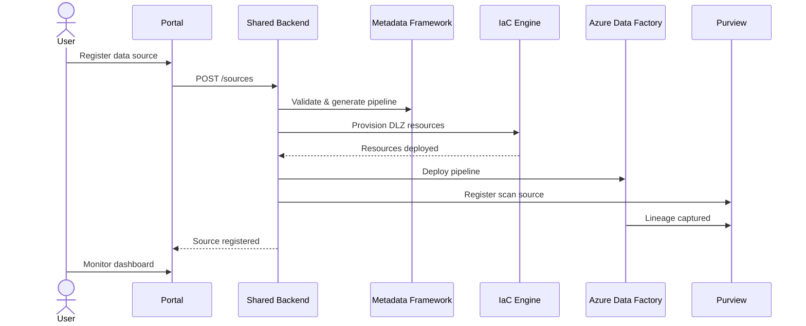

# Data Onboarding Portal — Multiple Implementations

This directory contains **four different implementations** of the autonomous data
onboarding portal, each using a different technology stack. All implementations share
the same backend API and provide the same functionality.

## What the Portal Does

The data onboarding portal enables **self-service data source registration**. Users can:

1. **Register** a new data source (SQL, API, file, streaming)
2. **Configure** ingestion parameters (schedule, mode, quality rules)
3. **Trigger** automatic Data Landing Zone provisioning
4. **Monitor** pipeline status, quality metrics, and freshness
5. **Browse** the data marketplace for discoverable data products
6. **Request** access to data products with approval workflow



## Implementations

### 1. PowerApps + Logic Apps (`powerapps/`)
- **Best for:** Organizations already in M365 ecosystem
- **Stack:** Canvas App + Model-Driven App + Logic Apps + Power Automate
- **Pros:** Low-code, rapid deployment, integrated with M365
- **Cons:** Less customizable, requires Power Platform license
- **Deploy time:** ~30 minutes

### 2. React/Next.js Web App (`react-webapp/`)
- **Best for:** Custom enterprise portals, maximum flexibility
- **Stack:** Next.js + Tailwind CSS + MSAL auth + Azure App Service
- **Pros:** Full control, open-source, developer-friendly
- **Cons:** More development effort, requires frontend skills
- **Deploy time:** ~45 minutes

### 3. Azure Static Web Apps + Functions (`static-webapp/`)
- **Best for:** Low-cost, lightweight deployments
- **Stack:** React/SvelteKit + Azure Functions + Static Web Apps
- **Pros:** Cheapest option, serverless, auto-scaling, GitHub integration
- **Cons:** Cold starts, limited backend complexity
- **Deploy time:** ~20 minutes

### 4. Kubernetes / AKS (`kubernetes/`)
- **Best for:** Enterprise-scale, multi-tenant, high availability
- **Stack:** Helm + AKS + Ingress + ArgoCD
- **Pros:** Maximum scalability, GitOps, HA, multi-cloud portable
- **Cons:** Most complex, requires K8s expertise
- **Deploy time:** ~60 minutes

## Shared Backend (`shared/`)

All portal implementations connect to the same **shared backend API**:

```
portal/shared/
├── api/
│   ├── app.py              # FastAPI application
│   ├── routes/
│   │   ├── sources.py      # Data source CRUD
│   │   ├── pipelines.py    # Pipeline management
│   │   ├── marketplace.py  # Data product discovery
│   │   ├── access.py       # Access request workflow
│   │   └── monitoring.py   # Health & metrics
│   ├── models/
│   │   ├── source.py       # Source registration models
│   │   ├── pipeline.py     # Pipeline models
│   │   └── access.py       # Access request models
│   └── services/
│       ├── provisioner.py  # DLZ provisioning
│       ├── scanner.py      # Purview scan integration
│       └── notifier.py     # Notification service
├── deploy/
│   ├── Dockerfile
│   └── api.bicep
└── tests/
```

## Quick Comparison

| Feature | PowerApps | React | Static Web App | Kubernetes |
|---|---|---|---|---|
| Cost | $$ (Power Platform) | $ (App Service) | ¢ (consumption) | $$$ (AKS cluster) |
| Customization | Low | High | Medium | High |
| Scalability | Medium | Medium | Auto | High |
| Auth | M365 built-in | MSAL | Built-in | Custom |
| Gov Cloud | ✅ | ✅ | ✅ | ✅ |
| Offline/PWA | ❌ | ✅ | ✅ | ✅ |
| GitOps | ❌ | ✅ | ✅ | ✅ |
