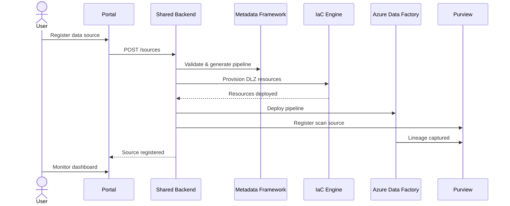

# Data Onboarding Portal


> [!NOTE]
> **TL;DR:** Four portal implementations — PowerApps, React/Next.js, Kubernetes, and CLI (`cli/` at the repo root) — all sharing the same FastAPI backend for self-service data source registration, pipeline monitoring, marketplace discovery, and access request workflows.

This directory contains **three browser / app implementations** of the autonomous data
onboarding portal plus a **fourth command-line variant** at `/cli/` in the repo root
(shipped as the `python -m cli` module). All four implementations share the same backend
API and provide the same functionality.

## Table of Contents

- [What the Portal Does](#what-the-portal-does)
- [Implementations](#implementations)
- [Shared Backend](#shared-backend-shared)
- [Quick Comparison](#quick-comparison)
- [Related Documentation](#related-documentation)

---

## ✨ What the Portal Does

The data onboarding portal enables **self-service data source registration**. Users can:

1. **Register** a new data source (SQL, API, file, streaming)
2. **Configure** ingestion parameters (schedule, mode, quality rules)
3. **Trigger** automatic Data Landing Zone provisioning
4. **Monitor** pipeline status, quality metrics, and freshness
5. **Browse** the data marketplace for discoverable data products
6. **Request** access to data products with approval workflow



---

## 🏗️ Implementations

### 1. PowerApps + Logic Apps (`powerapps/`)
- **Best for:** Organizations already in M365 ecosystem
- **Stack:** Canvas App + Model-Driven App + Logic Apps + Power Automate
- **Pros:** Low-code, rapid deployment, integrated with M365
- **Cons:** Less customizable, requires Power Platform license
- **Deploy time:** ~30 minutes

### 2. React/Next.js Web App (`react-webapp/`)
- **Best for:** Custom enterprise portals, maximum flexibility
- **Stack:** Next.js + Tailwind CSS + MSAL auth + Azure App Service
- **Pros:** Full control, open-source, developer-friendly
- **Cons:** More development effort, requires frontend skills
- **Deploy time:** ~45 minutes

### 3. Kubernetes / AKS (`kubernetes/`)
- **Best for:** Enterprise-scale, multi-tenant, high availability
- **Stack:** Helm + AKS + Ingress + ArgoCD
- **Pros:** Maximum scalability, GitOps, HA, multi-cloud portable
- **Cons:** Most complex, requires K8s expertise
- **Deploy time:** ~60 minutes

### 4. CLI (`/cli/` at the repo root)
- **Best for:** Automation, CI/CD pipelines, scripts, ops power-users
- **Stack:** Click + `python -m cli` (shares `portal/shared/api` over HTTP)
- **Entry point:** `python -m cli --help`
- **Commands:** `sources`, `pipelines`, `marketplace`, `stats`
- **Pros:** Scriptable, no browser required, works over SSH / in air-gapped
  environments, honors `CSA_API_URL` / `CSA_API_TOKEN` / `CSA_FORMAT` env vars
- **Cons:** No interactive dashboards — use one of the web variants above
  for visual workflows.
- **Deploy time:** minutes — `pip install -e ".[dev,portal]"` and run

---

## 🔌 Shared Backend (`shared/`)

All portal implementations connect to the same **shared backend API**:

```text
portal/shared/
├── api/
│   ├── app.py              # FastAPI application
│   ├── routes/
│   │   ├── sources.py      # Data source CRUD
│   │   ├── pipelines.py    # Pipeline management
│   │   ├── marketplace.py  # Data product discovery
│   │   ├── access.py       # Access request workflow
│   │   └── monitoring.py   # Health & metrics
│   ├── models/
│   │   ├── source.py       # Source registration models
│   │   ├── pipeline.py     # Pipeline models
│   │   └── access.py       # Access request models
│   └── services/
│       ├── provisioner.py  # DLZ provisioning
│       ├── scanner.py      # Purview scan integration
│       └── notifier.py     # Notification service
├── deploy/
│   ├── Dockerfile
│   └── api.bicep
└── tests/
```

---

## 📋 Quick Comparison

| Feature | PowerApps | React | Kubernetes | CLI |
|---|---|---|---|---|
| Cost | $$ (Power Platform) | $ (App Service) | $$$ (AKS cluster) | $ (local / dev box) |
| Customization | Low | High | High | N/A (API client) |
| Scalability | Medium | Medium | High | N/A (per-invocation) |
| Auth | M365 built-in | MSAL | Custom | Bearer token via `CSA_API_TOKEN` |
| Gov Cloud | ✅ | ✅ | ✅ | ✅ |
| Offline/PWA | ❌ | ✅ | ✅ | ✅ (against local backend) |
| GitOps | ❌ | ✅ | ✅ | ✅ (scriptable) |
| CI/CD-friendly | ❌ | ⚠️ | ⚠️ | ✅ |

---

## 🔗 Related Documentation

- [Architecture](../docs/ARCHITECTURE.md) — Overall system architecture
- [Platform Components](../csa_platform/README.md) — Platform component index
