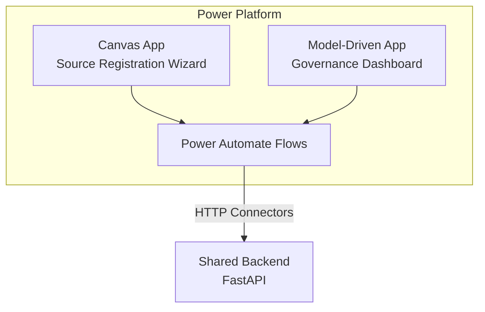

[← Portal Implementations](../README.md)

# PowerApps + Logic Apps Portal

> **Last Updated:** 2026-04-15 | **Status:** Active | **Audience:** Frontend Developers

> [!NOTE]
> **TL;DR:** Low-code data onboarding portal built on Microsoft Power Platform — Canvas App for source registration wizard, Model-Driven App for governance dashboard, Power Automate flows for approvals and monitoring. Supports GCC/GCC High/DoD. Deploy in ~30 minutes.

A low-code/no-code data onboarding portal built with Microsoft Power Platform.
Best suited for organizations already invested in the Microsoft 365 ecosystem.

## Table of Contents

- [Architecture](#architecture)
- [Components](#components)
- [Setup Instructions](#setup-instructions)
- [Solution Structure](#solution-structure)
- [Deployment](#deployment)
- [Azure Government](#azure-government)
- [Pros and Cons](#pros-and-cons)
- [Related Documentation](#related-documentation)

---

## 🏗️ Architecture



---

## ✨ Components

### Canvas App — Source Registration

A multi-screen canvas app that guides users through data source onboarding:

| Screen | Purpose |
|---|---|
| Home | Welcome + quick stats from API |
| Source Type | Gallery of source type cards |
| Connection | Dynamic form based on source type |
| Schema Preview | Table showing detected columns |
| Ingestion Config | Schedule, mode, batch size |
| Review & Submit | Summary + submit button |
| Confirmation | Success message + pipeline status |

### Model-Driven App — Governance Dashboard

Built on Dataverse tables for full CRUD with business rules:

| Table | Purpose |
|---|---|
| Data Sources | All registered sources with status tracking |
| Pipelines | Pipeline configurations and run history |
| Data Products | Marketplace catalog entries |
| Access Requests | Request/approval workflow |
| Quality Metrics | Historical quality scores |
| Domains | Data domain configuration |

### Power Automate Flows

| Flow | Trigger | Action |
|---|---|---|
| Source Registration | When Canvas App submits | POST to shared API, create Dataverse record |
| Approval Workflow | When source status = pending | Send approval to data steward, update on response |
| Pipeline Monitoring | Scheduled (every 15 min) | GET pipeline status, update Dataverse, alert on failure |
| Access Request | When access request created | Route to domain owner, apply RBAC on approval |
| Quality Alert | When quality score < threshold | Send Teams notification, create incident |

---

## 🚀 Setup Instructions

### 📎 Prerequisites

- Microsoft 365 license with Power Platform (E3/E5 or standalone)
- Power Platform environment (with Dataverse)
- Microsoft Entra ID app registration for API access

### Step 1: Import Solution

```powershell
# Install Power Platform CLI
npm install -g pac

# Authenticate
pac auth create --environment "https://your-org.crm.dynamics.com"

# Import managed solution
pac solution import --path ./solution/CSAPortal_managed.zip
```

### Step 2: Configure Connections

1. Open Power Apps Studio
2. Edit the "CSA Data Onboarding" canvas app
3. Update the `API_BASE_URL` environment variable
4. Configure the HTTP connector with your API endpoint
5. Set up Microsoft Entra ID connector for authentication

### Step 3: Configure Flows

1. Open Power Automate
2. Enable all flows in the CSA Portal solution
3. Update connection references:
   - HTTP connector → Shared API URL
   - Microsoft Teams → Your Teams channel
   - Office 365 → Approval mailbox
   - Dataverse → Your environment

### Step 4: Set Up Dataverse Tables

> [!TIP]
> Tables are auto-created by the solution import. Verify them in the Dataverse admin center.

```text
Data Sources     → csa_datasource
Pipelines        → csa_pipeline
Data Products    → csa_dataproduct
Access Requests  → csa_accessrequest
Quality Metrics  → csa_qualitymetric
Domains          → csa_domain
```

---

## 📁 Solution Structure

```text
portal/powerapps/
├── README.md                    # This file
├── solution/
│   ├── CSAPortal_managed.zip    # Managed solution package
│   └── CSAPortal_unmanaged.zip  # Unmanaged (for development)
├── canvas-apps/
│   ├── SourceRegistration.msapp # Canvas app package
│   └── screens/                 # Screen definitions (YAML)
├── model-driven/
│   ├── sitemap.xml              # App navigation
│   └── forms/                   # Entity form definitions
├── flows/
│   ├── source-registration.json # Registration flow definition
│   ├── approval-workflow.json   # Approval flow definition
│   ├── pipeline-monitor.json    # Monitoring flow definition
│   ├── access-request.json      # Access request flow definition
│   └── quality-alert.json       # Quality alert flow definition
├── dataverse/
│   ├── entities/                # Table definitions
│   ├── optionsets/              # Choice columns
│   └── security-roles/         # RBAC definitions
└── deploy/
    ├── deploy.ps1               # PowerShell deployment script
    └── config.json              # Environment configuration
```

---

## 📦 Deployment

### Export Solution (for CI/CD)

```powershell
# Export as managed
pac solution export \
  --name CSAPortal \
  --path ./solution/CSAPortal_managed.zip \
  --managed

# Export as unmanaged (for development)
pac solution export \
  --name CSAPortal \
  --path ./solution/CSAPortal_unmanaged.zip
```

### 🔄 CI/CD with GitHub Actions

```yaml
# .github/workflows/deploy-powerapps.yml
name: Deploy Power Apps Solution
on:
  push:
    paths: ['portal/powerapps/**']

jobs:
  deploy:
    runs-on: windows-latest
    steps:
      - uses: actions/checkout@v4
      - uses: microsoft/powerplatform-actions/install-pac@v1
      - uses: microsoft/powerplatform-actions/import-solution@v1
        with:
          environment-url: ${{ secrets.PP_ENVIRONMENT_URL }}
          user-name: ${{ secrets.PP_USERNAME }}
          password-secret: ${{ secrets.PP_PASSWORD }}
          solution-file: portal/powerapps/solution/CSAPortal_managed.zip
```

---

## 🔒 Azure Government

> [!IMPORTANT]
> Update all connection URLs and authentication endpoints for your Gov cloud tier.

Power Platform is available in Azure Government (GCC/GCC High/DoD):

| Tier | Endpoint |
|---|---|
| GCC | `*.crm9.dynamics.com` |
| GCC High | `*.crm.microsoftdynamics.us` |
| DoD | `*.crm.appsplatform.us` |

---

## 📋 Pros and Cons

| Aspect | Assessment |
|---|---|
| Development Speed | Fast — drag-and-drop UI builder |
| Customization | Moderate — limited by Power Platform capabilities |
| Licensing Cost | Included with M365 E3/E5, or per-app/per-user |
| Maintenance | Low — Microsoft-managed infrastructure |
| Gov Compliance | Strong — GCC High and DoD supported |
| Integration | Excellent — native M365, Dataverse, Azure connectors |
| Scalability | Good — Dataverse handles millions of records |
| Offline | Limited — requires connectivity |

---

## 🔗 Related Documentation

- [Portal Implementations](../README.md) — Portal implementation index
- [Shared Backend](../shared/README.md) — Shared backend API
- [Architecture](../../docs/ARCHITECTURE.md) — Overall system architecture
