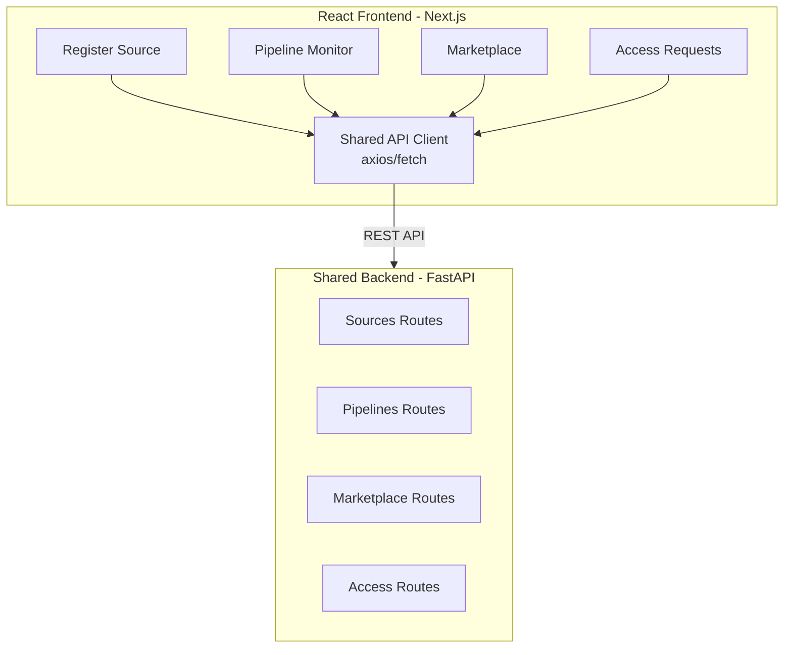

[← Portal Implementations](../README.md)

# React Web App — Data Onboarding Portal


> [!NOTE]
> **TL;DR:** Full-featured Next.js 14 (App Router) portal with Tailwind CSS, MSAL auth, React Query, and multi-step source registration wizard. The most customizable portal implementation — deployable to App Service, Container Apps, or Static Web Apps.

A full-featured React/Next.js web application for data source registration,
pipeline management, and data marketplace discovery. This is the most
customizable portal implementation in CSA-in-a-Box.

## Table of Contents

- [Architecture](#architecture)
- [Tech Stack](#tech-stack)
- [Quick Start](#quick-start)
- [Environment Variables](#environment-variables)
- [Pages](#pages)
- [Components](#components)
- [Deployment](#deployment)
- [Azure Government](#azure-government)
- [Development](#development)
- [Related Documentation](#related-documentation)

---

## 🏗️ Architecture



---

## 🏗️ Tech Stack

| Layer | Technology | Why |
|---|---|---|
| Framework | Next.js 14 (App Router) | SSR, file-based routing, API routes |
| UI | Tailwind CSS + Radix UI | Utility-first CSS, accessible components |
| Auth | MSAL.js (@azure/msal-react) | Microsoft Entra ID integration |
| State | React Query (TanStack) | Server state, caching, optimistic updates |
| Forms | React Hook Form + Zod | Type-safe forms with validation |
| HTTP | Axios | HTTP client with interceptors |
| Charts | Recharts | Dashboard visualizations |

---

## 🚀 Quick Start

```bash
# Install dependencies
cd portal/react-webapp
npm install

# Configure environment
cp .env.example .env.local
# Edit .env.local with your Microsoft Entra ID and API settings

# Start development server
npm run dev

# Open http://localhost:3000
```

---

## ⚙️ Environment Variables

```bash
# Microsoft Entra ID
NEXT_PUBLIC_AZURE_AD_CLIENT_ID=your-client-id
NEXT_PUBLIC_AZURE_AD_TENANT_ID=your-tenant-id
NEXT_PUBLIC_AZURE_AD_REDIRECT_URI=http://localhost:3000

# API Backend
NEXT_PUBLIC_API_URL=http://localhost:8000/api/v1

# Feature Flags
NEXT_PUBLIC_ENABLE_MARKETPLACE=true
NEXT_PUBLIC_ENABLE_ACCESS_REQUESTS=true
NEXT_PUBLIC_ENABLE_PIPELINE_MONITORING=true

# Auth Gate (CSA-0122) — set to "true" for any env that must enforce auth
# (staging, preview, production). Unset defaults to "false" (demo mode).
# Must track the backend ENVIRONMENT allow-list (CSA-0001 / CSA-0019).
NEXT_PUBLIC_AUTH_ENABLED=false
```

> [!WARNING]
> Never commit `.env.local` files containing real credentials. Use Key Vault references in production.

> [!IMPORTANT]
> `NEXT_PUBLIC_AUTH_ENABLED` must be `true` in every non-local environment. A missing value falls back to "on" only when `NODE_ENV=production` — pre-prod Next.js builds often run with `NODE_ENV=production` locally but need the flag explicit to avoid shipping unauthenticated.

---

## 📁 Pages

| Route | Page | Description |
|---|---|---|
| `/` | Dashboard | Platform overview with key metrics |
| `/sources` | Source Registry | List and manage registered data sources |
| `/sources/register` | Register Source | Multi-step form for new source onboarding |
| `/sources/[id]` | Source Detail | Source configuration, schema, pipeline status |
| `/pipelines` | Pipeline Monitor | Active pipeline runs and history |
| `/marketplace` | Data Marketplace | Browse and search data products |
| `/marketplace/[id]` | Product Detail | Data product details, quality, access |
| `/access` | Access Requests | Submit and track data access requests |
| `/settings` | Settings | User preferences, API keys, notifications |

---

## ✨ Components

### Source Registration Flow

The source registration form is a multi-step wizard:

1. **Source Type** — Select the data source type (SQL, API, file, etc.)
2. **Connection** — Configure connection details (host, port, credentials)
3. **Schema** — Preview and select tables/fields to ingest
4. **Ingestion** — Configure schedule, mode (batch/incremental/CDC)
5. **Quality** — Define data quality rules and thresholds
6. **Review** — Confirm and submit for provisioning

### Data Marketplace

The marketplace provides:
- Full-text search across data product names and descriptions
- Filter by domain, quality score, classification level
- Quality badges (freshness, completeness, accuracy)
- One-click access request with approval workflow
- Data preview (sample rows with PII masking)

---

## 📦 Deployment

### Azure App Service

```bash
# Build production bundle
npm run build

# Deploy via Azure CLI
az webapp up \
  --name csa-portal \
  --resource-group rg-csa-portal \
  --runtime "NODE:18-lts" \
  --sku B1
```

### Azure Container Apps

```bash
# Build container
docker build -t csa-portal:latest .

# Deploy to Container Apps
az containerapp create \
  --name csa-portal \
  --resource-group rg-csa-portal \
  --environment csa-env \
  --image csa-portal:latest \
  --target-port 3000 \
  --ingress external
```

### Azure Static Web Apps

For static export (no SSR):

```bash
npm run build:static
# Deploy via SWA CLI
npx @azure/static-web-apps-cli deploy \
  --app-location out \
  --api-location portal/shared/api
```

---

## 🔒 Azure Government

This portal works in Azure Government with these changes:

- Set `NEXT_PUBLIC_AZURE_AD_TENANT_ID` to your Gov tenant
- Use `login.microsoftonline.us` as the authority in MSAL config
- Point `NEXT_PUBLIC_API_URL` to your Gov-hosted backend
- All Entra ID endpoints use `.us` suffix

---

## 💡 Development

```bash
# Run tests
npm test

# Run linter
npm run lint

# Type check
npm run type-check

# Storybook (component development)
npm run storybook
```

---

## 🔗 Related Documentation

- [Portal Implementations](../README.md) — Portal implementation index
- [Shared Backend](../shared/README.md) — Shared backend API
- [Architecture](../../docs/ARCHITECTURE.md) — Overall system architecture
